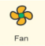

# APP下载和使用说明

## （1）安卓系统手机蓝牙APP（国内）：

下载链接：<https://xiazai.keyesrobot.cn/APP/keyes%20IoT%20home.apk> ，下载完后，使用数据线转移到手机上去安装。

二维码下载（用手机浏览器上的扫描功能）：

下载安装后打开，出现如下图界面。

上传测试代码成功，上电后

1. 打开APP，选择WIFI

2. APP控制LED和风扇

手机需要和智能家居连接同一个WiFi，或者手机打开热点，智能家居连接手机的热点。

A. APP输入IP地址（LCD1602显示出分配到的IP地址）

B. 点击连接

C. 连接成功标志是显示区域显示ESP32 ip: 192.168.0.171

D. 然后就可以点击LED，可以看到智能家居的LED被打开

E. 点击Fan按钮，风扇被打开。如下图操作。

  

## （2）苹果系统手机（平板电脑）APP：

打开 App Store。

在 APP Store 上搜索 **keyes IoT home** ，点击获取，下载安装APP即可。

手机APP上各个按钮对应的控制字符和各个按钮对应的功能，这里我们整理了一个表格如下：

（注意：功能的实现需要上传第15课手机APP控制智能家居的程序）

|按钮:|功能：选择WIFI模式||
|-|-|-|
|按钮:|功能：连接||
|按钮:|控制字符：点一下发送 “/led/on”； 再点一下发送“/led/off”。|功能：点一下，开启LED灯；再点一下，关闭LED灯。|
|按钮:|控制字符：点一下发送 “/window/on”； 再点一下发送“/window/off”。|功能：点一下，开启窗户； 再点一下，关闭窗户。|
|按钮:|控制字符：点一下发送 “/music/on”。|功能：点一下，播放一首歌曲。|
|按钮:|控制字符：点一下发送 “/buz/on”。|功能：点一下，蜂鸣器“哔”响一声。|
|按钮:|控制字符：点一下发送 “/door/on”； 再点一下发送“/door/off”。|功能：点一下，开启门； 再点一下，关闭门。|
|按钮:|控制字符：点一下发送 “/fan/on”； 再点一下发送“/fan/off”。|功能：点一下，开启风扇； 再点一下，关闭风扇。|
|按钮:|控制字符：点一下发送 “/rain/on”； 再点一下发送“/rain/off”。|功能：点一下，显示区显示雨滴值；再点一下，显示区显示off。|
|按钮:|控制字符：点一下发送 “/gas/on”； 再点一下发送“/gas/off”。|功能：点一下，显示区显示危险气体状态safety或dangerous；再点一下，显示区显示off。|
|按钮:|控制字符：点一下发送 “/body/on”； 再点一下发送“/body/off”。|功能：点一下，显示区显示人体检测状态someone或no one；再点一下，显示区显示off。|
|按钮:|控制字符：点一下发送 “/temp/on”； 再点一下发送“/temp/off”。|功能：点一下，显示区显示温度数值；再点一下，显示区显示off。|
|按钮:|控制字符：点一下发送 “/humidity/on”； 再点一下发送“/humidity/off”。|功能：点一下，显示区显示湿度数值；再点一下，显示区显示off。|
|按钮:|控制字符：点一下发送 “/sfx1/on”； 再点一下发送“sfx1/off”。|功能：点一下，RGB灯开启模式一氛围灯；再点一下，关闭RGB灯。|
|按钮:|控制字符：点一下发送 “/sfx2/on”； 再点一下发送“sfx2/off”。|功能：点一下，RGB灯开启模式二跑马灯；再点一下，关闭RGB灯。|
|按钮:|控制字符：点一下发送 “/red/on”； 再点一下发送“/red/off”。以此类推。|功能：点一下，RGB灯开启红色；再点一下，关闭RGB灯。以此类推。|

