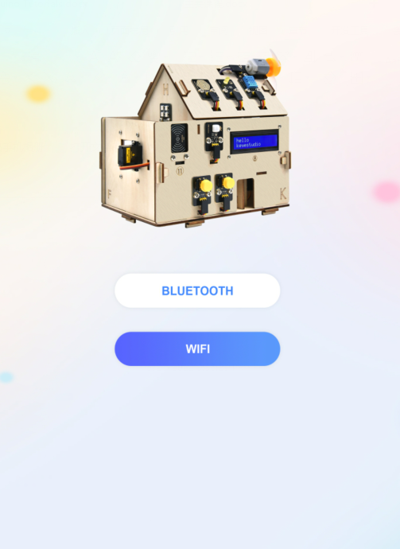

# APP下载和使用说明

## （1）安卓系统手机蓝牙APP（国内）：

下载链接：<https://xiazai.keyesrobot.cn/APP/keyes%20IoT%20home.apk> ，下载完后，使用数据线转移到手机上去安装。

二维码下载（用手机浏览器上的扫描功能）：

下载安装后打开，出现如下图界面。

上传测试代码成功，上电后

1. 打开APP，选择WIFI

2. APP控制LED和风扇

手机需要和智能家居连接同一个WiFi，或者手机打开热点，智能家居连接手机的热点。

A. APP输入IP地址（LCD1602显示出分配到的IP地址）

B. 点击连接

C. 连接成功标志是显示区域显示ESP32 ip: 192.168.0.171

D. 然后就可以点击LED，可以看到智能家居的LED被打开

E. 点击Fan按钮，风扇被打开。如下图操作。

  

## （2）苹果系统手机（平板电脑）APP：

打开 App Store。

在 APP Store 上搜索 **keyes IoT home** ，点击获取，下载安装APP即可。

手机APP上各个按钮对应的控制字符和各个按钮对应的功能，这里我们整理了一个表格如下：

（注意：功能的实现需要上传第15课手机APP控制智能家居的程序）

