# Arduino 教程

## 关于Arduino IDE

<span style="color: rgb(255, 76, 65);">**⚠️特别提醒**：</span><span style="background:#ff0;color:#000">本教程使用的是Arduino IDE 1.8.19 版本，其他的版本不能保证代码编译和上传成功。</span>

### 1. Windows系统：


#### 1.1.下载安装Arduino软件： 

（1）首先，进入arduino官方网站：[https://www.arduino.cc/en/software](https://www.arduino.cc/en/software) ，如下图所示：


（2）然后，根据你的操作系统选择并下载相应的安装程序。如果你是Windows用户，请选择“Windows安装程序”下载正确的安装驱动程序。


选择点击Windows Win7 and newer下载Arduino 1.8.19版本的安装程序，需要手动安装。而当点击Windows ZIP file时，Arduino 1.8.19版本的zip文件将被直接下载，只需要解压缩它就可以完成安装。


一般情况下，点击JUST DOWNLOAD就可以下载了，当然如果你愿意，你可以选择小小的赞助，以帮助伟大的Arduino开源事业。

（3）Arduino软件下载完成后，继续安装，当你收到操作系统的警告时，请允许驱动程序安装。首先点击I Agree, 然后选择好要安装的组件后再点击Next。


（4）选择安装目录(我们建议保持默认目录)，然后点击Install。


（5）如果出现以下界面，则应选择Install。


该过程将提取并安装所有必需的文件，以正确执行Arduino软件(IDE)。


安装完成后，会在桌面上生成一个Arduino 软件快捷方式。


#### 1.2.安装驱动： 

（注意：如果电脑已经安装了CH340驱动程序，则不需要再安装驱动；如果没有，则需要进行以下操作）

将主控板用USB线连接在电脑上，一般MacOS和Windows10系统的电脑会自动安装驱动。如果没能自动安装，则需要手动安装驱动。

（1）查看电脑是否自动安装好驱动：

点击“计算机”--“属性”--“设备管理器”，显示如下图是安装成功的了：


（2）如果没能自动安装，那就手动安装，步骤如下：

右键点击“USB Serial”，选择“更新驱动程序(P)”并点击。


跳转到以下页面，选择“浏览我的电脑以查找驱动程序(R)”并点击。

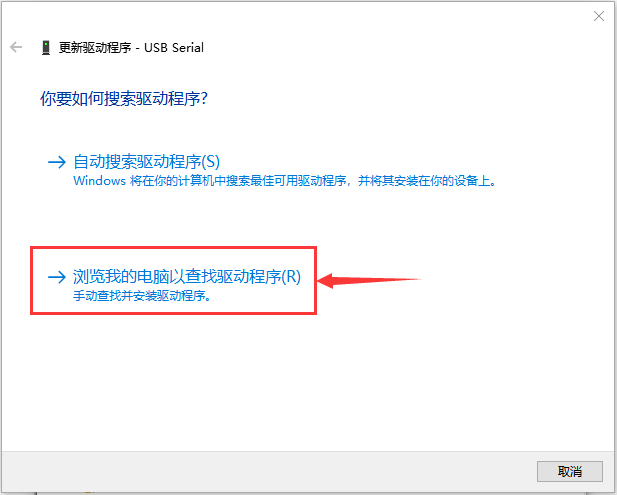

点击“浏览(R)...”选择我们提供的资料中的驱动文件夹 “usb_ch341_3.1.2009.06” ，如下图。


再次查看串口连接状态，如下图，则是成功安装驱动


#### 1.3. Arduino IDE工具栏介绍： 


A - 用于检查是否存在任何编译错误。

B - 用于将程序上传到Arduino板。

C - 用于创建新草图的快捷方式。

D - 用于直接打开示例草图之一。

E - 用于保存草图。

F - 用于从板接收串行数据并将串行数据发送到板的串行监视器。

语言切换功能：

（1）单击“File”→“Preferences”，在 Preferences
页面中将语言“English”切换成“简体中文”，点击“OK”就可以了。


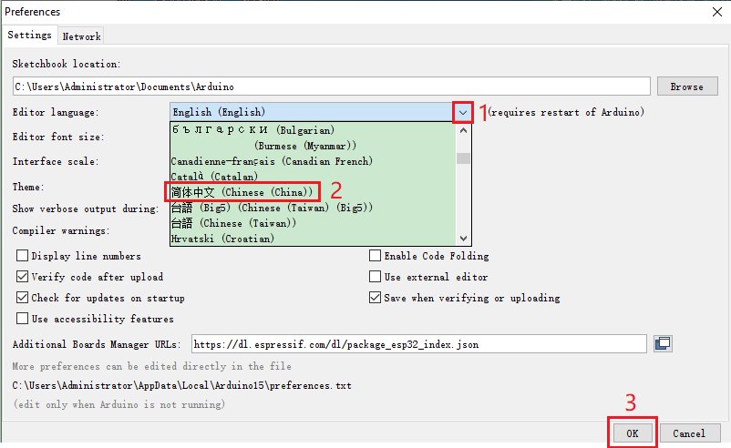

（2）关闭Arduino IDE再重启，这样，Arduino IDE页面中的语言就切换好了。


#### 1.4.在Arduino IDE上安装ESP32: 

上面已经学习了怎么下载ArduinoIDE和怎么安装驱动，那下面就要在Arduino IDE上安装ESP32，请执行以下步骤：  
特别注意：你需要Arduino IDE 1.8.5或更高版本才能在其上安装ESP32。

(1) 点击电脑桌面上的图标，打开Arduino  IDE。

 

(2) 点击“文件” →“首选页”，如下图：

 

(3) 打开下图标出的按钮

 

将这个地址：https://espressif.github.io/arduino-esp32/package_esp32_index.json ，复制粘贴到里面去再点击“好”保存这个地址，如下图


(5) 再点击“好”。


(6) 先点击“工具”→“开发版:”，再点击“开发版管理器...”进入“开发版管理器”页面，在“全部”后空格中输入“ESP32”，然后点击下面搜索内容，选择 <span style="color: rgb(255, 76, 65);">1.06</span> 版本进行安装，安装包不大，点击“**安装**”开始安装相关安装包。如下图：**<span style="color: rgb(255, 76, 0);">（特别提醒：选择更高版本或最新版本，可能会出现安装失败。）</span>**


(7）等待下载完成后，点击“关闭”关闭页面。再点击“工具” \>“开发板：”即可看到ESP32 Arduino


到此，完成ESP32环境添加。

#### 1.5. Arduino IDE设置介绍：

（1）点击电脑桌面上的图标，打开Arduino     IDE。


（2）为了避免在将程序上载到板上时出现任何错误，必须选择正确的控制板名称，该名称与连接到计算机的电路板相匹配。点击“工具”→“开发板:”，你可以在里面查看到各种不同型号ESP32开发板。选择对应的ESP32开发板型号。（开发板型ESP32  Dev Module 或ESP32 Wrover Module都可以，这里以开发板型ESP32 Wrover     Module为例。）


设置好板型后，再做板内设置，设置如下图。


然后再选择正确的COM口（安装驱动成功后可看到对应COM口）。


### 2\. Mac系统:


####  2.1.下载安装Arduino IDE: 

下载安装说明与1.1章相同，如下图所示：


#### 2.2.安装CH340驱动： 

(1)点击V1.5 CH340 MaxOS驱动程序包（对应的文件夹中已经提供有）


（2）单击安装包并点击“继续”。


（3）点击“安装”。


（4）输入用户密码，然后单击“安装软件”。


（5）点击“继续安装”。

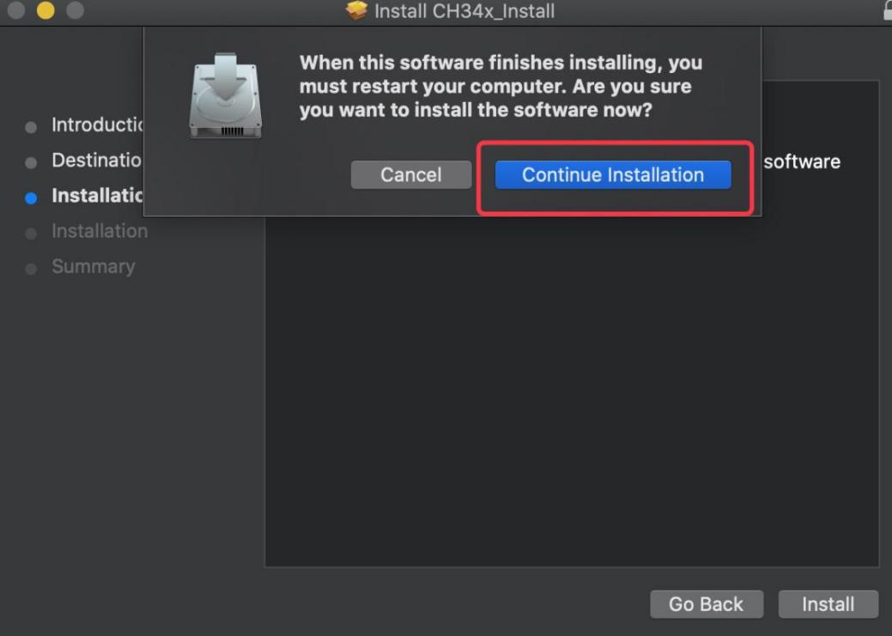

（6）等待安装。


（7）安装完成后，单击“重新启动”。

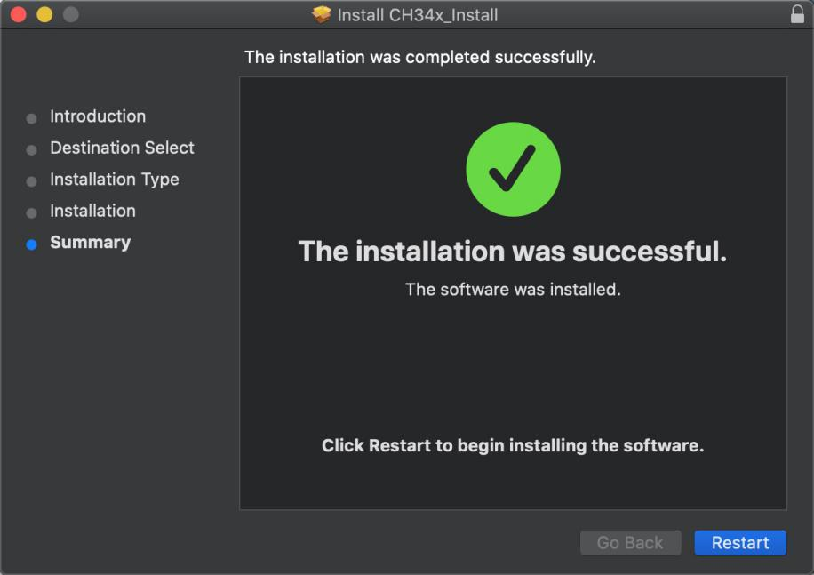

####  2.3.设置Arduino IDE: 

除了COM端口之外，设置方法与上面其它的是相同的，如下图所示：


####  2.4.添加ESP32主板环境 

（1）先打开arduinoIDE，点击“文件” \> “首选页”，如下图


（2）打开下图标出的按钮


（3）将链接：https://espressif.github.io/arduino-esp32/package_esp32_index.json ，复制粘贴到里面去，再点击“好”，如下图


（4）点击“工具” \> “开发板：” \> “”开发板管理器...”，如下图


(5) 在弹出的“开发板管理器”中搜索“ESP32”再点击“安装”就行，然后点击下面搜索内容，选择 <span style="color: rgb(255, 76, 65);">1.06</span> 版本进行安装，安装包不大，点击“**安装**”开始安装相关安装包。如下图：**<span style="color: rgb(255, 76, 0);">（特别提醒：选择更高版本或最新版本，可能会出现安装失败。）</span>**


(6) 等待下载完成后，点击“工具” \> “开发板：”即可看到ESP32 Arduino。


到此，完成ESP32环境添加。

## 添加Arduino库文件 

我们提供的Arduino 库文件是放在资料的(路径：) ..项目代码+驱动文件+库文件\库文件+固件\Arduino 库文件的文件夹中，如下图


### 1. Windows系统添加库文件的方法 

1\. 打开arduino IDE的安装目录下的libraries文件夹，操作步骤如下图：

(1) 选中arduino IDE的图标，然后右键点击，选择 “打开文件所在的位置(I)” 就会进入安装目录，再点击进入libraries文件夹。


(2) 复制我们提供的全部库文件

将库文件的压缩包复制粘贴到上一步打开的arduino IDE的libraries文件夹中。


（3）将我们提供的库文件压缩包一个一个的解压出来即可。


到此，完成库文件的添加。


### 2. MacOS系统的库文件添加方法 

（1）arduino IDE界面选择“项目” \> “加载库” \>“添加.ZIP库...”。


（2）找到我们提供资料包里面的库文件，再打开，只能一个一个的添加（这里以添加“Adafruit_GFX_Library.ZIP”库文件为例，其他库文件的添加方法一样），如下图：


到这，正常是安装成功的了。

## 项目教程

### 第1课 LED闪烁

**1.1. 项目介绍：**

前面我们已经组装好了智能家居。接下来的项目我们就要由简单到复杂，一步一步探索Arduino的世界了。首先我们要来完成经典的“Arduino点亮LED”，也就是Blink项目。Blink对于学习Arduino的爱好者而言，是最基础的项目，也是新手必须经历的一个练习。

LED，即发光二极管的简称。由含镓（Ga）、砷（As）、磷（P）、氮（N）等的[化合物](https://baike.baidu.com/item/%E5%8C%96%E5%90%88%E7%89%A9/1142931)制成。当电子与[空穴](https://baike.baidu.com/item/%E7%A9%BA%E7%A9%B4/3517781)复合时能辐射出可见光，因而可以用来制成发光二极管。在电路及仪器中作为指示灯，或者组成文字或数字显示。砷化镓二极管发红光，磷化镓二极管发绿光，碳化硅二极管发黄光，氮化镓二极管发蓝光。因化学性质又分有机发光二极管OLED和无机发光二极管LED。

为了实验的方便，我们将LED发光二极管做成了一个LED模块，在这个项目中，我们用一个最基本的测试代码来控制LED，亮一秒钟，灭一秒钟，来实现闪烁的效果。你可以改变代码中LED灯亮灭的时间，实现不同的闪烁效果。LED模块信号端S为高电平时LED亮起，S为低电平时LED熄灭。

**1.2. 模块相关资料：**


|工作电压:|DC 3.3-5V|
|-|-|
|工作电流：| 20mA|
|最大功率：|0.1W|
|控制接口:|数字口（数字输入）|
|工作温度：|-10°C ~ +50°C|
|LED显示颜色：|黄色|

**1.3. 实验组件：**

|||||
|-|-|-|-|
|ESP32 Plus主板 * 1|黄色LED模块*1|3P 转杜邦线母*1|USB线*1|

**1.4. 模块接线图：**

黄色LED灯的控制引脚：

* 黄色LED灯（S引脚）io12

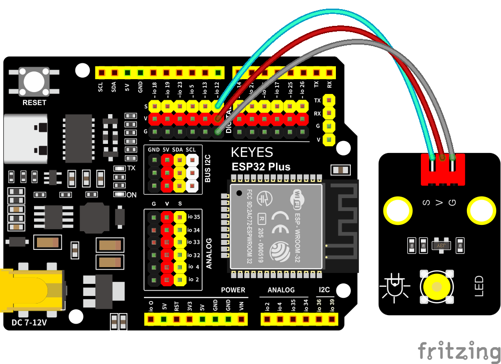

<span style="color: rgb(255, 76, 65);">注意：</span>这里体现的是实验使用到的模块接线图，若前面已经组装好智能家居并不用拆掉

**1.5. 实验代码：** 

```c
/*
  Keyes
  Blink
  www.keyes-robot.com
*/

#define led_y 12  //定义黄色led引脚为12

void setup() {    //setup函数里面的代码只运行一次
  pinMode(led_y, OUTPUT);  //设置引脚为输出模式
}

void loop() {     //loop函数里面的代码会一直循环运行
  digitalWrite(led_y, HIGH);  //控制led_w引脚输出高电平，也就是点亮LED灯
  delay(200);     //延时语句,单位为ms
  digitalWrite(led_y, LOW);   //控制led_w引脚输出低电平，也就是关闭LED灯
  delay(200);
}
```

怎么上传程序？

打开目录下我们提供的示例程序，选择开发板和串口，点击编译没错再上传，上传成功会在软件的左下角有提示。


**1.6. 实验结果：**

将示例代码上传到主板，上传成功后，外接电源供电，可以看到黄色LED灯不断地闪烁。

**1.7. 代码说明:**

|pinMode(led_y, OUTPUT);|设置引脚为输出模式|
|-|-|
|digitalWrite(led_y, HIGH);|设置引脚输出高电平|
|delay(200);|延时200毫秒|
|digitalWrite(led_y, LOW);|设置引脚输出低电平|

### 第2课 呼吸灯

**1.1. 项目介绍：**

在之前的研究中，我们知道LED有亮/灭状态，那么如何进入中间状态呢?如何输出一个中间状态让LED“半亮”?这就是我们将要学习的。呼吸灯，即LED由灭到亮，再由亮到灭，就像“呼吸”一样。那么，如何控制LED的亮度呢?我们将使用ESP32的PWM来实现这个目标。

**1.2. 模块相关资料：**


|工作电压:|DC 3.3-5V|
|-|-|
|工作电流：| 20mA|
|最大功率：|0.1W|
|控制接口:|数字口（数字输入）|
|工作温度：|-10°C ~ +50°C|
|LED显示颜色：|黄色|

**1.3. 元件知识：** 


**Analog & Digital**

模拟信号在时间和数值上都是连续的信号。相反，数字信号或离散时间信号是由一系列数字组成的时间序列。生活中的大多数信号都是模拟信号。一个熟悉的模拟信号的例子是，全天的温度是如何不断变化的，而不是突然从0到10的瞬间变化。然而，数字信号的值可以瞬间改变。这个变化用数字表示为1和0(二进制代码的基础)。如下图所示，我们可以更容易地看出它们的差异。


在实际应用中，我们经常使用二进制作为数字信号，即一系列的0和1。由于二进制信号只有两个值(0或1)，因此具有很大的稳定性和可靠性。最后，可以将模拟信号和数字信号相互转换。

**PWM：**

脉宽调制(PWM)是一种利用数字信号控制模拟电路的有效方法。普通处理器不能直接输出模拟信号。PWM技术使这种转换(将数字信号转换为模拟信号)非常方便。PWM技术利用数字引脚发送一定频率的方波，即高电平和低电平的输出，交替持续一段时间。每一组高电平和低电平的总时间一般是固定的，称为周期(注:周期的倒数是频率)。高电平输出的时间通常称为脉宽，占空比是脉宽(PW)与波形总周期(T)之比的百分比。高电平输出持续时间越长，占空比越长，模拟信号中相应的电压也就越高。下图显示了对应于脉冲宽度0%-100%的模拟信号电压在0V-3.3V(高电平为3.3V)之间的变化情况.


PWM占空比越长，输出功率越高。既然我们了解了这种关系，我们就可以用PWM来控制LED的亮度或直流电机的速度等等。从上面可以看出，PWM并不是真实的模拟信号，电压的有效值等于相应的模拟信号。因此，我们可以控制LED和其他输出模块的输出功率，以达到不同的效果。

**ESP32 与 PWM**

在ESP32上，LEDC(PWM)控制器有16个独立通道，每个通道可以独立控制频率，占空比，甚至精度。与传统的PWM引脚不同，ESP32的PWM输出引脚是可配置的，每个通道有一个或多个PWM输出引脚。最大频率与比特精度的关系如下公式所示：


其中比特的最大值为31。例如,生成PWM的8位精度(2的8次方 = 256。取值范围为0 ~ 255)，最大频率为80,000,000/255 = 312,500Hz。)

我们为ESP32提供PWM输出的库文件\<analogWrite.h\>，因此只要非常简单的一条语句analogWrite();就可以控制PWM输出了。

**1.4. 实验组件：**

|||||
|-|-|-|-|
|ESP32 Plus主板 * 1|黄色LED模块*1|3P 转杜邦线母*1|USB线*1|

**1.5. 模块接线图：**

黄色LED的控制引脚：

* 黄色LED灯（S引脚）io12


**注意：** 这里体现的是实验使用到的模块接线图，若前面已经组装好智能家居并不用拆掉

**1.6. 实验代码：** 

<span style="color: rgb(255, 76, 65);">⚠️特别提醒</span>：使用前先添加库文件“ESP32_AnalogWrite”，添加方法请点击链接： **[添加Arduino库文件](https://www.keyesrobot.cn/projects/KE3050/zh-cn/latest/docs/Arduino%20%E6%95%99%E7%A8%8B/Arduino%20%E6%95%99%E7%A8%8B.html#id7)** 查看。如果已经添加好了，就跳过。

```c
/*
  Keyes
  breath_led
  www.keyes-robot.com
*/

#include <analogWrite.h>  //导入PWM输出的库文件
#define led_y 12    //定义LED引脚

void setup(){
  pinMode(led_y, OUTPUT);  //设置引脚为输出模式
}

void loop(){
  for(int i=0; i<255; i++)  //for循环语句,不断增加变量i的值，直到最大255时退出循环
  {
    analogWrite(led_y, i);  //PWM输出，控制LED灯亮度
    delay(3);
  }
  for(int i=255; i>0; i--)  //for循环语句,不断减少变量i的值，直到最小0时退出循环
  {
    analogWrite(led_y, i);
    delay(3);
  }
}
```

**1.7. 实验结果：**

将示例代码上传到主板，上传成功后，外接电源供电，可以看到黄色LED灯渐亮渐暗，似乎在呼吸。

**1.8. 代码说明:**

|pinMode(LED, OUTPUT);|设置引脚为输出模式|
|-|-|
|int i = 0; 255; i ++|i从0到255，每次加1|
|analogWrite (led_y, i);|Led_y为PWM口，i是要输出的PWM值（0~255）|

### 第3课 台灯

**1.1. 项目介绍：**

常见的台灯，用到了LED灯和按键。通过按按键来控制灯的开与关。

按键按下，我们的单片机读取到低电平，松开读取到高电平。在这一实验课程中，我们利用按键和黄色LED做一个扩展，当按键按下时即读取到低电平时点亮黄色LED灯，松开按键时即读取到高电平时熄灭黄色LED灯，这样就可以通过一个模块控制另一个模块了。

**1.2. 模块相关资料：**


附原理图，按键有四个引脚，其中1和3是相连的，2和4是相连的，在我们未按下按键时，13与24是断开的，信号端S读取的是被4.7K的上拉电阻R1所拉高的高电平，而当我们按下按键时，13和24连通。信号端S连接到了GND，此时读取到的电平为低电平，即按下按键，传感器信号端为低电平；松开按键时，信号端为高电平。

**1.3. 实验组件：**

||||||
|-|-|-|-|-|
|ESP32 Plus主板 * 1|黄色LED模块*1|按键*1|3P 转杜邦线母*2|USB线*1|

**1.4. 模块接线图：**

木板房子⑦处按键1和黄色LED的控制引脚：

|木板房子⑦处按键1（S引脚）|io16|
|-|-|
|黄色LED灯（S引脚）|io12|


**1.5. 读取按钮值的实验代码：** 

读取按钮的状态值，在串口监视器中显示出来，这样就可以直观的看到按钮的状态值。

```c
/*
  Keyes
  button
  www.keyes-robot.com
*/

#define btn1 16

void setup() {
  Serial.begin(9600);
  pinMode(btn1, INPUT);
}

void loop() {
  boolean btn1_val = digitalRead(btn1);
  Serial.print("button1 = ");
  Serial.println(btn1_val);
  delay(100);
}

```

**1.6. 实验结果1：**

上传测试代码成功，上电后，点击打开arduino IDE的串口监视器，设置波特率为9600，如下图操作。


再按下⑦处的按键1就可以看到按键状态值的改变，如下图。

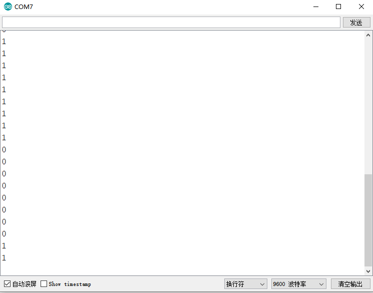

**1.7. 台灯的实验代码：** 

计算按键被点击的次数，然后再对计算的次数进行对2求余数，即可得到0或1两种状态值。

```c
/*
  Keyes
  button_led
  www.keyes-robot.com
*/

#define btn1 16
#define led_y 12
int btn_count = 0; //用于计算点击按钮的次数

void setup() {
  Serial.begin(9600);
  pinMode(btn1, INPUT);
  pinMode(led_y, OUTPUT);
}

void loop() {
  boolean btn1_val = digitalRead(btn1);
  if(btn1_val == 0) //如果按钮被按下了
  {
    delay(10);  //延时10ms，起到消除按钮抖动作用
    if(btn1_val == 0) //再次确定按钮被按下了
    {
      boolean btn_state = 1;
      while(btn_state == 1) //无限循环，直到按钮被松开
      {
        boolean btn_val = digitalRead(btn1);
        if(btn_val == 1)  //如果按钮被松开了
        {
          btn_count++;    //自动加1，计算按钮被点击的次数
          Serial.println(btn_count);
          btn_state = 0;  //按钮松开了，退出循环
        }
      }
    }
    boolean value = btn_count % 2; //对值求余数，得到0或1
    if(value == 1)
    {
      digitalWrite(led_y, HIGH);
    }
    else{
      digitalWrite(led_y, LOW);
    }
  }
} 
```

**1.8. 实验结果2：**

打开串口监视器，设置波特率为9600，打印出按键被点击的次数，并且点击一次⑦处按键1，LED灯就亮，再点击一次，LED关闭。


**1.9. 代码说明:**

digitalRead(button):读取按键的数字电平，高HIGH或者低LOW。如果该引脚未连接任何东西，则digitalRead（）可以返回HIGH或LOW（并且可以随机更改）

if..else..语句：当if后面（）的逻辑判断为真时，执行大括号里的代码；否则执行else后面{}里的代码。

### 第4课 人体感应灯

**1.1. 项目介绍：**

人体红外热释电传感器和按钮一样也是数字传感器，也就是有两个状态值0或1。还有需要人在动时才能感应的到。

人体红外热释电传感器在日常生活中是有很多应用场景的，例如，楼梯的自动感应灯，洗手台的自动感应水龙头等。

**1.2. 模块相关资料：**


|工作电压：|DC 4.5-6.5V|
|-|-|
|最大工作电流：|50MA|
|静态电流:|50uA|
|控制接口：|数字输出(高电平为3.3V ，低电平0V)|
|控制信号：|数字信号1/0|
|工作温度：|-10 ~ 50 ℃|
|最大探测距离：|4米|
|感应角度：|＜100°锥角|


**1.3. 元件知识：** 

**人体红外热释电传感器：** 它是一款基于热释电效应的人体热释电红外运动传感器，能检测运动的人体或动物身上发出的红外信号，配合菲涅尔透镜能使传感器探测范围更远更广。它主要采用RE200B-P传感器元件，当附近有人或动物运动时，人体红外热释电传感器能根据检测到的红外线，将红外线信号转化为数字信号并输出一个高电平。它可以应用于多种场合来检测人体的运动。传统的热释电红外传感器体积大，电路复杂，可靠性低。

现在我们推出这款一款新的热释电红外运动传感器，该传感器集成了数字热释电红外传感器和连接管脚。具有灵敏度高、可靠性强、超低功耗，体积小、重量轻，超低电压工作模式和外围电路简单等特点。

**1.4. 实验组件：**

||||||
|-|-|-|-|-|
|ESP32 Plus主板 * 1|人体红外热释传感器*1|黄色LED模块*1|3P 转杜邦线母*2|USB线*1|

**1.5. 模块接线图：**

人体红外热释传感器和黄色LED灯的控制引脚：

|人体红外热释传感器（S引脚）|io14|
|-|-|
|黄色LED灯（S引脚）|io12|


**1.6. 读取人体红外热释电传感器值的实验代码1：**

通过串口打印出人体红外热释电传感器的状态值。

```c
/*
  Keyes
  pyroelectric
  www.keyes-robot.com
*/

#define pyroelectric 14

void setup() {
  Serial.begin(9600);
  pinMode(pyroelectric, INPUT);
}

void loop() {
  boolean pyroelectric_val = digitalRead(pyroelectric);
  Serial.print("pyroelectric value = ");
  Serial.println(pyroelectric_val);
  delay(200);
}
```

**1.7. 实验结果1：**

上传好代码，打开串口监视器，设置波特率为9600，通过串口监视器打印的数据可以看到，当你在传感器前静止不动，读取到的值是0，稍微动一下，读取到的值就变为1.


**1.8. 人体感应灯的实验代码2：** 

只要有人在人体红外热释电传感器前面移动一下，LED灯就会亮起。

```c
/*
  Keyes
  pyroelectric_led
  www.keyes-robot.com
*/

#define pyroelectric 14
#define led_y 12  //定义黄色led引脚为12

void setup() {
  Serial.begin(9600);
  pinMode(pyroelectric, INPUT);
  pinMode(led_y, OUTPUT);  //设置引脚为输出模式
}

void loop() {
  boolean pyroelectric_val = digitalRead(pyroelectric);
  Serial.print("pyroelectric value = ");
  Serial.println(pyroelectric_val);
  delay(200);
  if(pyroelectric_val == 1)
  {
    digitalWrite(led_y, HIGH);
  }else{
    digitalWrite(led_y, LOW);
  }
}
```

**1.9. 实验结果2：**

上传好代码，上电后，用手在传感器前面移动一下，LED灯亮起，人静止不动几秒后，LED灯关闭。

### 第5课 演奏音乐

**1.1. 项目介绍：**

本实验用无源蜂鸣器播放音乐，无源蜂鸣器是通过PWM脉冲宽度调制脉冲进而调节音调，

PWM比较多用于调节LED灯的亮度或者调节无源蜂鸣器的频率，或者是电机的转动速度，电机带动的车轮速度也就能很容易控制了，在玩一些Arduino机器人时，更能体现PWM的好处。

音乐除了要“唱的准”，还要“节奏对”，每一个音符的持续时间，就是节拍啦。我们可以用延时多少来设置节拍的，例如：1拍，1秒即1000毫秒；1/2拍，0.5秒即500毫秒；1/4拍，0.25秒即250毫秒；1/8拍，0.125秒即125毫秒….，我们可以试一试组合不同的音调和节拍，看看会有什么不同的效果。

**1.2. 模块相关资料：**

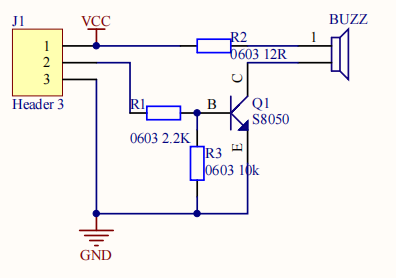

工作电压：3.3-5V（DC）

电流：50MA

工作温度：-10摄氏度 到 +50摄氏度

尺寸：31.6mmx23.7mm

接口：3PIN接口

输入信号：数字信号（方波）

**1.3. 元件知识：** 

无源蜂鸣器：其内部不带震荡电路，控制时需要在元件正极输入不同频率的方波，负极接地，从而控制喇叭功放元件响起不同频率的声音。

**1.4. 实验组件：**

||||||
|-|-|-|-|-|
|ESP32 Plus主板 * 1|无源蜂鸣器模块*1|按键*1|3P 转杜邦线母*2|USB线*1|

**1.5. 模块接线图：**

木板房子⑦处按键1和无源蜂鸣器的控制引脚：

|木板房子⑦处按键1（S引脚）|io16|
|-|-|
|无源蜂鸣器（S引脚）|io25|


**1.6. 播放生日快乐的实验代码1：** 

<span style="color: rgb(255, 76, 65);">⚠️特别提醒</span>：使用前先添加库文件“ESP32Tone”，添加方法请点击链接： **[添加Arduino库文件](https://www.keyesrobot.cn/projects/KE3050/zh-cn/latest/docs/Arduino%20%E6%95%99%E7%A8%8B/Arduino%20%E6%95%99%E7%A8%8B.html#id7)** 查看。如果已经添加好了，就跳过。

```c
/*
  Keyes
  buzzer
  www.keyes-robot.com
*/

#include <ESP32Tone.h>
#define buzzer_pin 25

void setup() {
  pinMode(buzzer_pin, OUTPUT);
  birthday();
}

void loop() {
  
}

void birthday()
{
  tone(buzzer_pin,294,250,0);  //4个参数分别为，引脚，频率，延时，通道
  tone(buzzer_pin,440,250,0);
  tone(buzzer_pin,392,250,0);
  tone(buzzer_pin,532,250,0);
  tone(buzzer_pin,494,250,0);
  tone(buzzer_pin,392,250,0);
  tone(buzzer_pin,440,250,0);
  tone(buzzer_pin,392,250,0);
  tone(buzzer_pin,587,250,0);
  tone(buzzer_pin,532,250,0);
  tone(buzzer_pin,392,250,0);
  tone(buzzer_pin,784,250,0);
  tone(buzzer_pin,659,250,0);
  tone(buzzer_pin,532,250,0);
  tone(buzzer_pin,494,250,0);
  tone(buzzer_pin,440,250,0);
  tone(buzzer_pin,698,250,0);
  tone(buzzer_pin,659,250,0);
  tone(buzzer_pin,532,250,0);
  tone(buzzer_pin,587,250,0);
  tone(buzzer_pin,532,500,0);
  noTone(buzzer_pin,0);  //关闭
}
```

**1.7. 实验结果1：**

上传代码到开发板，上电后，就会听到无源蜂鸣器播放一次生日快乐。

**1.8. 音乐盒的实验代码2：** 

做个音乐盒，通过按键来切换曲子。

<span style="color: rgb(255, 76, 65);">⚠️特别提醒</span>：使用前先添加库文件“ESP32Tone”和“ESP32_music_lib_home”，添加方法请点击链接： **[添加Arduino库文件](https://www.keyesrobot.cn/projects/KE3050/zh-cn/latest/docs/Arduino%20%E6%95%99%E7%A8%8B/Arduino%20%E6%95%99%E7%A8%8B.html#id7)** 查看。如果已经添加好了，就跳过。

```c
/*
  Keyes
  music
  www.keyes-robot.com
*/

#include <ESP32Tone.h>
#include <musicESP32_home.h>   
music Music(25);
#define btn1 16
int btn_count = 0; //用于计算点击按钮的次数
boolean music_flag = 0;

void setup() {
  Serial.begin(9600);
  pinMode(btn1, INPUT);
  pinMode(25, OUTPUT);
//  Music.tetris();
//  Music.birthday();
//  Music.Ode_to_Joy();
//  Music.christmas();
//  Music.super_mario();
//  Music.star_war_tone();
}

void loop() {
  boolean btn1_val = digitalRead(btn1);
  if(btn1_val == 0) //如果按钮被按下了
  {
    delay(10);  //延时10ms，起到消除按钮抖动作用
    if(btn1_val == 0) //再次确定按钮被按下了
    {
      boolean btn_state = 1;
      while(btn_state == 1) //无限循环，直到按钮被松开
      {
        boolean btn_val = digitalRead(btn1);
        if(btn_val == 1)  //如果按钮被松开了
        {
          music_flag = 1;
          btn_count++;    //自动加1，计算按钮被点击的次数
          Serial.println(btn_count);
          if(btn_count == 4)
          {
            btn_count = 1;
          }
          switch(btn_count)
          {
            case 1: if(music_flag == 1){Music.Ode_to_Joy();music_flag=0;} break;
            case 2: if(music_flag == 1){Music.christmas();music_flag=0;} break;
            case 3: if(music_flag == 1){Music.tetris();music_flag=0;} break;
          }
          btn_state = 0;  //按钮松开了，退出循环
        }
      }
    }
  }
}
```

**1.9. 实验结果2：**

上传代码到开发板，上电后，点击一次按键1，播放一曲Ode_to_Joy，播放完之后，再点击按键1，播放christmas，播放完之后，再点击按键1，播放tetris。

### 第6课 自动门窗

**1.1. 项目介绍：**

当我们在制作智能家居时，经常会将舵机和门、窗等固定在一起。这样，我们就可以利用舵机转动，带动门、窗等开或关，从而起到家居生活的智能化功能。既然是自动门窗，那就需要动力装置，我们使用的是180度的舵机。再加上一些传感器，就会变得更加自动化，例如添加个雨滴传感器，就可以做下雨自动关窗；增加个RFID，就可以实现刷卡开门等。

**1.2. 舵机相关资料：**

**舵机：** 舵机是一种位置伺服的驱动器，主要是由外壳、电路板、无核心马达、齿轮与位置检测器所构成。其工作原理是由接收机或者单片机发出信号给舵机，其内部有一个基准电路，产生周期为20ms，宽度为1.5ms
的基准信号，将获得的直流偏置电压与电位器的电压比较，获得电压差输出。经由电路板上的IC
判断转动方向，再驱动无核心马达开始转动，透过减速齿轮将动力传至摆臂，同时由位置检测器送回信号，判断是否已经到达定位。适用于那些需要角度不断变化并可以保持的控制系统。当电机转速一定时，通过级联减速齿轮带动电位器旋转，使得电压差为0，电机停止转动。

伺服电机有多种规格，但它们都有三根连接线，分别是棕色、红色、橙色(不同品牌可能有不同的颜色)。棕色为GND，红色为电源正极，橙色为信号线。


舵机的伺服系统由可变宽度的脉冲来进行控制，橙色的控制线是用来传送脉冲的。一般而言，PWM控制舵机的基准信号周期为20ms（50Hz），理论上脉宽应在1ms到2ms之间，对应控制舵机角度是0°～180°。但是，实际上更多控制舵机的脉宽范围是0.5ms
到2.5ms，具体需要自己实际调试下。


经过实测，舵机的脉冲范围为0.65ms~2.5ms。180度舵机，对应的控制关系是这样的：

|高电平时间|舵机角度|基准信号周期时间（20ms）|
|-|-|-|
|0.65ms|0度|0.65ms高电平+19.35ms低电平|
|1.5ms|90度|1.5ms高电平+18.5ms低电平|
|2.5ms|180度|2.5ms高电平+17.5ms低电平|

**舵机的规格参数：**

|工作电压：|DC 4.8V〜6V|可操作角度范围：|大约180°(在500→2500μsec)|
|-|-|-|-|
|脉波宽度范围：|500→2500 μsec|外观尺寸：|22.9*12.2*30mm|

|空载转速：|0.12±0.01 sec/60度（DC 4.8V） 0.1±0.01 sec/60度（DC 6V）|
|-|-|
|空载电流：|200±20mA（DC 4.8V） 220±20mA（DC 6V）|
|停止扭力：|1.3±0.01kg·cm（DC 4.8V） 1.5±0.1kg·cm（DC 6V）|
|停止电流：|≦850mA（DC 4.8V） ≦1000mA（DC 6V）|
|待机电流：|3±1mA（DC 4.8V） 4±1mA（DC 6V）|
|重量:|9±1g (without servo horn)|
|使用温度：|-30℃~60℃|

**1.3. 实验组件：**

||||||
|-|-|-|-|-|
|ESP32 Plus主板 * 1|水滴传感器模块*1|180度舵机*2|3P 转杜邦线母*1|USB线*1|

**1.4. 模块接线图：**

水滴传感器，窗户舵机和门舵机的控制引脚：

|窗户舵机（橙黄色线引脚）|io5|
|-|-|
|门舵机（橙黄色线引脚）|io13|
|水滴传感器（S引脚）|io34|


**1.5. 控制门来回转动的实验代码1：** 

<span style="color: rgb(255, 76, 65);">⚠️特别提醒</span>：使用前先添加库文件“ESP32Servo”，添加方法请点击链接： **[添加Arduino库文件](https://www.keyesrobot.cn/projects/KE3050/zh-cn/latest/docs/Arduino%20%E6%95%99%E7%A8%8B/Arduino%20%E6%95%99%E7%A8%8B.html#id7)** 查看。如果已经添加好了，就跳过。

```c
/*
  Keyes
  servo
  www.keyes-robot.com
*/

##include <ESP32_Servo.h>
Servo myservo;  // 创建舵机对象来控制舵机
                //在ESP32上可以创建16个伺服对象
                
int pos = 0;    // 建立变量来存储伺服位置
// 推荐的ESP32 PWM GPIO引脚包括2,4,12-19,21-23,25-27,32-33 
int servoPin = 13;
                
void setup() {
  myservo.attach(servoPin, 500, 2400);   // 将伺服管脚13连接到伺服对象上

}

void loop() {
  for (pos = 0; pos <= 180; pos += 1) { // 从0°到180°
    // 每一步1度
    myservo.write(pos);              // 告诉舵机去的位置在变量'pos'
    delay(15);                       // 等待15ms舵机到达对应的位置
  }
  for (pos = 180; pos >= 0; pos -= 1) { // 从180度到0度
    myservo.write(pos);              // 告诉舵机去的位置在变量'pos'
    delay(15);                       // 等待15ms舵机到达对应的位置
  }
}
```

**1.6. 实验结果1：**

上传测试代码成功，外接电源供电后，“智能家居的门”0~180度来回转动，并且每15ms转动一度。

**1.7. 下雨自动关窗的实验代码2：** 

使用舵机和雨滴传感器搭配做个下雨自动关窗装置。

**雨滴传感器：** 这是个模拟输入传感器，水分覆盖到检测面上的面积越大，返回的值越大（范围0~4096）

<span style="color: rgb(255, 76, 65);">⚠️特别提醒</span>：使用前先添加库文件“ESP32Servo”，添加方法请点击链接： **[添加Arduino库文件](https://www.keyesrobot.cn/projects/KE3050/zh-cn/latest/docs/Arduino%20%E6%95%99%E7%A8%8B/Arduino%20%E6%95%99%E7%A8%8B.html#id7)** 查看。如果已经添加好了，就跳过。

```c
/*
  Keyes
  Auto_window
  www.keyes-robot.com
*/

#include <ESP32_Servo.h>
Servo myservo;
#define servoPin 5
#define waterPin 34


void setup() {
  Serial.begin(9600);
  pinMode(waterPin, INPUT);
  myservo.attach(servoPin, 500, 2500);
  myservo.write(100);
  delay(200);
}

void loop() {
  int water_val = analogRead(waterPin);
  Serial.println(water_val);
  if(water_val > 3300) {
    myservo.write(0);
    delay(200);
  }
  else {
    myservo.write(100);
    delay(200);
  }
}

```

**1.8. 实验结果2：**

上传测试代码成功，外接电源供电后，开始窗户自动打开，然后用手（手皮肤有水）触碰一下雨滴传感器，窗户就会关闭。

### 第7课 氛围灯

**1.1. 项目介绍：**

智能家居的氛围灯是4个SK6812RGB LED，RGB LED属于简单的发光模块，可以通过调节色彩调出不同颜色的灯效，可广泛应用于建筑物、桥梁、道路、花园、庭院、地板等领域的装饰照明与会场布置、圣诞节、万圣节、情人节、复活节、国庆节等节日期间烘托气氛等场景。在本实验中，实现各种灯光效果。

**1.2. 模块相关资料：**

**SK6812RGB：** 从原理图中可以看出，这4个RGBLED都是串联起来的，在电压电流充足的情况下可以接几百个RGB LED，都可以用一根信号线控制任意一个RGB LED，并且让它显示任意一种颜色。每一颗RGBLED都是一个独立的像素点，每个像素点都是由R、G、B三基色颜色组成，可实现256级亮度显示，完成16777216种颜色的全真色彩显示，同时像素点内部包含了智能数字接口数据锁存信号整形放大驱动电路，还内置信号整形电路，有效保证了像素点光的颜色高度一致。

数据协议采用单线归零码的通讯方式，像素点在上电复位以后，S端接受从控制器传输过来的数据，首先送过来的24bit数据被第一个像素点提取后，送到像素点内部的数据锁存器。这个6812RGB通讯协议与驱动已经在底层封装好了，我们直接调用函数的接口就可以使用，简单方便，LED具有低电压驱动，环保节能，亮度高，散射角度大，一致性好，超低功率，超长寿命等优点。


**1.3. 实验组件：**

||||||
|-|-|-|-|-|
|ESP32 Plus主板 * 1|按键*2|SK6812RGB灯*1|3P 转杜邦线母*3|USB线*1|

**1.4. 模块接线图：**

按键1，按键2和SK6812RGB灯模块的控制引脚：

|SK6812RGB灯（S引脚）|io26|
|-|-|
|按键1（S引脚）|io16|
|按键2（S引脚）|io27|

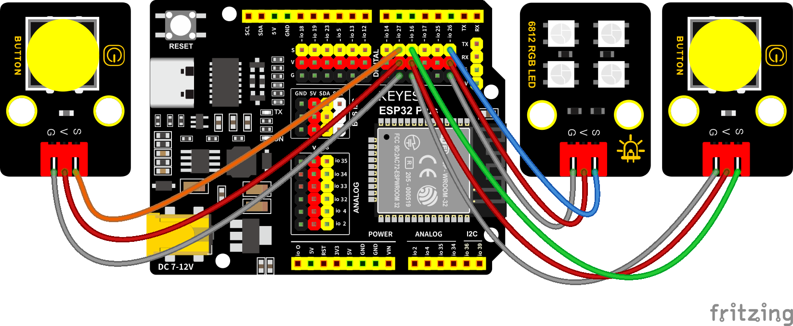

**1.5. 控制SK6812的实验代码1：** 

控制SK6812显示各种灯效

<span style="color: rgb(255, 76, 65);">⚠️特别提醒</span>：使用前先添加库文件“Adafruit_NeoPixel-master”，添加方法请点击链接： **[添加Arduino库文件](https://www.keyesrobot.cn/projects/KE3050/zh-cn/latest/docs/Arduino%20%E6%95%99%E7%A8%8B/Arduino%20%E6%95%99%E7%A8%8B.html#id7)** 查看。如果已经添加好了，就跳过。

```c
/*
  Keyes
  sk6812
  www.keyes-robot.com
*/

#include <Adafruit_NeoPixel.h>
#ifdef __AVR__
 #include <avr/power.h> // 所需的16兆赫Adafruit Trinket
#endif
// Arduino上的哪个引脚连接到NeoPixels上?
// 对于Trinket or Gemma，我们建议改为1:
#define LED_PIN    26
// Arduino上有多少个新像素?
#define LED_COUNT 4
// 声明我们的NeoPixel条带对象:
Adafruit_NeoPixel strip(LED_COUNT, LED_PIN, NEO_GRB + NEO_KHZ800);

void setup() {
  // 这些线路是专门支持Adafruit Trinket 的5V 16MHz.
  // 任何其他板，你可以删除这部分(但没有伤害留下它):
#if defined(__AVR_ATtiny85__) && (F_CPU == 16000000)
  clock_prescale_set(clock_div_1);
#endif
  // 结束 Trinket-specific 代码.

  strip.begin();           // 初始化NeoPixel条带对象(REQUIRED)
  strip.show();            // 尽快关闭所有像素
  strip.setBrightness(50); // 将亮度设置为1/5(最大值为255)
}


// loop() 功能——只要开发板开着，就会重复运行 ---------------

void loop() {
  // 沿着RGB条带的长度设置各种颜色...
  colorWipe(strip.Color(255,   0,   0), 50); // Red
  colorWipe(strip.Color(  0, 255,   0), 50); // Green
  colorWipe(strip.Color(  0,   0, 255), 50); // Blue

  // 在不同的颜色做一个跑马灯的效果...
  theaterChase(strip.Color(127, 127, 127), 50); // 白色,一半亮度
  theaterChase(strip.Color(127,   0,   0), 50); // 红色,一半亮度
  theaterChase(strip.Color(  0,   0, 127), 50); // 蓝色,一半亮度

  rainbow(10);             // 沿着整个RGB条带流动的彩虹循环
  theaterChaseRainbow(50); // Rainbow-enhanced theaterChase variant
}


// 我们自己创建动画效果的一些功能 -----------------

// 用颜色一个接一个地填充条纹像素。RGB条带未先清除;
//  任何东西都会被一个像素一个像素地覆盖. 传入颜色(作为一个“打包”的32位值，你可以通过调用strip来获得。
// 如上面loop()函数中所示的颜色(红、绿、蓝),以及像素之间的延迟时间(以毫秒为单位).
void colorWipe(uint32_t color, int wait) {
  for(int i=0; i<strip.numPixels(); i++) { // 对于条带中的每个像素...
    strip.setPixelColor(i, color);         //  设置像素的颜色(在RAM中)
    strip.show();                          //  更新条带以匹配
    delay(wait);                           //  暂停一会
  }
}

// 跑马灯追逐的效果。传入一个颜色(32位值，如上所述，strip.Color(r,g,b))和帧之间的延迟时间(以毫秒为单位).
void theaterChase(uint32_t color, int wait) {
  for(int a=0; a<10; a++) {  // 重复十次...
    for(int b=0; b<3; b++) { //  'b'从0数到2...
      strip.clear();         //   将RAM中的所有像素设置为0(关闭)
      // 'c'从'b'开始计数，每步3次...
      for(int c=b; c<strip.numPixels(); c += 3) {
        strip.setPixelColor(c, color); // 设置像素c的值为color
      }
      strip.show(); // 更新RGB条带的内容
      delay(wait);  // 暂停一会
    }
  }
}

// 彩虹沿着整条带子循环。在帧之间传递延迟时间(毫秒).
void rainbow(int wait) {
  // 第一个像素的色调在色轮中运行5个完整的循环.
  // 色轮的范围是65536，但如果我们滚动它是可以的, 从0数到5*65536. 
  // 每次在firstPixelHue中添加256意味着我们将让5*65536/256 = 1280通过这个外部循环:
  for(long firstPixelHue = 0; firstPixelHue < 5*65536; firstPixelHue += 256) {
    for(int i=0; i<strip.numPixels(); i++) { // For each pixel in strip...
      // 偏移像素色相的量，使色轮沿色带长度旋转一圈(范围65536)
      // (strip.numPixels() 步骤):
      int pixelHue = firstPixelHue + (i * 65536L / strip.numPixels());
      // colorhsv()可以接受1或3个参数:一个色调(0到65535)或可选地添加饱和度和值(亮度)(每个0到255).
      // 这里我们只使用单参数的色调变体. 结果通过strip.gamma32()传递，以便在分配给每个像素之前提供“更真实的”颜色:
      strip.setPixelColor(i, strip.gamma32(strip.ColorHSV(pixelHue)));
    }
    strip.show(); // 更新带新的内容
    delay(wait);  // 暂停一会
  }
}

// 彩虹跑马灯的效果。在帧之间传递延迟时间(毫秒).
void theaterChaseRainbow(int wait) {
  int firstPixelHue = 0;     // 第一个像素从红色开始(色调0)
  for(int a=0; a<30; a++) {  // 重复30次...
    for(int b=0; b<3; b++) { //  'b'从0数到2...
      strip.clear();         //   将RAM中的所有像素设置为0(关闭)
      // 'c'从'b'开始计数，以3为单位递增...
      for(int c=b; c<strip.numPixels(); c += 3) {
        // 像素“c”的色相偏移量使色轮沿条带的长度(strip. numpixels()步骤)旋转一圈(范围65536):
        int      hue   = firstPixelHue + c * 65536L / strip.numPixels();
        uint32_t color = strip.gamma32(strip.ColorHSV(hue)); // 颜色 -> RGB
        strip.setPixelColor(c, color); // 设置像素c的值为color
      }
      strip.show();                // 更新色带的内容
      delay(wait);                 // 暂停一会
      firstPixelHue += 65536 / 90; // 一个周期的彩色轮超过90帧
    }
  }
}
```

**1.6. 实验结果1：**

将示例代码上传到主板，上传成功后，外接电源供电，智能家居的氛围灯显示各种颜色和各种灯效。

**1.7. 按钮切换灯颜色的实验代码2：** 

两个按钮，左右切换氛围灯的颜色。

<span style="color: rgb(255, 76, 65);">⚠️特别提醒</span>：使用前先添加库文件“Adafruit_NeoPixel-master”，添加方法请点击链接： **[添加Arduino库文件](https://www.keyesrobot.cn/projects/KE3050/zh-cn/latest/docs/Arduino%20%E6%95%99%E7%A8%8B/Arduino%20%E6%95%99%E7%A8%8B.html#id7)** 查看。如果已经添加好了，就跳过。

```c
/*
  Keyes
  btn_6812
  www.keyes-robot.com
*/

#define btn1 16
#define btn2 27
#include <Adafruit_NeoPixel.h>
#ifdef __AVR__
 #include <avr/power.h> // 所需的16兆赫Adafruit Trinket
#endif
// Arduino上的哪个引脚连接到NeoPixels上?
// 对于Trinket or Gemma，我们建议改为1:
#define LED_PIN    26
// Arduino上有多少个新像素?
#define LED_COUNT 4
// 声明我们的NeoPixel条带对象:
Adafruit_NeoPixel strip(LED_COUNT, LED_PIN, NEO_GRB + NEO_KHZ800);

int btn_count = 0; //用于计算点击按钮的次数

void setup() {
  Serial.begin(9600);
  pinMode(btn1, INPUT);
  pinMode(btn2, INPUT);
  #if defined(__AVR_ATtiny85__) && (F_CPU == 16000000)
    clock_prescale_set(clock_div_1);
  #endif
    // 结束 Trinket-specific 代码.

  strip.begin();           // 初始化NeoPixel条带对象(REQUIRED)
  strip.show();            // 尽快关闭所有像素
  strip.setBrightness(50); // 将亮度设置为1/5(最大值为255)

}

void loop() {
  boolean btn1_val = digitalRead(btn1);
  boolean btn2_val = digitalRead(btn2);
  if(btn1_val == 0) //如果按钮被按下了
  {
    delay(10);  //延时10ms，起到消除按钮抖动作用
    if(btn1_val == 0) //再次确定按钮被按下了
    {
      boolean btn_state = 1;
      while(btn_state == 1) //无限循环，直到按钮被松开
      {
        boolean btn_val = digitalRead(btn1);
        if(btn_val == 1)  //如果按钮被松开了
        {
          btn_count--;    //自动加1，计算按钮被点击的次数
          if(btn_count <= 0)
          {
            btn_count = 0;
          }
          Serial.println(btn_count);
          btn_state = 0;  //按钮松开了，退出循环
        }
      }
    }
  }
    
  if(btn2_val == 0) //如果按钮被按下了
  {
    delay(10);  //延时10ms，起到消除按钮抖动作用
    if(btn2_val == 0) //再次确定按钮被按下了
    {
      boolean btn_state2 = 1;
      while(btn_state2 == 1) //无限循环，直到按钮被松开
      {
        boolean btn2_val = digitalRead(btn2);
        if(btn2_val == 1)  //如果按钮被松开了
        {
          btn_count++;    //自动加1，计算按钮被点击的次数
          if(btn_count >= 6)
          {
            btn_count = 6;
          }
          Serial.println(btn_count);
          btn_state2 = 0;  //按钮松开了，退出循环
        }
      }
    }
  }

  switch(btn_count)
  {
    case 0: colorWipe(strip.Color(0,   0,   0), 50); break;
    case 1: colorWipe(strip.Color(255,  0,   0), 50); break;
    case 2: colorWipe(strip.Color(0,   255,   0), 50); break;
    case 3: colorWipe(strip.Color(0,   0,   255), 50); break;
    case 4: colorWipe(strip.Color(255,   255,   0), 50); break;
    case 5: colorWipe(strip.Color(255,   0,   255), 50); break;
    case 6: colorWipe(strip.Color(255,   255,   255), 50); break;
  }
}

void colorWipe(uint32_t color, int wait) {
  for(int i=0; i<strip.numPixels(); i++) { // 对于条带中的每个像素...
    strip.setPixelColor(i, color);         //  设置像素的颜色(在RAM中)
    strip.show();                          //  更新条带以匹配
    delay(wait);                           //  暂停一会
  }
}
```

**1.8. 实验结果2：**

将示例代码上传到主板，上传成功后，外接电源供电，通过点击按键1和按键2来切换氛围灯的颜色。

### 第8课 风扇

**1.1. 项目介绍：**

130电机控制模块采用HR1124S电机控制芯片。HR1124S是应用于直流电机方案的单通道H桥驱动器芯片。HR1124S的H桥驱动部分采用低导通电阻的PMOS和NMOS功率管。低导通电阻保证芯片低的功率损耗，使得芯片安全工作更长时间。此外HR1124S拥有低待机电流，低静态工作电流，这些性能使HR1124S易用于玩具方案。

该模块兼容各种单片机控制板，如arduino系列单片机。模块上自带的防反插红色端子间距为2.54mm，实验中，我们可通过输出到两个信号端IN+和IN-的电压方向来控制电机的转动方向，使用PWM输出控制风扇的转速，让电机转动起来。

**1.2. 模块相关资料：**

**（1）元件知识：**

130电机控制模块采用HR1124S电机控制芯片。HR1124S是应用于直流电机方案的单通道H桥驱动器芯片。HR1124S的H桥驱动部分采用低导通电阻的PMOS和NMOS功率管。低导通电阻保证芯片低的功率损耗，使得芯片安全工作更长时间。此外HR1124S拥有低待机电流，低静态工作电流，这些性能使HR1124S易用于玩具方案。

该模块兼容各种单片机控制板，如arduino系列单片机。模块上自带的防反插红色端子间距为2.54mm，实验中，我们可通过输出到两个信号端IN+和IN-的电压方向来控制电机的转动方向，使用PWM输出控制风扇的转速，让电机转动起来。


|工作电压：|3.3-5V(DC)|最大电流：|200mA (DC5V)|
|-|-|-|-|
|最大功率：|1W|控制接口：|双数字口（数字输入）|
|工作温度：|-10°C ~+50°C|环保属性：|ROHS|

**（2）控制方法**

需要两个引脚控制风扇的电机，一引脚为IN+，二引脚为IN-。PWM值范围是0~255，当两个引脚的PWM输出一定差值时，风扇就能转动。

|IN+ - INB- = -45|顺时针转动|
|-|-|
|IN+- IN- ;= 45|逆时针转动|
|IN+ == 0 , IN- == 0|停止|

**1.3. 实验组件：**

||||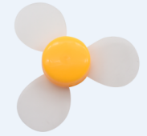|
|-|-|-|-|
|ESP32 Plus主板 * 1|按键*2|130电机模块*1|风扇叶*1|
|||||
|4P 转杜邦线母*1|3P 转杜邦线母*2|USB线*1||

**1.4. 模块接线图：**

按键1，按键2和130电机模块的控制引脚：

|按键1（S引脚）|io16|
|-|-|
|按键2（S引脚）|io27|
|电机模块的IN+引脚|io19|
|电机模块的IN-引脚|io18|


**1.5. 控制风扇转动的实验代码1：** 

控制风扇的正反转和速度。

<span style="color: rgb(255, 76, 65);">⚠️特别提醒</span>：使用前先添加库文件“ESP32_AnalogWrite”，添加方法请点击链接： **[添加Arduino库文件](https://www.keyesrobot.cn/projects/KE3050/zh-cn/latest/docs/Arduino%20%E6%95%99%E7%A8%8B/Arduino%20%E6%95%99%E7%A8%8B.html#id7)** 查看。如果已经添加好了，就跳过。

```c
/*
  Keyes
  fan
  www.keyes-robot.com
*/

##include <analogWrite.h>
##define fanPin1 19
##define fanPin2 18

void setup() {
  pinMode(fanPin1, OUTPUT);
  pinMode(fanPin2, OUTPUT);
}

void loop() {
  digitalWrite(fanPin1, LOW); //pwm = 0
  analogWrite(fanPin2, 180);
  delay(3000);
  digitalWrite(fanPin1, LOW);
  digitalWrite(fanPin2, LOW);
  delay(1000);
  digitalWrite(fanPin1, HIGH); //pwm = 255
  analogWrite(fanPin2, 210);
  delay(3000);
  digitalWrite(fanPin1, LOW);
  digitalWrite(fanPin2, LOW);
  delay(1000);

}
```

**1.6. 实验结果1：**

烧录好测试程序，上电后，可以看到顺时针和逆时针不同转速转动。

**1.7. 按钮开关风扇的实验代码2：** 

一台简易的风扇，通过一个按钮开关风扇，另一个按钮控制风扇的速度。

<span style="color: rgb(255, 76, 65);">⚠️特别提醒</span>：使用前先添加库文件“ESP32_AnalogWrite”，添加方法请点击链接： **[添加Arduino库文件](https://www.keyesrobot.cn/projects/KE3050/zh-cn/latest/docs/Arduino%20%E6%95%99%E7%A8%8B/Arduino%20%E6%95%99%E7%A8%8B.html#id7)** 查看。如果已经添加好了，就跳过。

```c
/*
  Keyes
  btn_fan
  www.keyes-robot.com
*/

##include <analogWrite.h>
##define fanPin1 19
##define fanPin2 18
##define btn1 16
int btn_count = 0; //用于计算点击按钮的次数
##define btn2 27
int btn_count2 = 0;
int speed_val = 130; //定义速度的变量

void setup() {
  Serial.begin(9600);
  pinMode(btn1, INPUT);
  pinMode(btn2, INPUT);
  pinMode(fanPin1, OUTPUT);
  pinMode(fanPin2, OUTPUT);
}

void loop() {
  boolean btn1_val = digitalRead(btn1);
  if(btn1_val == 0) //如果按钮被按下了
  {
    delay(10);  //延时10ms，起到消除按钮抖动作用
    if(btn1_val == 0) //再次确定按钮被按下了
    {
      boolean btn_state = 1;
      while(btn_state == 1) //无限循环，直到按钮被松开
      {
        boolean btn_val = digitalRead(btn1);
        if(btn_val == 1)  //如果按钮被松开了
        {
          btn_count++;    //自动加1，计算按钮被点击的次数
          Serial.println(btn_count);
          btn_state = 0;  //按钮松开了，退出循环
        }
      }
    }
    boolean value = btn_count % 2; //对值求余数，得到0或1
    while(value == 1)
    {
      //Serial.println("on");
      digitalWrite(fanPin1, LOW); //pwm = 0
      analogWrite(fanPin2, speed_val);
      
      boolean btn2_val = digitalRead(btn2);
      if(btn2_val == 0)
      {
        delay(10);
        if(btn2_val == 0)
        {
          boolean btn_state2 = 1;
          while(btn_state2 == 1)
          {
            boolean btn2_val = digitalRead(btn2);
            if(btn2_val == 1)
            {
              btn_count2++;
              if(btn_count2 > 3)
              {
                btn_count2 = 1;
              }
              switch(btn_count2)
              {
                case 1: speed_val = 130; Serial.println(speed_val);break;  //调速
                case 2: speed_val = 180; Serial.println(speed_val);break;
                case 3: speed_val = 230; Serial.println(speed_val);break;
              }
              btn_state2 = 0;
            }
          }
        }
      }
      boolean btn1_val = digitalRead(btn1);
      if(btn1_val == 0) //如果按钮被按下了
      {
        digitalWrite(fanPin1, LOW); //pwm = 0
        analogWrite(fanPin2, 0);
        value = 0;  //退出循环
      }
      
    }
  }
} 
```

**1.8. 实验结果2：**

烧录好测试程序，上电后，点击一下按钮1，风扇开始转动，点击按钮2进行调速，总共可以调3个不同转速，再按一下按钮1，风扇停止。

### 第9课 LCD1602显示

**1.1. 项目介绍：**


现代社会人类每天面对最多的就是屏幕了吧，电脑、手机和各类电子产品。屏幕是人与电子设备最好的交互方式之一，直观明了。

Keyes I2C 1602 LCD模块是可以显示2行，每行16个字符的液晶显示器模块。液晶显示器显示蓝底白字，自带I2C通信模块，使用时只需连接单片机I2C通信接口，大大节约了单片机资源。最初的1602 LCD需要7个IO端口来启动和运行，而Keyes I2C 1602 LCD模块内置Arduino IIC/I2C接口，节省了5个IO端口。和Arduino液晶库文件兼容，用起来很简单。

LCD非常适合打印数据和显示数字。可以显示32个字符(16x2)。在Keyes I2C 1602 LCD模块的背面有一个蓝色的电位器，可以转动电位器来调整对比度。连接时请注意，LCD的GND和VCC不能接反，否则会损坏LCD。

**1.2. 模块相关资料：**

|工作电压：|DC5V|I2C地址：|0x27|控制接口：|I2C|
|-|-|-|-|-|-|
|工作电流：| 130mA|工作环境温度：|0°C ~ 45°C（推荐）|驱动芯片：|PCF8574T|

|GND：一个接地的引脚|VCC：一个连接到+5V电源的引脚|SDA：一个连接到SDA（或A4）的引脚，用于IIC通信|
|-|-|-|
|SCL：一个连接到SCL（或A5）的引脚，用于IIC通信|背光（蓝底白字）|可调对比度|

**1.3. 实验组件：**

|||||
|-|-|-|-|
|ESP32 Plus主板 * 1|I2C LCD1602模块* 1|4P 转杜邦线母*1|USB线*1|

**1.4. 模块接线图：** 

I2C 1602 LCD模块的控制引脚：

|I2C 1602 LCD模块的SCL引脚|SCL|
|-|-|
|I2C 1602 LCD模块的SDA引脚|SDA|


**1.5. 屏幕显示字符串的实验代码：** 

<span style="color: rgb(255, 76, 65);">⚠️特别提醒</span>：使用前先添加库文件“LiquidCrystal_I2C”和“Wire”，添加方法请点击链接： **[添加Arduino库文件](https://www.keyesrobot.cn/projects/KE3050/zh-cn/latest/docs/Arduino%20%E6%95%99%E7%A8%8B/Arduino%20%E6%95%99%E7%A8%8B.html#id7)** 查看。如果已经添加好了，就跳过。

```c
/*
  Keyes
  lcd
  www.keyes-robot.com
*/

##include <Wire.h>
##include <LiquidCrystal_I2C.h>
LiquidCrystal_I2C mylcd(0x27,16,2);

void setup(){
  mylcd.init();
  mylcd.backlight();
}

void loop(){
  mylcd.setCursor(0, 0);
  mylcd.print("hello");
  mylcd.setCursor(0, 1);
  mylcd.print("keyes");
  //mylcd.clear();
}
```

**1.6. 实验结果：**

上传好程序，上电后，LCD1602第一行显示hello，第二行显示keyes。

**1.7. 代码说明:**

LiquidCrystal_I2C lcd (0x27,16,2):这个LCD1602可以显示2行16个字符，LCD IIC地址为0x27

mylcd.init ()：LCD初始化函数

mylcd.backlight ()：LCD清屏函数

mylcd.print ("Hello, world!")：LCD显示内容

### 第10课 MQ2模拟气体传感器实验

**1.1. 项目介绍：**

气体传感器检测到危险气体比较浓时，蜂鸣器发出警报声，显示屏显示dangerous。

**1.2. 模块相关资料：**


**（1）元件知识**

气体传感器（MQ-2）可用于家庭用气体泄漏报警器、工业用可燃气体报警器以及便携式气体检测仪器，适宜于液化气、苯、烷、酒精、氢气、烟雾等的探测，被广泛运用到各种消防报警系统中。故因此，气体传感器（MQ-2）可以准确来说是一个多种气体探测器，同时还具有灵敏度高、响应快、稳定性好、寿命长、驱动电路简单等优点。

气体传感器（MQ-2）检测可燃气体与烟雾的浓度范围是300~10000ppm，对天然气、液化石油气等烟雾有很高的灵敏度，尤其对烷类烟雾更为敏感。在使用之前必须加热一段时间，这样输出的电阻和电压较准确。但是加热电压不宜过高，否则会导致内部的信号线熔断。

模拟气体（MQ-2）传感器属于二氧化锡半导体气敏材料，属于表面离子式N型半导体。处于200~300摄氏度时，二氧化锡吸附空气中的氧，形成氧的负离子吸附，使半导体中的电子密度减少，从而使其电阻值增加。当与空气中可燃气体和烟雾烟雾接触时，如果晶粒间界处的势垒收到烟雾的调至而变化，就会引起表面导电率的变化。利用这一点就可以获得烟雾或可燃气体存在的信息，空气中烟雾或可燃气体的浓度越大，导电率越大，输出电阻越低，则输出的模拟信号就越大。

此外，通过旋转电位器可以调整气体传感器（MQ-2）灵敏度。上电后，传感器上的一个指示灯亮绿灯，并且还可以调节蓝色的正方体电位器，使模块上另一个指示灯介于不亮与亮之间的临界点时，灵敏度最高。

**（2）参数**


|工作电压：|3.3-5V|
|-|-|
|工作电流：|160mA (DC5V)|
|工作温度：|0°C ~ 40°C|
|控制接口：|数字、模拟输出|
|检测浓度：|300-10000ppm(可燃气体)|
|浓度斜率：|≤0.6(R3000ppm/R1000ppm C3H8)|
|灵敏度：|Rs(in air)/Rs(1000ppm异丁烷)≥5|
|敏感体表面电阻(Rs)|2KΩ-20KΩ(in 2000ppm C3H8 )|

**1.3. 实验组件：**

|||||
|-|-|-|-|
|ESP32 Plus主板 * 1|MQ2传感器*1|无源蜂鸣器模块*1|3P 转杜邦线母*1|
|||||
|I2C LCD1602模块* 1|4P 转杜邦线母*2|USB线*1||

**1.4. 模块接线图：**

MQ-2气体传感器，无源蜂鸣器和I2C 1602 LCD模块的控制引脚：

|MQ-2气体传感器（D引脚）|io23|
|-|-|
|无源蜂鸣器（S引脚）|io25|
|I2C 1602 LCD模块的SCL引脚|SCL|
|I2C 1602 LCD模块的SDA引脚|SDA|


**1.5. 实验代码：** 

<span style="color: rgb(255, 76, 65);">⚠️特别提醒</span>：使用前先添加库文件“LiquidCrystal_I2C”和“Wire”，添加方法请点击链接： **[添加Arduino库文件](https://www.keyesrobot.cn/projects/KE3050/zh-cn/latest/docs/Arduino%20%E6%95%99%E7%A8%8B/Arduino%20%E6%95%99%E7%A8%8B.html#id7)** 查看。如果已经添加好了，就跳过。

```c
/*
  Keyes
  gas_lcd
  www.keyes-robot.com
*/

##include <Wire.h>
##include <LiquidCrystal_I2C.h>
LiquidCrystal_I2C mylcd(0x27,16,2);
##define gasPin 23
##define buzPin 25
boolean i = 1;
boolean j = 1;

void setup(){
  Serial.begin(9600);
  mylcd.init();
  mylcd.backlight();
  pinMode(buzPin, OUTPUT);
  pinMode(gasPin, INPUT);
  mylcd.setCursor(0, 0);
  mylcd.print("safety");
}

void loop(){
  boolean gasVal = digitalRead(gasPin);  //读取气体传感器检测到的值
  Serial.println(gasVal);
  if(gasVal == 0)  //如果测到危险气体，LCD显示dangerous，蜂鸣器发出警报声
  {
    while(i == 1)
    {
      mylcd.clear();
      mylcd.setCursor(0, 0);
      mylcd.print("dangerous");
      i = 0;
      j = 1;
    }
    digitalWrite(buzPin,HIGH);
    delay(1);
    digitalWrite(buzPin,LOW);
    delay(1);
  }
  else{
    digitalWrite(buzPin,LOW);
    while(j == 1)
    {
      mylcd.clear();
      mylcd.setCursor(0, 0);
      mylcd.print("safety");
      i = 1;
      j = 0;
    }
  }
}
```

**1.6. 实验结果：**

按照上图接线，烧录好程序，上电后，屏幕正常状态下显示safety，当气体传感器检测到一些危险气体，例如一氧化碳(可以用打火机气体测试)，检测到一定浓度时，蜂鸣器就会发出警报声，显示屏显示dangerous。

### 第11课 温湿度

**1.1. 项目介绍：**


XHT11温湿度传感器（XHT11完全兼容DHT11）是一款含有已校准数字信号输出的温湿度复合传感器，其精度：湿度±5%RH，温度±2℃；量程：湿度5-95%RH，温度-20~60℃。XHT11温湿度传感器应用专用的数字模块采集技术和温湿度传感技术，确保产品具有极高的可靠性和卓越的长期稳定性。XHT11温湿度传感器包括一个电阻式感湿元件和一个NTC测温元件，非常适用于对精度和实时性要求不高的温湿度测量场合。

XHT11有三个引脚，分别为V，G，和S。S为数据输出的引脚，使用的是串行通讯。

**1.2. 模块相关资料：**

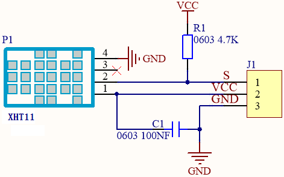

|工作电压：|3.3V-5V（DC）|
|-|-|
|最大工作电流：|50mA|
|最大功率：|0.25W|
|控制接口：|数字双向单总线|
|温度范围：|0-50℃（±2℃）|
|湿度范围：|20-90%RH（±5%RH）|
|工作温度：|-25℃~+60℃|

**XHT11温湿度传感器的单总线格式定义：**

|名称|单总线格式定义|
|-|-|
|起始信号|微处理器把数据总线（SDA）拉低一段时间至少 18ms（最大不得超过30ms），通知传感器准备数据。|
|响应信号|传感器把数据总线（SDA）拉低 83µs，再接高 87µs以响应主机的起始信号。|
|湿度|湿度高位为湿度整数部分数据，湿度低位为湿度小数部分数据|
|温度|温度高位为温度整数部分数据，温度低位为温度小数部分数据，且温度低位Bit8 为 1 则表示负温度，否则为正温度。|
|校验位|校验位＝湿度高位+湿度低位+温度高位+温度低位|

**XHT11温湿度传感器数据时序图：**

用户主机（MCU）发送一次开始信号后，XHT11
从低功耗模式转换到高速模式，待主机开始信号结束后，XHT11
发送响应信号，送出 40bit 的数据，并触发一次信采集。信号发送如图所示。


**1.3. 实验组件：**

||||
|-|-|-|
|ESP32 Plus主板 * 1|XHT11传感器*1|3P 转杜邦线母*1|
||||
|I2C LCD1602模块* 1|4P 转杜邦线母*1|USB线*1|

**1.4. 模块接线图：**

XHT11温湿度传感器和I2C 1602 LCD模块的控制引脚：

|XHT11温湿度传感器（S引脚）|io17|
|-|-|
|I2C 1602 LCD模块的SCL引脚|SCL|
|I2C 1602 LCD模块的SDA引脚|SDA|


**1.5. 实验代码：** 

<span style="color: rgb(255, 76, 65);">⚠️特别提醒</span>：使用前先添加库文件“LiquidCrystal_I2C”, “xht11” 和 “Wire”，添加方法请点击链接： **[添加Arduino库文件](https://www.keyesrobot.cn/projects/KE3050/zh-cn/latest/docs/Arduino%20%E6%95%99%E7%A8%8B/Arduino%20%E6%95%99%E7%A8%8B.html#id7)** 查看。如果已经添加好了，就跳过。

```c
/*
  Keyes
  XHT11
  www.keyes-robot.com
*/
##include <Wire.h>
##include <LiquidCrystal_I2C.h>
LiquidCrystal_I2C mylcd(0x27,16,2);
##include "xht11.h"
xht11 xht(17);

unsigned char dht[4] = {0, 0, 0, 0};//只接收前32位数据，不接收奇偶校验位
void setup() {
  Serial.begin(9600);//启动串口监视器，设置波特率为9600
  mylcd.init();
  mylcd.backlight();
}

void loop() {
  if (xht.receive(dht)) { //选中正确时返回true
    Serial.print("RH:");
    Serial.print(dht[0]); //湿度的积分部分，DHT[1]是分数部分
    Serial.print("%  ");
    Serial.print("Temp:");
    Serial.print(dht[2]); //温度的积分部分，DHT[3]是分数部分
    Serial.println("C");
    
    mylcd.setCursor(0, 0);
    mylcd.print("T = ");
mylcd.print(dht[2]);
    mylcd.setCursor(7, 0);
    mylcd.print("C ");
    mylcd.setCursor(0, 1);
    mylcd.print("H = ");
mylcd.print(dht[0]);
    mylcd.setCursor(7, 1);
    mylcd.print("% ");
    //mylcd.clear();
    delay(200);
  } else {    //读取错误
    Serial.println("sensor error");
  }
  delay(1000);  //设备读取的等待时间为1000ms
}
```

**1.6. 实验结果：**

上传测试代码成功，上电后，LCD1602显示屏显示温度值，T = \*\* ℃（代码中用C表示℃，因为代码中直接用℃容易乱码），湿度值H = \*\* %RH，用口对着温湿度传感器呼一下气体，可以看到湿度值上升。

### 第12课 刷卡开门

**1.1. 项目介绍：**

现在很多小区的门使用了刷卡开门这个功能，非常的方便。这节课我们将学习使用及RFID-MFRC522模块和磁卡（钥匙扣/白卡）控制门转动。

**1.2. 模块相关资料：**

**（1）元件知识**

**RFID：** RFID (Radio Frequency Identification)是一种无线通信技术。一个完整的RFID系统一般由应答器和读取器组成。通常我们使用标签作为应答器，每个标签都有一个唯一的代码，它附着在物体上，用来识别目标物体。阅读器是用来读取(或写入)标签信息的设备。

从RFID技术衍生的产品可以分为三类：无源RFID产品、有源RFID产品和半有源RFID产品。而无源RFID产品是市场上最早、最成熟、使用最广泛的产品。它在我们的日常生活中随处可见，如公交卡、餐卡、银行卡、酒店门禁卡等，这些都属于近距离接触识别。无源RFID产品的主要工作频率有:125KHZ(低频)、13.56MHZ(高频)、433MHZ(超高频)、915MHZ(超高频)。有源和半有源RFID产品工作在更高的频率。

我们使用的RFID模块是无源RFID产品，工作频率为13.56MHz。

**RFID-RC522模块：** MFRC522是一个高度集成的读取/写入器IC，用于13.56MHz的非接触式通信。MFRC522的内部发射器能够驱动一个读取/写入天线，设计用于与ISO/IEC 14443A/MIFARE卡和应答器通信，而无需额外的有源电路。接收模块为来自ISO/IEC 14443 A/MIFARE兼容卡和应答器的信号解调和解码提供了一个健壮和高效的实现。数字模块管理完整的ISO/IEC 14443A组帧和错误检测(奇偶校验和CRC)功能。

该RFID模块采用MFRC522作为控制芯片，采用I2C (Inter－Integrated Circuit)接口。

**（2）规格参数：**

工作电压：DC 3.3V-5V

工作电流：13—100mA/DC 5V

空闲电流：10-13mA/DC 5V

休眠电流：\<80uA

峰值电流：\<100mA

工作频率：13.56MHz

最大功率：0.5W

支持的卡类型：mifare1 S50、mifare1 S70、mifare UltraLight、mifare Pro、mifare Desfire

环境工作温度：摄氏-20—80℃  
环境储存温度：摄氏-40—85℃  
环境相对湿度：相对湿度5%—95%

数据传输速率：最大10Mbit/s

**1.3. 实验组件：**

|||||
|-|-|-|-|
|ESP32 Plus主板 * 1|RFID-MFRC522模块*1|180度舵机*1|3P 转杜邦线母*1|
|||||
|I2C LCD1602模块* 1|按键*1|白卡*1|4P 转杜邦线母*1| 
||||  |
|4pin 黑红蓝绿母对母连拼*1|USB线*1|钥匙扣*1|  |

**1.4. 模块接线图：**

RFID-RC522模块，木板房子⑦处按键1，门舵机和I2C 1602 LCD模块的控制引脚：

|木板房子⑦处按键1（S引脚）|io16|
|-|-|
|门舵机（橙黄色线引脚）|io13|
|RFID-RC522模块的SCL引脚|SCL|
|RFID-RC522模块的SDA引脚|SDA|
|I2C 1602 LCD模块的SCL引脚|SCL|
|I2C 1602 LCD模块的SDA引脚|SDA|


**1.5. 实验代码：**

<span style="color: rgb(255, 76, 65);">特别注意：</span>对于不同的RFID-RC522的白磁卡和蓝色钥匙扣，其白磁卡值和蓝色钥匙扣的值可能都不一样。所以，当使用你自己的白磁卡片靠近RFID模块的感应区域时，你需要将你在串口监视器窗口中读取的值更换程序中的值。

<span style="color: rgb(255, 76, 65);">⚠️特别提醒</span>：使用前先添加库文件“LiquidCrystal_I2C”，“Wire”，“ESP32Servo”和“MFRC522_I2C”，添加方法请点击链接： **[添加Arduino库文件](https://www.keyesrobot.cn/projects/KE3050/zh-cn/latest/docs/Arduino%20%E6%95%99%E7%A8%8B/Arduino%20%E6%95%99%E7%A8%8B.html#id7)** 查看。如果已经添加好了，就跳过。

```c
/*  
  Keyes
  RFID_door
  www.keyes-robot.com
*/
#include <Wire.h>
#include <LiquidCrystal_I2C.h>
LiquidCrystal_I2C mylcd(0x27,16,2);
#include <ESP32_Servo.h>
Servo myservo;
#include <Wire.h>
#include "MFRC522_I2C.h"
// IIC引脚默认为ESP32的GPIO21和GPIO22
// 0x28是SDA的i2c地址，如果不匹配，请检查你的地址和i2c.
MFRC522 mfrc522(0x28);   // 创建MFRC522.
#define servoPin  13
#define btnPin 16
boolean btnFlag = 0;

String password = "";

void setup() {
  Serial.begin(115200);           // 初始化与PC机的串口通信
  mylcd.init();
  mylcd.backlight();
  Wire.begin();                   // 初始化I2C
  mfrc522.PCD_Init();             // 初始化MFRC522
  ShowReaderDetails();            // 显示PCD - MFRC522读卡器
  Serial.println(F("Scan PICC to see UID, type, and data blocks..."));
  myservo.attach(servoPin, 500, 2500);
  pinMode(btnPin, INPUT);
  mylcd.setCursor(0, 0);
  mylcd.print("Card");
  myservo.write(0);
  delay(200);
}

void loop() {
  // 
  if ( ! mfrc522.PICC_IsNewCardPresent() || ! mfrc522.PICC_ReadCardSerial() ) {
    delay(50);
    password = "";
    if(btnFlag == 1)
    {
      boolean btnVal = digitalRead(btnPin);
      if(btnVal == 0)  //刷卡开门后，点击按钮1关门
      {
        Serial.println("close");
        mylcd.setCursor(0, 0);
        mylcd.print("close");
        myservo.write(0);
        btnFlag = 0;
      }
    }
    return;
  }
  
  // 选择一张门卡。UID和SAK为mfrc522.uid.
  
  // 保存UID
  Serial.print(F("Card UID:"));
  for (byte i = 0; i < mfrc522.uid.size; i++) {
    Serial.print(mfrc522.uid.uidByte[i] < 0x10 ? " 0" : " ");
    //Serial.print(mfrc522.uid.uidByte[i], HEX);
    Serial.print(mfrc522.uid.uidByte[i]);
    password = password + String(mfrc522.uid.uidByte[i]);
  }
  if(password == "17121741227")  //卡号正确，开门
  {
    Serial.println("open");
    mylcd.setCursor(0, 0);
    mylcd.clear();
    mylcd.print("open");
    myservo.write(180);
    password = "";
    btnFlag = 1;
  }
  else   //卡号错误，LCD显示error
  {
    password = "";
    mylcd.setCursor(0, 0);
    mylcd.print("error");
  }
  //Serial.println(password);
}

void ShowReaderDetails() {
  //  实现了MFRC522软件
  byte v = mfrc522.PCD_ReadRegister(mfrc522.VersionReg);
  Serial.print(F("MFRC522 Software Version: 0x"));
  Serial.print(v, HEX);
  if (v == 0x91)
    Serial.print(F(" = v1.0"));
  else if (v == 0x92)
    Serial.print(F(" = v2.0"));
  else
    Serial.print(F(" (unknown)"));
  Serial.println("");
  // 当返回到0x00或0xFF时，可能无法传输通信信号
  if ((v == 0x00) || (v == 0xFF)) {
    Serial.println(F("WARNING: Communication failure, is the MFRC522 properly connected?"));
  }
}
```

**1.6. 实验结果：**

上传测试代码成功，上电后，将我们提供的白磁卡片靠近RFID-RC522模块的感应区域，门就会转动打开，LCD1602显示”open”。点击一下按键1，门转动关闭，LCD1602显示”close”。刷另一个蓝色的感应块，LCD1602显示“Error”。

### 第13课 摩斯密码

**1.1. 项目介绍：**

摩尔斯电码也被称作摩斯密码，是一种时通时断的信号代码，通过不同的排列顺序来表达不同的英文字母、数字和标点符号。

现在我们使用它来作为我们的密码门。

**1.2. 摩斯密码的相关资料：**

摩斯密码对应的字符如下：


**1.3. 实验组件：**

|||||
|-|-|-|-|
|ESP32 Plus主板 * 1|按键*2|180度舵机*1|3P 转杜邦线母*2|
|||||
|I2C LCD1602模块* 1|4P 转杜邦线母*1|USB线*1||

**1.4. 模块接线图：**

按键1，按键2，门舵机和I2C 1602 LCD模块的控制引脚：

|按键1（S引脚）|io16|
|-|-|
|按键2（S引脚）|io27|
|门舵机（橙黄色线引脚）|io13|
|I2C 1602 LCD模块的SCL引脚|SCL|
|I2C 1602 LCD模块的SDA引脚|SDA|


**1.5. 实验代码：** 

简单的使用作为正确密码。

还使用到了一个很好用的按钮库文件OneButton，非常简单的实现按钮的点击、双击、长按等功能。对应摩斯密码，点击为“.”，长按再松开为“-”。(“.”的意思是点击按钮，“-”的意思是长按按钮2秒以上)

<span style="color: rgb(255, 76, 65);">⚠️特别提醒</span>：使用前先添加库文件“LiquidCrystal_I2C”，“Wire”，“ESP32Servo”和“OneButton-master”，添加方法请点击链接： **[添加Arduino库文件](https://www.keyesrobot.cn/projects/KE3050/zh-cn/latest/docs/Arduino%20%E6%95%99%E7%A8%8B/Arduino%20%E6%95%99%E7%A8%8B.html#id7)** 查看。如果已经添加好了，就跳过。


```c
/*
  Keyes
  mosDoor
  www.keyes-robot.com
*/

#include <Wire.h>
#include <LiquidCrystal_I2C.h>
LiquidCrystal_I2C mylcd(0x27,16,2);
#include "OneButton.h"
// 在Pin16上安装一个新的OneButton.  
OneButton button1(16, true);
// 在Pin27上安装一个新的OneButton.  
OneButton button2(27, true);
#include <ESP32_Servo.h>
Servo myservo;
int servoPin = 13;
String password = "";
String correct_p = "-.-";  //密码门的正确密码

// 安装代码在这里，运行一次:
void setup() {
  Serial.begin(115200);
  mylcd.init();
  mylcd.backlight();
  // 链接按钮1的功能.
  button1.attachClick(click1);
  button1.attachLongPressStop(longPressStop1);
  // 链接按钮2个功能.
  button2.attachClick(click2);
  button2.attachLongPressStop(longPressStop2);

  myservo.attach(servoPin, 500, 2500);
  myservo.write(0);
  mylcd.setCursor(0, 0);
  mylcd.print("Enter password");
}

void loop() {
  // 继续看按钮:
  button1.tick();
  button2.tick();
  delay(10);
}

// ----- 按键1回调函数
// 当button1被按下1次(第2次)时，这个函数将被调用。按钮按下后).
void click1() {
  Serial.print(".");
  password = password + '.';
  mylcd.setCursor(0, 1);
  mylcd.print(password);
} // click1

// 这个函数将被调用一次，当按钮1在长时间按下后被释放时.
void longPressStop1() {
  Serial.print("-");
  password = password + '-';
  mylcd.setCursor(0, 1);
  mylcd.print(password);
} // longPressStop1

// ... 按钮2也是一样:
void click2() {
  Serial.println(password);
  if(password == correct_p)
  {
    myservo.write(180);  //密码正确就开门
    mylcd.clear();
    mylcd.setCursor(0, 0);
    mylcd.print("open");
  }
  else
  {
    mylcd.clear();
    mylcd.setCursor(0, 0);
    mylcd.print("error");
    delay(2000);
    mylcd.clear();
    mylcd.setCursor(0, 0);
    mylcd.print("input again");
  }
  password = "";
} // click2

void longPressStop2() {
  //Serial.println("Button 2 longPress stop");
   myservo.write(0);  //关门
   mylcd.clear();
   mylcd.setCursor(0, 0);
   mylcd.print("close");
} // longPressStop2
```

**1.6. 实验结果：**

上传测试代码成功，上电后，开始LCD1602显示“Enter password”，点击或长按按键1,来输入密码，如果输入正确密码“-.-”，再点击按键2，门就转动打开，LCD1602显示“open”。如果是输入了其它错误的密码，门不会动，LCD1602显示error，两秒后显示enter again。长按按键2关门。

### 第14课 WiFi控制

**1.1. 项目介绍：**

物联网，就是将硬件设备接入网络。接入网络最便捷的方法就是使用WiFi连接了。ESP32 Plus主控板自带有WiFi模块，所以将我们的智能家居接入网络还是比较简单的。

我们将智能家居连接到局域网，也就是你家里的WiFi或者你手机开启的热点。连接成功后就会分配一个地址，这个地址就可以用来通讯了，我们将分配到的地址在串口监视器中打印出来。

**1.2. 相关资料：**

Station模式：当ESP32选择Station模式时，它作为一个WiFi客户端。它可以连接路由器网络，通过WiFi连接与路由器上的其他设备通信。如下图所示，PC和路由器已经连接，ESP32如果要与PC通信，需要将PC和路由器连接起来。


**1.3. 实验组件：**

|||||
|-|-|-|-|
|ESP32 Plus主板 * 1|130电机模块*1|黄色LED模块*1|3P 转杜邦线母*1|
|||||
|I2C LCD1602模块* 1|风扇叶*1|4P 转杜邦线母*2|USB线*1|

**1.4. 模块接线图：**

黄色LED灯，I2C 1602 LCD模块和130电机模块的控制引脚：

|黄色LED灯（S引脚）|io12|
|-|-|
|电机模块的IN+引脚|io19|
|电机模块的IN-引脚|io18|
|I2C 1602 LCD模块的SCL引脚|SCL|
|I2C 1602 LCD模块的SDA引脚|SDA|


**1.5. 智能家居连接WiFi的实验代码1：** 

<span style="color: rgb(255, 76, 65);">注意：</span> 代码中的ssid 和 password要填上你自己的WiFi名称和密码。


```c
/*
  Keyes
  wifi_test
  www.keyes-robot.com
*/

##include <Arduino.h>
##include <WiFi.h>
##include <ESPmDNS.h>
##include <WiFiClient.h>

String item = "0";
const char* ssid = "ChinaNet-2.4G-0DF0";
const char* password = "ChinaNet@233";
WiFiServer server(80);

void setup() {
  Serial.begin(115200);
  WiFi.begin(ssid, password);
  while (WiFi.status() != WL_CONNECTED) {
    delay(500);
    Serial.print(".");
  }
  Serial.println("");
  Serial.print("Connected to ");
  Serial.println(ssid);
  Serial.print("IP address: ");
  Serial.println(WiFi.localIP());
  server.begin();
  Serial.println("TCP server started");
  MDNS.addService("http", "tcp", 80);
}

void loop() {
  Serial.print("Connected to ");
  Serial.println(ssid);
  Serial.print("IP address: ");
  Serial.println(WiFi.localIP());  //串口监视器中打印出分配到的ip地址
  delay(200);
  WiFiClient client = server.available();
  if (!client) {
      return;
  }
  while(client.connected() && !client.available()){
      delay(1);
  }
  String req = client.readStringUntil('\r');
  int addr_start = req.indexOf(' ');
  int addr_end = req.indexOf(' ', addr_start + 1);
  if (addr_start == -1 || addr_end == -1) {
      Serial.print("Invalid request: ");
      Serial.println(req);
      return;
  }
  req = req.substring(addr_start + 1, addr_end);
  item=req;
  Serial.println(item);
  String s;
  if (req == "/")  //浏览器访问地址就能读取到client.println(s);发送的信息
  {
      IPAddress ip = WiFi.localIP();
      String ipStr = String(ip[0]) + '.' + String(ip[1]) + '.' + String(ip[2]) + '.' + String(ip[3]);
      s = "HTTP/1.1 200 OK\r\nContent-Type: text/html\r\n\r\n<!DOCTYPE HTML>\r\n<html>Hello from ESP32 at ";
      s += ipStr;
      s += "</html>\r\n\r\n";
      Serial.println("Sending 200");
      client.println(s);  //将字符串S的内容发送出去，使用浏览器访问E智能家居的地址时，就能读取到信息。
  }
  //client.print(s);
  client.stop();
}
```

**1.6. 实验结果1：**

上传测试代码成功，上电后，打开串口监视器，设置波特率为115200，如果成功连接上WiFi，串口监视器会打印出分配到的IP地址。（假如串口监视器没打印出分配到的IP地址，可以按下主板上的复位键重启）

<span style="color: rgb(255, 76, 65);">注意：</span> 只支持连接2.4GHz频段的WiFi，不支持连接5GHz频段的WiFi。


打开浏览器访问ip地址，将会读取到代码中client.println(s);发送出去的字符串S的内容。


**1.7. 浏览器控制智能家居的实验代码2：** 

在上面实验，我们知道浏览器怎么和智能家居通讯了，就是访问地址就行。地址只有一个，但是可以在地址下添加些字符串，就可以通过访问地址下不同的字符串而实现控制智能家居不同的功能。

我们有LCD显示屏，通过显示屏打印出ip地址，这更方便了。

<span style="color: rgb(255, 76, 65);">注意：</span> 代码中的ssid 和 password要填上你自己的WiFi名称和密码。


<span style="color: rgb(255, 76, 65);">⚠️特别提醒</span>：使用前先添加库文件“LiquidCrystal_I2C”，“Wire”和“ESP32_AnalogWrite”，添加方法请点击链接： **[添加Arduino库文件](https://www.keyesrobot.cn/projects/KE3050/zh-cn/latest/docs/Arduino%20%E6%95%99%E7%A8%8B/Arduino%20%E6%95%99%E7%A8%8B.html#id7)** 查看。如果已经添加好了，就跳过。

```c
/*
  Keyes
  wifi_led
  www.keyes-robot.com
*/

##include <Arduino.h>
##include <WiFi.h>
##include <ESPmDNS.h>
##include <WiFiClient.h>

String item = "0";
const char* ssid = "ChinaNet-2.4G-0DF0";
const char* password = "ChinaNet@233";
WiFiServer server(80);

##include <Wire.h>
##include <LiquidCrystal_I2C.h>
LiquidCrystal_I2C mylcd(0x27,16,2);
##include <analogWrite.h>
##define fanPin1 19
##define fanPin2 18
##define led_y 12  //定义黄色led引脚为12

void setup() {
  Serial.begin(115200);
  mylcd.init();
  mylcd.backlight();
  pinMode(led_y, OUTPUT);
  pinMode(fanPin1, OUTPUT);
  pinMode(fanPin2, OUTPUT);
  
  WiFi.begin(ssid, password);
  while (WiFi.status() != WL_CONNECTED) {
    delay(500);
    Serial.print(".");
  }
  Serial.println("");
  Serial.print("Connected to ");
  Serial.println(ssid);
  Serial.print("IP address: ");
  Serial.println(WiFi.localIP());
  server.begin();
  Serial.println("TCP server started");
  MDNS.addService("http", "tcp", 80);
  mylcd.setCursor(0, 0);
  mylcd.print("ip:");
  mylcd.setCursor(0, 1);
  mylcd.print(WiFi.localIP());  //LCD显示ip地址
}

void loop() {
  WiFiClient client = server.available();
  if (!client) {
      return;
  }
  while(client.connected() && !client.available()){
      delay(1);
  }
  String req = client.readStringUntil('\r');
  int addr_start = req.indexOf(' ');
  int addr_end = req.indexOf(' ', addr_start + 1);
  if (addr_start == -1 || addr_end == -1) {
      Serial.print("Invalid request: ");
      Serial.println(req);
      return;
  }
  req = req.substring(addr_start + 1, addr_end);
  item=req;
  Serial.println(item);
  String s;
  if (req == "/")  //浏览器访问地址就能读取到client.println(s);发送的信息
  {
      IPAddress ip = WiFi.localIP();
      String ipStr = String(ip[0]) + '.' + String(ip[1]) + '.' + String(ip[2]) + '.' + String(ip[3]);
      s = "HTTP/1.1 200 OK\r\nContent-Type: text/html\r\n\r\n<!DOCTYPE HTML>\r\n<html>Hello from ESP32 at ";
      s += ipStr;
      s += "</html>\r\n\r\n";
      Serial.println("Sending 200");
      client.println(s);  //将字符串S的内容发送出去，使用浏览器访问E智能家居的地址时，就能读取到信息。
  }
  if(req == "/led/on") //浏览器访问ip地址/led/on
  {
    client.println("turn on the LED");
    digitalWrite(led_y, HIGH);
  }
  if(req == "/led/off") //浏览器访问ip地址/led/off
  {
    client.println("turn off the LED");
    digitalWrite(led_y, LOW);
  }
  if(req == "/fan/on") //浏览器访问ip地址/fan/on
  {
    client.println("turn on the fan");
    digitalWrite(fanPin1, LOW); //pwm = 0
    analogWrite(fanPin2, 180);
  }
  if(req == "/fan/off") //浏览器访问ip地址/fan/on
  {
    client.println("turn off the fan");
    digitalWrite(fanPin1, LOW); //pwm = 0
    analogWrite(fanPin2, 0);
  }
  //client.print(s);
  client.stop();
}
```

**1.8. 实验结果2：**

上传测试代码成功，上电后，当智能家居成功连接上WiFi时，LCD显示屏显示分配到的地址


浏览器中访问 地址+/led/on，如我这边的地址是192.168.0.129/led/on

智能家居的LED灯就会打开，访问192.168.0.129/led/off，LED灯关闭。

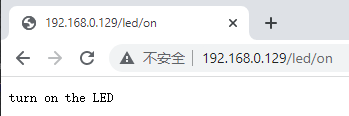

浏览器访问192.168.0.129/fan/on，智能家居的风扇会打开，192.168.0.129/fan/off风扇关闭。


### 第15课 手机APP控制智能家居

**1.1. 项目介绍：**

大部分人都有手机，现在大部分物联网产品的控制端都是用手机，使用起来就很便捷，打开手机APP，点击一下就能启动各种设备。

物联网智能家居，将智能家居通过WiFi连接家庭WiFi，用于操作的手机也要连接同一个WiFi，当然也可以是手机打开热点，智能家居连接手机的热点。连接成功后，LCD1602显示IP地址，然后在手机APP上输入对应的IP进行通讯。实现APP控制智能家居的各个功能。

**1.2. APP下载：**

[安装APP及说明书](https://www.keyesrobot.cn/projects/KE3050/zh-cn/latest/docs/APP%E4%B8%8B%E8%BD%BD%E5%92%8C%E4%BD%BF%E7%94%A8%E8%AF%B4%E6%98%8E.html)

**1.3. 实验组件**：

|||||
|-|-|-|-|
|ESP32 Plus主板 * 1|XHT11传感器*1|黄色LED模块*1|SK6812RGB灯模块*1|
|||||
|无源蜂鸣器模块*1|130电机模块*1|180度舵机*2|水滴传感器模块*1|
|||||
|人体红外热释传感器*1|MQ2传感器*1|风扇叶*1|I2C LCD1602模块* 1|
|||| |
|USB线*1|4P 转杜邦线母*3|3P 转杜邦线母*6| |

**1.4. 模块接线图：** 

|传感器模块名称|传感器模块引脚|ESP32 Plus主板对应的接线|
|-|-|-|
|人体红外热释传感器模块|G/V/S|G/V/io14|
|无源蜂鸣器模块|G/V/S|G/V/io25|
|黄色LED模块|G/V/S|G/V/io12|
|小风扇模块|GND/VCC/IN+/IN-|G/V/io19/io18|
|控制门的舵机1|棕色线/红色线/橙色线|G/V/io13|
|控制窗的舵机2|棕色线/红色线/橙色线|G/V/io5|
|MQ-2气体传感器模块|GND/VCC/D|G/V/io23|
|XHT11模块|G/V/S|G/V/io17|
|SK6812RGB灯模块|G/V/S|G/V/io26|
|LCD1602显示屏模块|GND/VCC/SDA/SCL|GND/V/SDA/SCL|
|水滴传感器模块|G/V/S|G/V/io34|

**1.5. 测试APP与智能家居通讯的实验代码1：** 

使用APP控制智能家居的LED灯和风扇的开关。

<span style="color: rgb(255, 76, 65);">⚠️特别提醒</span>：使用前先添加对应的库文件，添加方法请点击链接： **[添加Arduino库文件](https://www.keyesrobot.cn/projects/KE3050/zh-cn/latest/docs/Arduino%20%E6%95%99%E7%A8%8B/Arduino%20%E6%95%99%E7%A8%8B.html#id7)** 查看。如果已经添加好了，就跳过。


```c
/*
  Keyes
  app_test
  www.keyes-robot.com
*/

#include <Arduino.h>
#include <WiFi.h>
#include <ESPmDNS.h>
#include <WiFiClient.h>

String item = "0";
const char* ssid = "ChinaNet-2.4G-0DF0";
const char* password = "ChinaNet@233";
WiFiServer server(80);

#include <Wire.h>
#include <LiquidCrystal_I2C.h>
LiquidCrystal_I2C mylcd(0x27,16,2);
#include <analogWrite.h>
#define fanPin1 19
#define fanPin2 18
#define led_y 12  //定义黄色led引脚为12

void setup() {
  Serial.begin(115200);
  mylcd.init();
  mylcd.backlight();
  pinMode(led_y, OUTPUT);
  pinMode(fanPin1, OUTPUT);
  pinMode(fanPin2, OUTPUT);
  
  WiFi.begin(ssid, password);
  while (WiFi.status() != WL_CONNECTED) {
    delay(500);
    Serial.print(".");
  }
  Serial.println("");
  Serial.print("Connected to ");
  Serial.println(ssid);
  Serial.print("IP address: ");
  Serial.println(WiFi.localIP());
  server.begin();
  Serial.println("TCP server started");
  MDNS.addService("http", "tcp", 80);
  mylcd.setCursor(0, 0);
  mylcd.print("ip:");
  mylcd.setCursor(0, 1);
  mylcd.print(WiFi.localIP());  //LCD显示ip地址
}

void loop() {
  WiFiClient client = server.available();
  if (!client) {
      return;
  }
  while(client.connected() && !client.available()){
      delay(1);
  }
  String req = client.readStringUntil('\r');
  int addr_start = req.indexOf(' ');
  int addr_end = req.indexOf(' ', addr_start + 1);
  if (addr_start == -1 || addr_end == -1) {
      Serial.print("Invalid request: ");
      Serial.println(req);
      return;
  }
  req = req.substring(addr_start + 1, addr_end);
  item=req;
  Serial.println(item);
  String s;
  if (req == "/")  //浏览器访问地址就能读取到client.println(s);发送的信息
  {
      IPAddress ip = WiFi.localIP();
      String ipStr = String(ip[0]) + '.' + String(ip[1]) + '.' + String(ip[2]) + '.' + String(ip[3]);
      s = "HTTP/1.1 200 OK\r\nContent-Type: text/html\r\n\r\n<!DOCTYPE HTML>\r\n<html>ESP32 ip:";
      s += ipStr;
      s += "</html>\r\n\r\n";
      Serial.println("Sending 200");
      client.println(s);  //将字符串S的内容发送出去，使用浏览器访问E智能家居的地址时，就能读取到信息。
  }
  if(req == "/led/on") //浏览器访问ip地址/led/on
  {
    client.println("turn on the LED");
    digitalWrite(led_y, HIGH);
  }
  if(req == "/led/off") //浏览器访问ip地址/led/off
  {
    client.println("turn off the LED");
    digitalWrite(led_y, LOW);
  }
  if(req == "/fan/on") //浏览器访问ip地址/fan/on
  {
    client.println("turn on the fan");
    digitalWrite(fanPin1, LOW); //pwm = 0
    analogWrite(fanPin2, 180);
  }
  if(req == "/fan/off") //浏览器访问ip地址/fan/off
  {
    client.println("turn off the fan");
    digitalWrite(fanPin1, LOW); //pwm = 0
    analogWrite(fanPin2, 0);
  }
  //client.print(s);
  client.stop();
}
```

**1.6. 操作步骤及实验结果1：**

上传测试代码成功，上电后, 如果成功连接上WiFi，打开串口监视器，设置波特率为115200，串口监视器会打印出分配到的IP地址。（假如串口监视器没打印出分配到的IP地址，可以按下主板上的复位键重启）

<span style="color: rgb(255, 76, 65);">注意：</span>只支持连接2.4GHz频段的WiFi，不支持连接5GHz频段的WiFi。

**1. 打开APP，选择WIFI**


**2. APP控制LED和风扇**

    手机需要和智能家居连接同一个WiFi，或者手机打开热点，智能家居连接手机的热点。

    APP输入IP地址（LCD1602显示出分配到的IP地址），点击连接，连接成功标志是显示区域显示ESP32     ip: 192.168.0.171 。

    然后就可以点击LED，可以看到智能家居的LED被打开；点击Fan按钮，风扇被打开。如下图操作。

    

**1.7. IoT智能家居的实验代码2：** 

<span style="color: rgb(255, 76, 65);">⚠️特别提醒</span>：使用前先添加对应的库文件，添加方法请点击链接： **[添加Arduino库文件](https://www.keyesrobot.cn/projects/KE3050/zh-cn/latest/docs/Arduino%20%E6%95%99%E7%A8%8B/Arduino%20%E6%95%99%E7%A8%8B.html#id7)** 查看。如果已经添加好了，就跳过。

```c
/*
  Keyes
  IoT_smart_home
  www.keyes-robot.com
*/

#include <WiFi.h>
#include <ESPmDNS.h>
#include <WiFiClient.h>
#include <Adafruit_NeoPixel.h>
#define LED_PIN    26
// Arduino上有多少个新像素?
#define LED_COUNT 4
// 声明我们的NeoPixel条带对象:
Adafruit_NeoPixel strip(LED_COUNT, LED_PIN, NEO_GRB + NEO_KHZ800);

String item = "0";
const char* ssid = "ChinaNet-2.4G-0DF0";
const char* password = "ChinaNet@233";
WiFiServer server(80);

#include <Wire.h>
#include <LiquidCrystal_I2C.h>
LiquidCrystal_I2C mylcd(0x27,16,2);
#include <analogWrite.h>
#include "xht11.h"
xht11 xht(17);
//#include <ESP32_Servo.h>
//Servo Wservo;
//Servo Dservo;
#include <ESP32Tone.h>
#define buzzer_pin 25
//#define windowServo 5
//#define doorServo 13
#define waterPin 34
#define fanPin1 19
#define fanPin2 18
#define led_y 12  //定义黄色led引脚为12
#define waterPin 34
#define gasPin 23
#define pyroelectric 14

unsigned char dht[4] = {0, 0, 0, 0};//只接收前32位数据，不接收奇偶校验位

// 舵机通道 
int channel_PWM = 13;
int channel_PWM2 = 10;
int freq_PWM = 50; 
int resolution_PWM = 10;
const int PWM_Pin1 = 5;
const int PWM_Pin2 = 13;

void setup() {
  Serial.begin(115200);
  mylcd.init();
  mylcd.backlight();
  pinMode(led_y, OUTPUT);
  pinMode(fanPin1, OUTPUT);
  pinMode(fanPin2, OUTPUT);
  ledcSetup(5, 1200, 8);//设置LEDC通道1频率为1200，PWM分辨率为8，即占空比256.
  ledcAttachPin(fanPin2, 5);  //将LEDC通道1绑定到指定的左电机引脚gpio26上以实现输出.
  pinMode(waterPin, INPUT);
  pinMode(buzzer_pin, OUTPUT);
  pinMode(gasPin, INPUT);
  pinMode(pyroelectric, INPUT);
  ledcSetup(channel_PWM, freq_PWM, resolution_PWM); // 设置舵机通道,舵机频率,PWM分辨率.
  ledcSetup(channel_PWM2, freq_PWM, resolution_PWM);
  ledcAttachPin(PWM_Pin1, channel_PWM);  //将LEDC通道绑定到指定 IO 口上以实现输出
  ledcAttachPin(PWM_Pin2, channel_PWM2);  //将LEDC通道绑定到指定 IO 口上以实现输出
//  Wservo.attach(windowServo);
//  Dservo.attach(doorServo);
//  #if defined(__AVR_ATtiny85__) && (F_CPU == 16000000)
//    clock_prescale_set(clock_div_1);
//  #endif
//    // END of Trinket-specific code.
//  strip.begin();           // INITIALIZE NeoPixel strip object (REQUIRED)
//  strip.show();            // Turn OFF all pixels ASAP
//  strip.setBrightness(50); // Set BRIGHTNESS to about 1/5 (max = 255)
  
  WiFi.begin(ssid, password);
  while (WiFi.status() != WL_CONNECTED) {
    delay(500);
    Serial.print(".");
  }
  Serial.println("");
  Serial.print("Connected to ");
  Serial.println(ssid);
  Serial.print("IP address: ");
  Serial.println(WiFi.localIP());
  server.begin();
  Serial.println("TCP server started");
  MDNS.addService("http", "tcp", 80);
  mylcd.setCursor(0, 0);
  mylcd.print("ip:");
  mylcd.setCursor(0, 1);
  mylcd.print(WiFi.localIP());  //LCD显示ip地址
}

void loop() {
  WiFiClient client = server.available();
  if (!client) {
      return;
  }
  while(client.connected() && !client.available()){
      delay(1);
  }
  String req = client.readStringUntil('\r');
  int addr_start = req.indexOf(' ');
  int addr_end = req.indexOf(' ', addr_start + 1);
  if (addr_start == -1 || addr_end == -1) {
      Serial.print("Invalid request: ");
      Serial.println(req);
      return;
  }
  req = req.substring(addr_start + 1, addr_end);
  item=req;
  Serial.println(item);
  String s;
  if (req == "/")  //浏览器访问地址就能读取到client.println(s);发送的信息
  {
      IPAddress ip = WiFi.localIP();
      String ipStr = String(ip[0]) + '.' + String(ip[1]) + '.' + String(ip[2]) + '.' + String(ip[3]);
      s = "HTTP/1.1 200 OK\r\nContent-Type: text/html\r\n\r\n<!DOCTYPE HTML>\r\n<html>ESP32 ip:";
      s += ipStr;
      s += "</html>\r\n\r\n";
      Serial.println("Sending 200");
      client.println(s);  //将字符串S的内容发送出去，使用浏览器访问E智能家居的地址时，就能读取到信息。
  }
  if(req == "/led/on") //浏览器访问ip地址/led/on
  {
    client.println("turn on the LED");
    digitalWrite(led_y, HIGH);
  }
  if(req == "/led/off") //浏览器访问ip地址/led/off
  {
   client.println("turn off the LED");
   digitalWrite(led_y, LOW);
  }
  if(req == "/window/on")
  {
    client.println("open the window");
    ledcWrite(channel_PWM, 80);  //20ms高电平为2.5ms左右 ，也就是2.5/20*1024，舵机转动指定角度.

  }
  if(req == "/window/off")
  {
    client.println("close the window");
    ledcWrite(channel_PWM, 25);  //20ms高电平为0.5ms左右 ，也就是0.5/20*1024，舵机转动指定角度.

  }
  if(req == "/music/on")
  {
    //client.println("play music");
  }
  if(req == "/music/off")
  {
    client.println("play music");
    birthday();
    noTone(buzzer_pin,0);
  }
  if(req == "/buz/on")
  {
    client.println("buzzer");
    tone(buzzer_pin,392,250,0);
    Serial.println("1");
  }
  if(req == "/buz/off")
  {
    client.println("off");
    noTone(buzzer_pin,0);
  }
  if(req == "/door/on")
  {
    client.println("open the door");
    ledcWrite(channel_PWM2, 120);
//    Dservo.write(180);
  }
  if(req == "/door/off")
  {
    client.println("close the door");
     ledcWrite(channel_PWM2, 20);
//    Dservo.write(0);
  }
  if(req == "/fan/on")
  {
    client.println("turn on the fan");
    digitalWrite(fanPin1, LOW); //pwm = 0
    ledcWrite(5, 100); //LEDC通道1绑定到指定的左电机输出PWM值为100.
  }
  if(req == "/fan/off")
  {
    client.println("turn off the fan");
    digitalWrite(fanPin1, LOW); //pwm = 0
    ledcWrite(5, 0); //LEDC通道1绑定到指定的左电机输出PWM值为0.
  }
  if(req == "/red/on")
  {
    client.println("red on");
    colorWipe(strip.Color(255,   0,   0), 50);
  }
  if(req == "/red/off")
  {
    client.println("red off");
    colorWipe(strip.Color(0,   0,   0), 50);
  }
  if(req == "/oringe/on")
  {
    client.println("oringe on");
    colorWipe(strip.Color(200,   100,   0), 50);
  }
  if(req == "/oringe/off")
  {
    client.println("oringe off");
    colorWipe(strip.Color(0,   0,   0), 50);
  }
  if(req == "/yellow/on")
  {
    client.println("yellow on");
    colorWipe(strip.Color(200,   200,   0), 50);
  }
  if(req == "/yellow/off")
  {
    client.println("yellow off");
    colorWipe(strip.Color(0,   0,   0), 50);
  }
  if(req == "/green/on")
  {
    client.println("green on");
    colorWipe(strip.Color(0,   255,   0), 50);
  }
  if(req == "/green/off")
  {
    client.println("green off");
    colorWipe(strip.Color(0,   0,   0), 50);
  }
  if(req == "/cyan/on")
  {
    client.println("cyan on");
    colorWipe(strip.Color(0,   100,   255), 50);
  }
  if(req == "/cyan/off")
  {
    client.println("cyan off");
    colorWipe(strip.Color(0,   0,   0), 50);
  }
  if(req == "/blue/on")
  {
    client.println("blue on");
    colorWipe(strip.Color(0,   0,   255), 50);
  }
  if(req == "/blue/off")
  {
    client.println("blue off");
    colorWipe(strip.Color(0,   0,   0), 50);
  }
  if(req == "/purple/on")
  {
    client.println("purple on");
    colorWipe(strip.Color(100,   0,   255), 50);
  }
  if(req == "/purple/off")
  {
    client.println("purple off");
    colorWipe(strip.Color(0,   0,   0), 50);
  }
  if(req == "/white/on")
  {
    client.println("white on");
    colorWipe(strip.Color(255,   255,   255), 50);
  }
  if(req == "/white/off")
  {
    client.println("white off");
    colorWipe(strip.Color(0,   0,   0), 50);
  }
  if(req == "/sfx1/on")
  {
    client.println("sfx1 on");
    rainbow(10);
  }
  if(req == "/sfx1/off")
  {
    client.println("sfx1 off");
    colorWipe(strip.Color(0,   0,   0), 50);
  }
  if(req == "/sfx2/on")
  {
    client.println("sfx2 on");
    theaterChaseRainbow(50);
  }
  if(req == "/sfx2/off")
  {
    client.println("sfx2 off");
    colorWipe(strip.Color(0,   0,   0), 50);
  }


  if(req == "/rain/on")
  {
    int rainVal = analogRead(waterPin);
    client.println(rainVal);
  }
  if(req == "/rain/off")
  {
    client.println("off");
  }
  if(req == "/gas/on")
  {
    boolean gasVal = analogRead(gasPin);
    if(gasVal == 0)
    {
      client.println("dangerous");
    }
    else
    {
      client.println("safety");
    }
  }
  if(req == "/gas/off")
  {
    client.println("off");
  }
  if(req == "/body/on")
  {
    boolean pyroelectric_val = digitalRead(pyroelectric);
    if(pyroelectric_val == 1)
    {
      client.println("someone");
    }
    else
    {
      client.println("no one");
    }
  }
  if(req == "/body/off")
  {
    client.println("off");
  }
  if(req == "/temp/on")
  {
    if (xht.receive(dht)) { //选中正确时返回true
      Serial.print("Temp:");
      Serial.print(dht[2]); //温度的积分部分，DHT[3]是分数部分
      Serial.println("C");
      delay(200);
    } else {    //读取 error
      Serial.println("sensor error");
    }
    client.println(dht[2]);
    delay(1000);  //设备读取的等待时间为1000ms
  }
  if(req == "/temp/off")
  {
    client.println("off");
  }
  if(req == "/humidity/on")
  {
    if (xht.receive(dht)) { //选中正确时返回true
      Serial.print("Humid:");
      Serial.print(dht[0]); //温度的积分部分，DHT[3]是分数部分
      Serial.println("%");
      delay(200);
    } else {    //读取 error
      Serial.println("sensor error");
    }
    client.println(dht[0]);
    delay(1000);  //设备读取的等待时间为1000ms
  }
  if(req == "/humidity/off")
  {
    client.println("off");
  }

  
  //client.stop();
}


void birthday()
{
  tone(buzzer_pin,294,250,0);  //4个参数分别为，引脚，频率，延时，通道
  tone(buzzer_pin,440,250,0);
  tone(buzzer_pin,392,250,0);
  tone(buzzer_pin,532,250,0);
  tone(buzzer_pin,494,250,0);
  tone(buzzer_pin,392,250,0);
  tone(buzzer_pin,440,250,0);
  tone(buzzer_pin,392,250,0);
  tone(buzzer_pin,587,250,0);
  tone(buzzer_pin,532,250,0);
  tone(buzzer_pin,392,250,0);
  tone(buzzer_pin,784,250,0);
  tone(buzzer_pin,659,250,0);
  tone(buzzer_pin,532,250,0);
  tone(buzzer_pin,494,250,0);
  tone(buzzer_pin,440,250,0);
  tone(buzzer_pin,698,250,0);
  tone(buzzer_pin,659,250,0);
  tone(buzzer_pin,532,250,0);
  tone(buzzer_pin,587,250,0);
  tone(buzzer_pin,532,500,0);
  noTone(buzzer_pin,0);  //关闭
}

void colorWipe(uint32_t color, int wait) {
  for(int i=0; i<strip.numPixels(); i++) { // 对于条带中的每个像素...
    strip.setPixelColor(i, color);         //  设置像素的颜色(在RAM中)
    strip.show();                          //  更新条带以匹配
    delay(wait);                           //  暂停一会
  }
}

// 彩虹沿着整条带子循环。在帧之间传递延迟时间(毫秒).
void rainbow(int wait) {
  for(long firstPixelHue = 0; firstPixelHue < 5*65536; firstPixelHue += 256) {
    for(int i=0; i<strip.numPixels(); i++) { // For each pixel in strip...
      int pixelHue = firstPixelHue + (i * 65536L / strip.numPixels());
      strip.setPixelColor(i, strip.gamma32(strip.ColorHSV(pixelHue)));
    }
    strip.show(); // 更新带新的内容
    delay(wait);  // 暂停一会
  }
}

// Rainbow-enhanced跑马灯式。在帧之间传递延迟时间(毫秒)
void theaterChaseRainbow(int wait) {
  int firstPixelHue = 0;     // 第一个像素从红色开始(色调0)
  for(int a=0; a<30; a++) {  // 重复30次...
    for(int b=0; b<3; b++) { //  'b'从0数到2...
      strip.clear();         //   将RAM中的所有像素设置为0(关闭)
      // 'c'从'b'开始计数，以3为单位递增...
      for(int c=b; c<strip.numPixels(); c += 3) {
        int      hue   = firstPixelHue + c * 65536L / strip.numPixels();
        uint32_t color = strip.gamma32(strip.ColorHSV(hue)); // 颜色 -> RGB
        strip.setPixelColor(c, color); // 设置像素c的值为color
      }
      strip.show();                // 更新带新的内容
      delay(wait);                 // 暂停一会
      firstPixelHue += 65536 / 90; // 一个周期的彩色轮超过90帧
    }
  }
}
```
**1.8. 操作步骤及实验结果2：**

<span style="color: rgb(255, 76, 65);">注意：</span> 只支持连接2.4GHz频段的WiFi，不支持连接5GHz频段的WiFi。

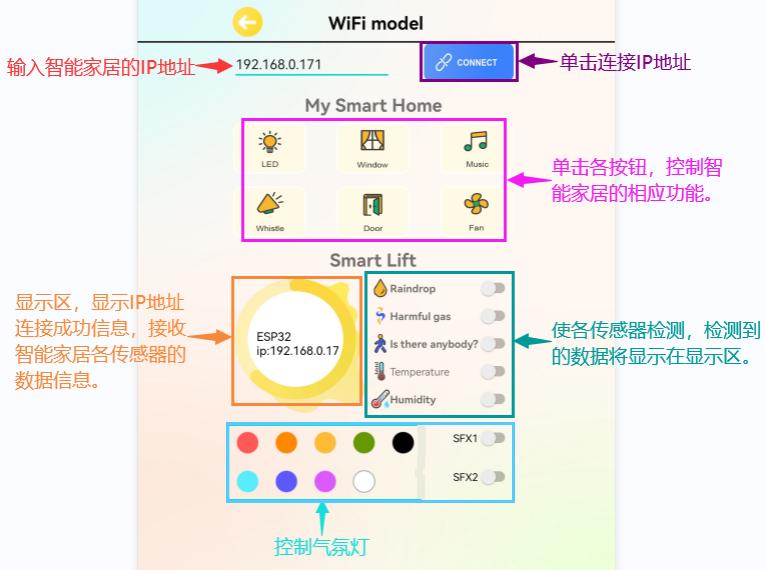
