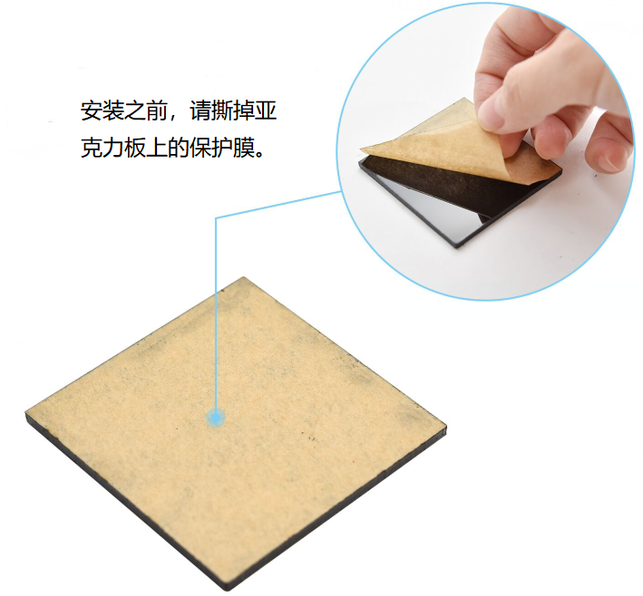
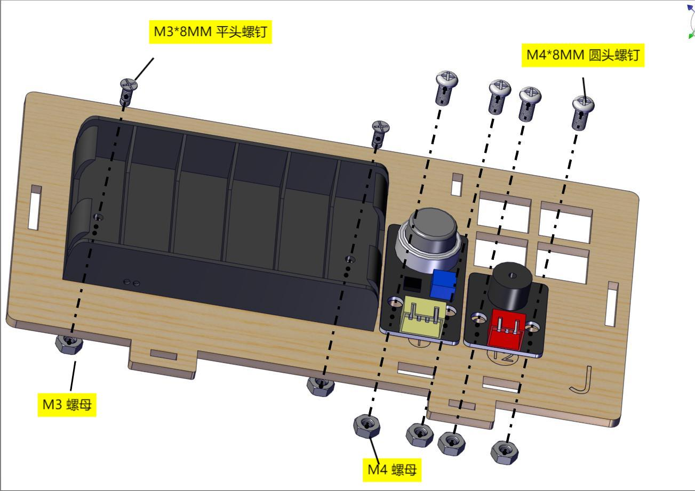
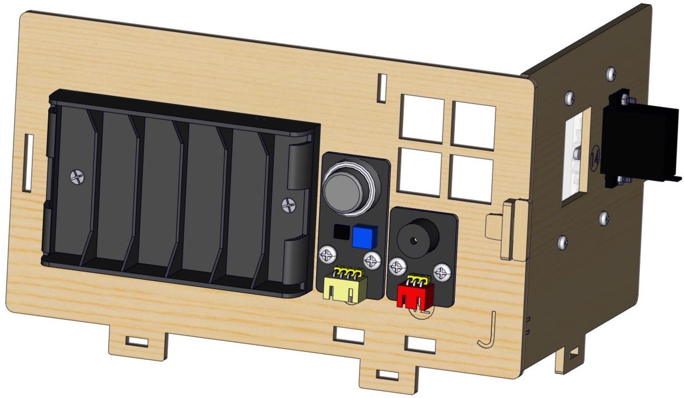
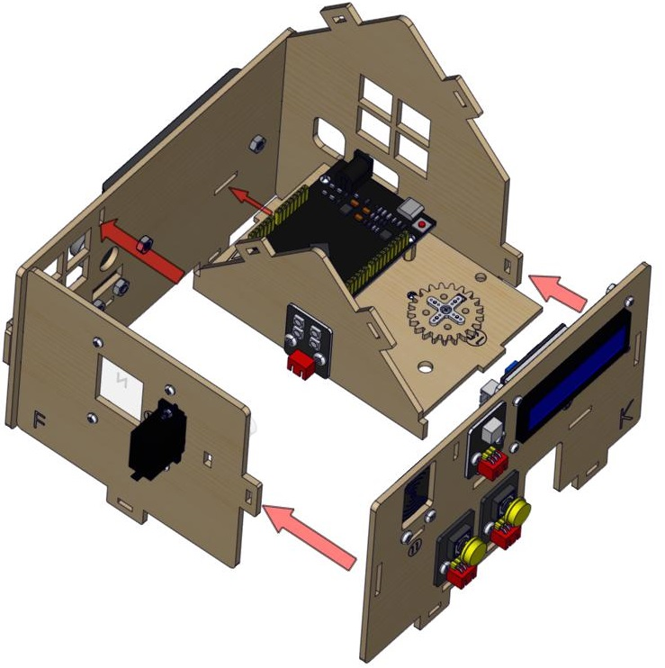
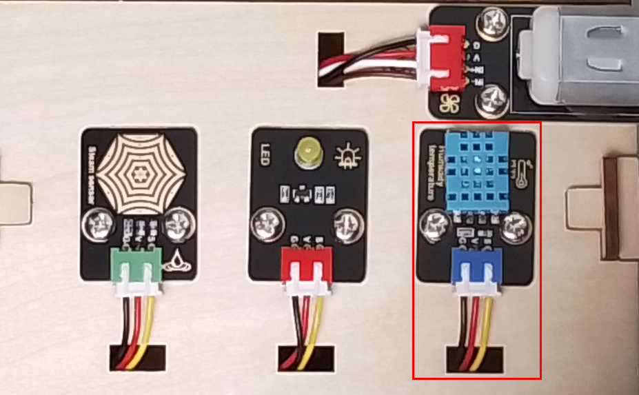
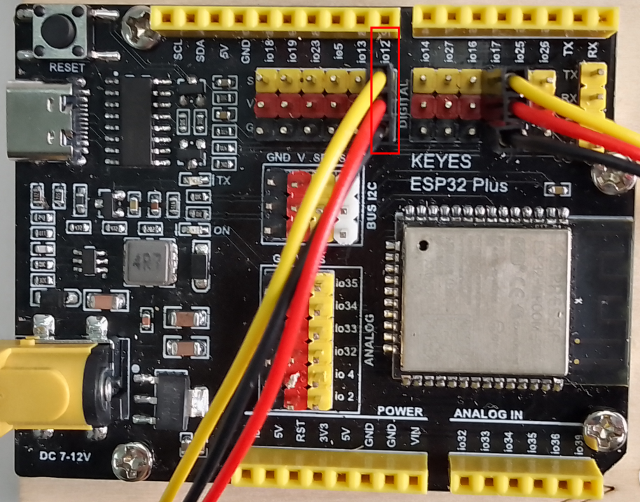
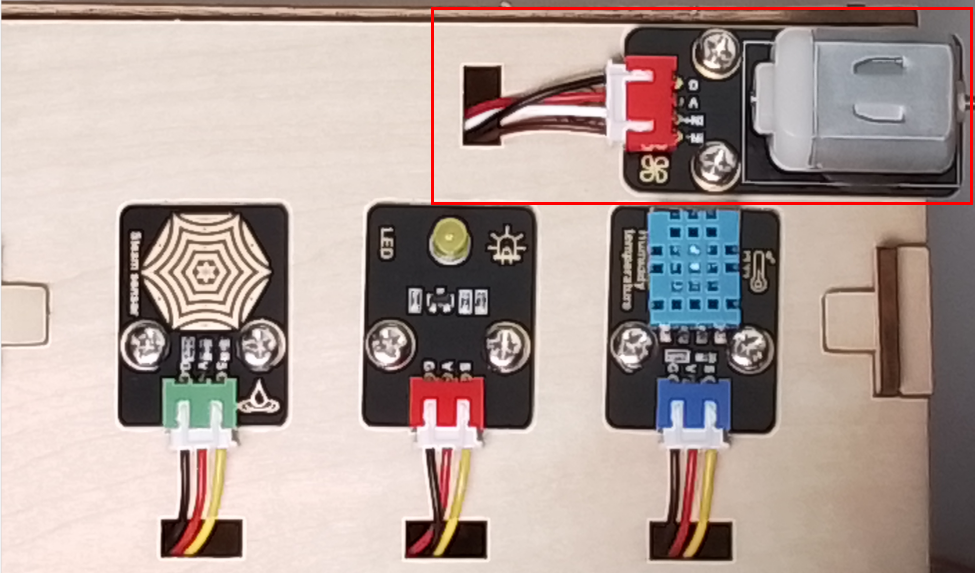
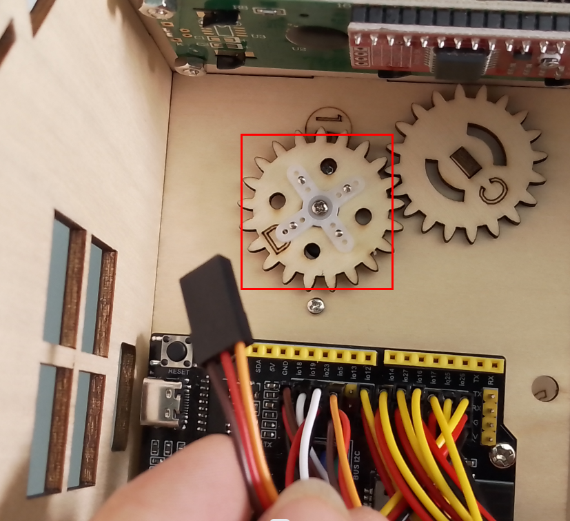

# ESP32智能家居组装步骤


<span style="color: rgb(255, 76, 65);">注意：</span>这个套件的亚克力板使用时需要先撕去上面的保护膜。



**安装1**

安装所需零件


安装


完成


**安装2**

安装所需零件


安装


完成


**安装3**

安装所需零件


安装（注意电池盒线材朝下安装）



完成


**安装4**

安装所需零件


安装


完成


**安装5**

安装所需零件


安装


完成


**安装6**

安装所需零件


安装（<span style="color: rgb(255, 76, 65);">注意自锁螺母不可拧紧</span>）


完成


**安装7**

安装所需零件


<span style="color: rgb(255, 76, 65);">安装前需要调节舵机角度，我们需要将窗户的舵机调整到0度再安装</span>

|    舵机    |     主板     |
| :---------: | :---------: |
| 棕线  |      G      |
|  红线   |     V      |
| 橙黄线 | IO5 |


**方法一：Arduino 代码**

<span style="color: rgb(255, 76, 65);">**⚠️特别提示:** </span> 在编写代码并上传之前，必须安装Arduino IDE，请进入链接：[关于Arduino IDE](https://www.keyesrobot.cn/projects/KE3050/zh-cn/latest/docs/Arduino%20%E6%95%99%E7%A8%8B/Arduino%20%E6%95%99%E7%A8%8B.html#arduino-ide)

```c++
#include <ESP32_Servo.h>
Servo myservo;
#define servoPin 5

void setup() {
  myservo.attach(servoPin,500,2500);
  myservo.write(0);
  delay(300);
  myservo.write(90);
  delay(300);
  myservo.write(0);
  delay(300);
}

void loop() {
  // put your main code here, to run repeatedly:
}

```
如何得到它？

资料提供了调整窗户舵机的代码，请打开并烧录到主板，如下图所示。在文件夹 **..\项目代码+驱动文件+库文件\项目代码\窗户上的舵机初始化角度_代码** ，打开文件**window_servo.ino**。或将上述测试代码复制粘贴到Arduino IDE中。


将上述测试代码上传至主板之后，未发现舵机转动，可以按下主板上的复位键。

**方法二：Python 代码**

<span style="color: rgb(255, 76, 65);">**⚠️特别提示:** </span> 在编写代码并上传之前，必须安装 Thonny IDE，请进入链接：[关于Thonny IDE](https://www.keyesrobot.cn/projects/KE3050/zh-cn/latest/docs/Python%20%E6%95%99%E7%A8%8B/Python%20%E6%95%99%E7%A8%8B.html#thonny-ide)

```python
# 作者 : www.keyes-robot.com

from machine import Pin, PWM
import time
pwm = PWM(Pin(5))  
pwm.freq(50)

'''
与角度对应的占空比 
0°----2.5%----25
45°----5%----51.2
90°----7.5%----77
135°----10%----102.4
180°----12.5%----128
'''
angle_0 = 25
angle_90 = 77
angle_180 = 128

pwm.duty(angle_0)
time.sleep(1)
pwm.duty(angle_90)
time.sleep(1)
pwm.duty(angle_0)
time.sleep(1)

# while True:
```
如何得到它？

资料提供了调整窗户舵机的代码，请打开并烧录到主板，如下图所示。在文件夹 **..\项目代码+驱动文件+库文件\项目代码\窗户上的舵机初始化角度_代码** ，打开文件**window_servo.py**。或将上述测试代码复制粘贴到Thonny IDE中。


单击运行上述测试代码，未发现舵机转动，可以按下主板上的复位键。

**方法三：Mixly 代码**

<span style="color: rgb(255, 76, 65);">**⚠️特别提示:** </span> 在编写代码并上传之前，必须安装 Mixly IDE，请进入链接：[关于Mixly IDE](https://www.keyesrobot.cn/projects/KE3050/zh-cn/latest/docs/Mixly%20%E6%95%99%E7%A8%8B/Mixly%20%E6%95%99%E7%A8%8B.html#mixly-ide)


如何得到它？

资料提供了调整窗户舵机的代码，请打开并烧录到主板，如下图所示。在文件夹 **..\项目代码+驱动文件+库文件\项目代码\窗户上的舵机初始化角度_代码** ，使用 Mixly IDE 打开文件**window_servo.mix**。或在Mixly IDE中直接拖动代码块编写上述测试代码。


单击运行上述测试代码，未发现舵机转动，可以按下主板上的复位键。

**方法四：KidsBlock(Scratch) 代码**

<span style="color: rgb(255, 76, 65);">**⚠️特别提示:** </span> 在编写代码并上传之前，必须安装 KidsBlock IDE，请进入链接：[关于KidsBlock IDE](https://www.keyesrobot.cn/projects/KE3050/zh-cn/latest/docs/Scratch%20%E6%95%99%E7%A8%8B/Scratch%20%E6%95%99%E7%A8%8B.html#kidsblock-ide)


如何得到它？

资料提供了调整窗户舵机的代码，请打开并烧录到主板，如下图所示。在文件夹 **..\项目代码+驱动文件+库文件\项目代码\窗户上的舵机初始化角度_代码** ，使用 KidsBlock IDE 打开文件**window_servo.sb3**。或在KidsBlock IDE中直接拖动代码块编写上述测试代码。


单击运行上述测试代码，未发现舵机转动，可以按下主板上的复位键。


安装（需按照下图姿态安装）


<span style="background: rgb(255, 251, 0);">若使用为M1.4*6MM自攻螺丝时，如下图</span>


完成


**安装8**

安装所需零件


安装


完成


**安装9**

安装所需零件


安装


完成


**安装10**

安装所需零件


安装


完成


**安装11**

安装所需零件


安装


完成



**安装12**

安装所需零件


安装


完成


**安装13**

安装所需零件


安装



完成


**安装14**

安装所需零件


安装


完成


**安装15**

安装所需零件


安装


完成


**安装16**

安装所需零件


安装


完成


**安装17**

安装所需零件


安装


完成


**安装18**

安装所需零件


安装


完成


**安装19**

安装所需零件


安装


完成


**接线部分**


将温湿度模块接到io17接口




将黄色led模块接到io12接口




将水滴传感器接到io34接口


风扇模块接线(IN+对应io19，IN-对应io18）使用的杜邦线：4根散开的杜邦线




将人体红外传感器接到io14接口


将左边按键模块接到io16接口


将右边按键模块接到io27接口


将RFID模块接到IIC接口


将LCD1602显示屏接到IIC接口


将6812RGB灯接到io26接口


将气体传感器的白线接到io23接口，棕线不用接。


将蜂鸣器接到io25接口


将控制窗户的舵机接到io5接口


将控制门的舵机接到io13接口




电源接线


**安装20**

安装所需零件


安装


完成


安装所需零件


安装


完成


