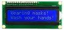
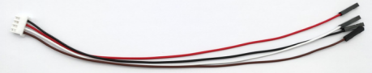
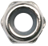

|序号|图片|描述|数量|
|---|----|---------------------------------------------------------|--------|
|15||I2C1602液晶屏模块|1|
|16||XH2.54-3Pin+杜邦母单 长19.5cm (红线在中间)|8|
|17||XH-2.54 4P 转杜邦线母单 26AWG 黑红白棕 200mm|3|
|18||高温硅胶杜邦线 4pin 黑红蓝绿母对母20cm 26AWG 连拼|1|
|19||M1.4*6MM 圆头 十字 自攻螺钉|10|
|20||M3 镀镍 自锁|5|
|21||M4*8MM 圆头 十字|24|