# Python 教程

<span style="color: rgb(2550, 10, 50);"><span style="font-size: 20px;">请确保 “项目代码+驱动文件+库文件” 压缩包已经下载完成并解压存放于方便使用的地方，本教程以 “项目代码+驱动文件+库文件” 文件夹存放于 **D盘** 路径下为例，路径为 **`D:..\项目代码+驱动文件+库文件`**，“项目代码+驱动文件+库文件” 文件夹包含 `Python 代码` 和 `Python 库文件` 等文件资料。</span></span>你也可以把代码存放于其他的盘内。

## 关于Thonny IDE

在开始构建项目之前，你需要首先做一些准备，这是非常重要的，你不能跳过。

### 一、安装Thonny(重要)

Thonny是一个免费、开源的软件平台，体积小，界面简单，操作简单，功能丰富，是一个适合初学者的Python IDE。在本教程中，我们使用这个IDE在整个过程中开发ESP32。Thonny支持多种操作系统，包括Windows, Mac OS, Linux。

下载Thonny软件： 

(1)进入软件官网：[<u>https://thonny.org</u>](https://thonny.org)下载Thonny软件，最好下载最新版的，否则可能不支持ESP32.

(2)Thonny的开源代码库：[<u>https://github.com/thonny/thonny</u>](https://github.com/thonny/thonny)

请按照官网的指导安装或点击下面的链接下载安装。(请根据您的操作系统选择相应的选项.)

|操作系统|下载链接/方法|
|-|-|
|MAC OS：|<a href="https://github.com/thonny/thonny/releases/download/v3.2.7/thonny-3.2.7.pkg">https://github.com/thonny/thonny/releases/download/v3.2.7/thonny-3.2.7.pkg</a>|
|Windows：|<a href=" https:/github.com/thonny/thonny/releases/download/v3.2.7/thonny-3.2.7.exe">https://github.com/thonny/thonny/releases/download/v3.2.7/thonny-3.2.7.exe</a>|


Windows上安装Thonny软件： 

1.  下载后的Thonny图标如下。

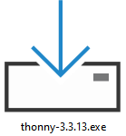

2.  双击“thonny-3.3.13.exe”，会出现下面对话框，我这里是选择“”进行操作的。你也可以选择“”进行操作的。


3.  如果你不熟悉电脑软件安装，你可以一直单击“Next”直到安装完成。


4.  如果您需要更改Thonny软件的安装路径，可以单击“Browse...”进行修改。选择安装路径后，单击“OK”。

如果您不想更改安装路径，只需单击“Next”；然后又继续单击“Next”。


5.  选中“Create desktop icon”，Thonny软件会在你的桌面上生成一个快捷方式，方便你稍后打开Thonny软件。


6.  单击“Install”安装软件。


7.  在安装过程中，您只需等待安装完成，千万不要点击“Cancel”，否则将无法安装成功。


8.  一旦看到如下界面，就表示已经成功安装了Thonny软件，点击“Finish”就可以。


9.  如果你在安装过程中选择了“Create desktop icon”，则可以在桌面上看到如下图标。


### 二、Thonny软件基本配置： 

1.  双击Thonny软件的桌面图标，可以看到如下界面，同时还可以进行语言选择(这里选择简体中文)和初始设置。设置完了点击“Let’s go！”。


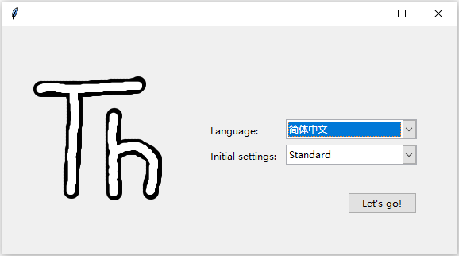

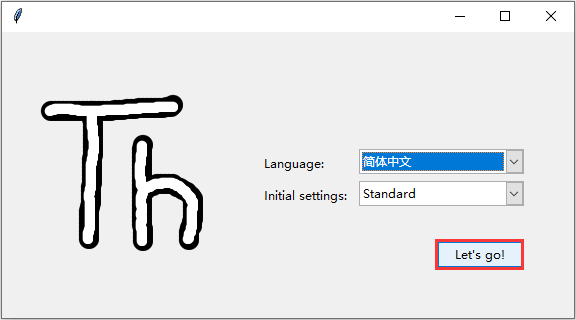

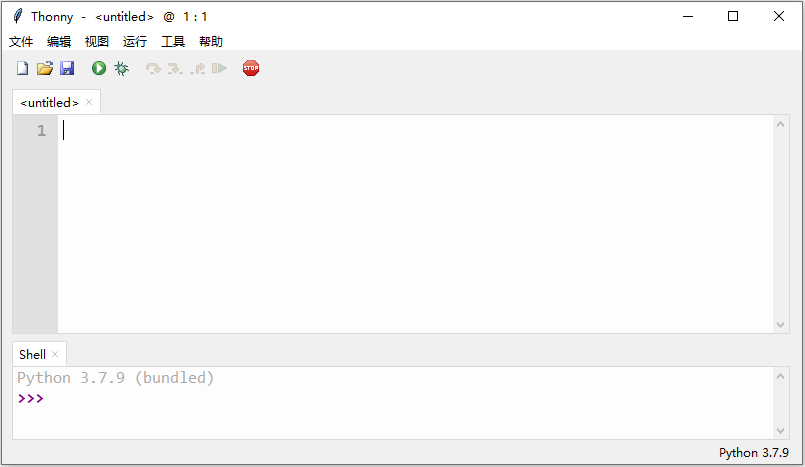

2.  选择“视图”→“文件”和“Shell”。

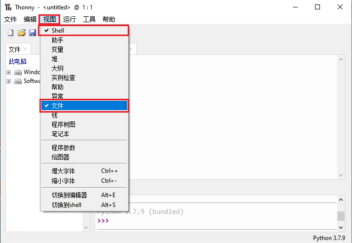

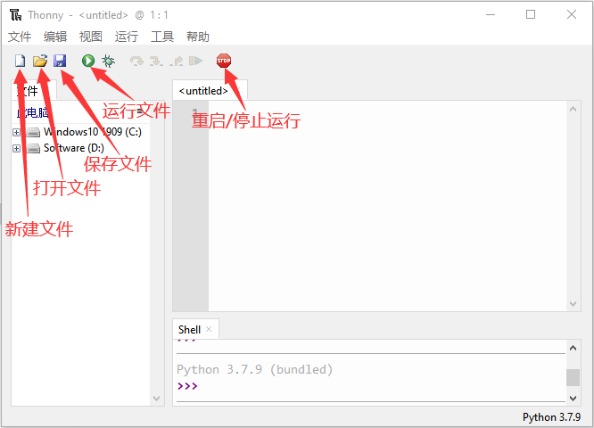

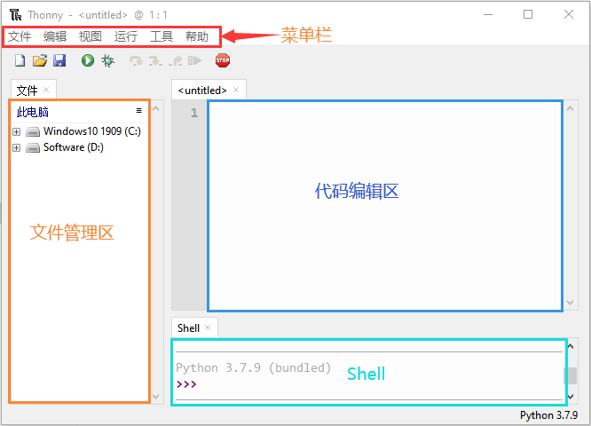

### 三、安装CH340驱动： 

ESP32 PLUS主板通过CH340驱动下载代码。所以在使用它之前，我们需要在计算机中安装CH340驱动程序。

**1\. Windows 系统** 

检查CH340驱动是否已经安装

A. 用USB线连接计算机和ESP32 Plus主板。

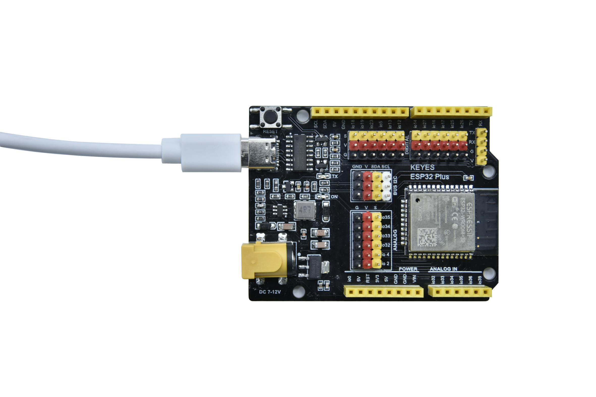

B. 进入计算机主界面，选择“我的电脑”，单击“设备管理器”。如果你的计算机已经安装了CH340驱动，则可以看到“USB SERIAL CH340 (COMx)”。

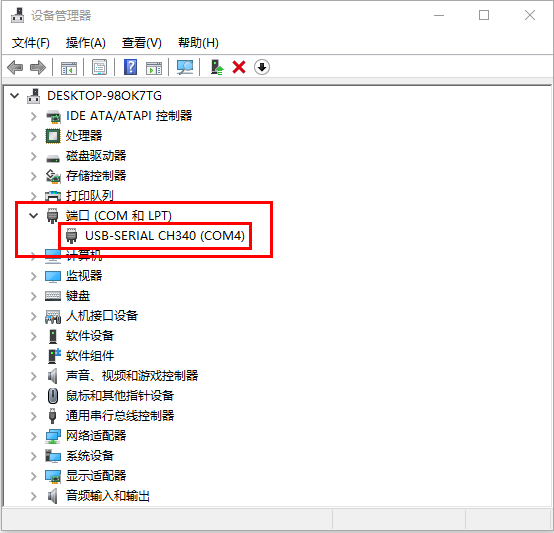

**安装CH340驱动**

1. 如果未安装CH340驱动，则需要手动操作安装。右键点击“USB Serial”，选择“更新驱动程序(P)”并点击。


2\. 跳转到以下页面，选择“浏览我的电脑以查找驱动程序(R)”并点击。

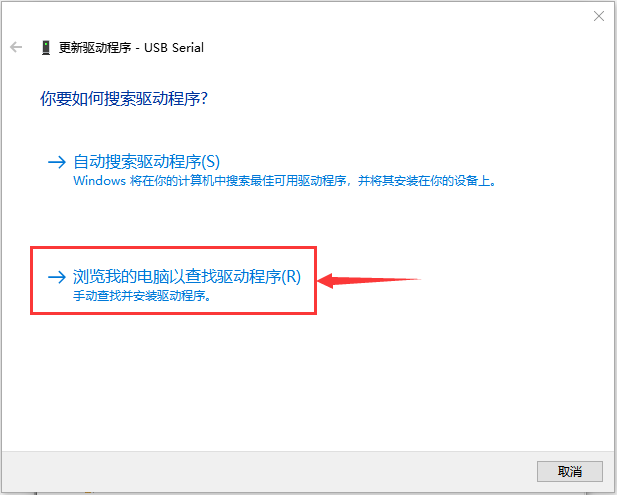

3\. 点击“浏览(R)...”选择我们提供的资料中的驱动文件夹“usb_ch341_3.1.2009.06”，如下图。

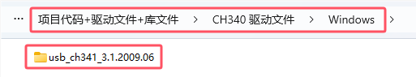

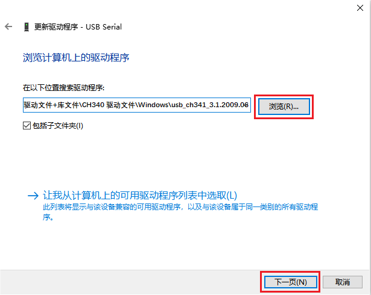


4\. 再次查看串口连接状态，如下图，则是成功安装驱动


**MAC 系统** 

1.我们提供的CH340驱动在下图位置：

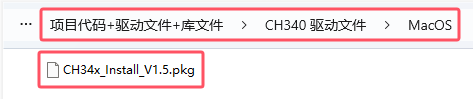

2怎样安装CH340驱动:

请参考以下链接：[<u>https://wiki.keyestudio.com/Download_CH340_Driver_on_MAC_System</u>](https://wiki.keyestudio.com/Download_CH340_Driver_on_MAC_System)

### 三、烧入Micropython固件(重要) 

要在ESP32 PLUS主板上运行Python程序，我们需要先将固件烧入到ESP32 PLUS主板。

**1\. 下载Micropython固件** 

microPython官方网站：[http://micropython.org/](http://micropython.org/)

网页列出microPython的ESP32固件：[https://micropython.org/download/esp32/](https://micropython.org/download/esp32/)


本教程中使用的固件是：esp32-20210902-v1.17.bin


我们的文件夹中也提供了这个固件，位置如下图：

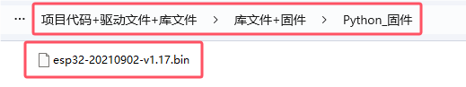


**2\. 烧入Micropython固件** 

用USB线连接计算机和ESP32 Plus主板。


确保驱动程序已成功安装，并能正确识别COM端口。打开设备管理器并展开“端口”。


<span style="color: rgb(255, 76, 65);">注：</span>不同电脑的COM端口可能不同，这是正常情况。

A. 打开Thonny，点击“运行” ，选择 “选择解释器...”

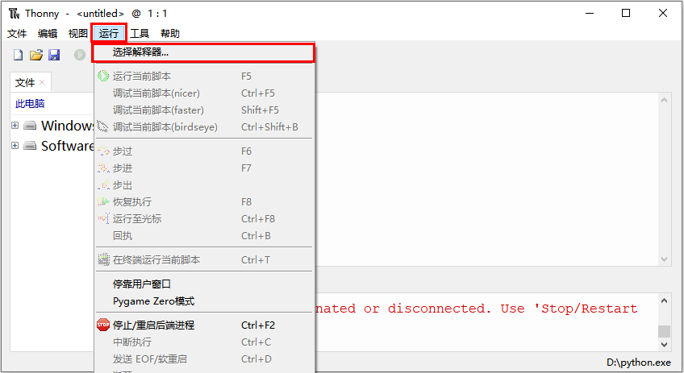

B. 先选中“Micropython (ESP32)”，再选中“USB-SERIAL CH340(COM5)”，然后点击“Install or update firmware”。

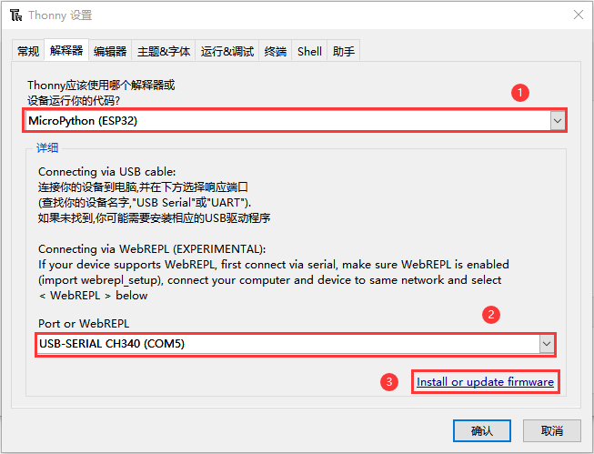

C\.  弹出如下对话框，“Port”选择“USB-SERIAL CH340(COM5)”，单击“Browse...”选择之前准备好的microPython固件esp32-20210902-v1.17.bin。检查“Erase flash before installing”和“Flash mode”，然后点击“安装”，等待安装完成提示。

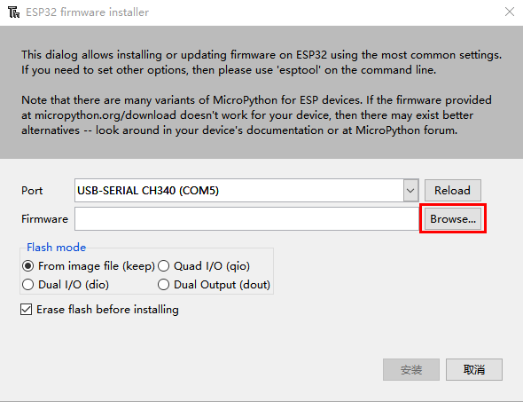

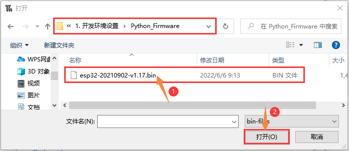

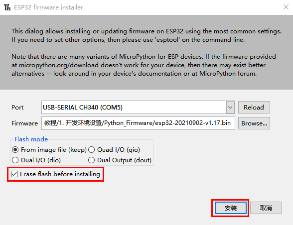

D\.  等待安装完成。安装完成后先点击“关闭”再点击“确认”就行。

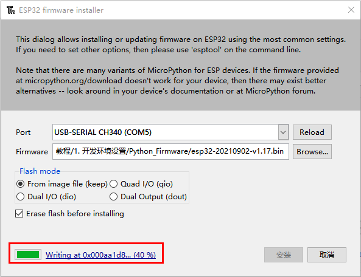

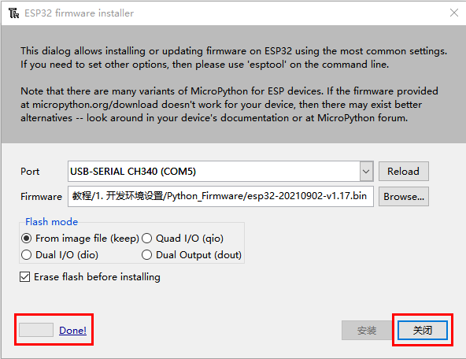

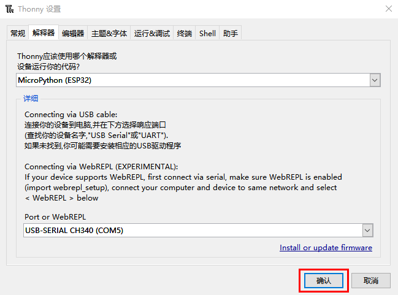

E\.  关闭所有对话框，转到主界面，点击“停止/重启后端进程”。如下图所示

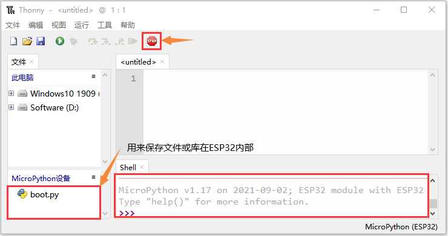

F\.  到目前为止，一切准备工作都已就绪。

### 四、Thonny界面介绍

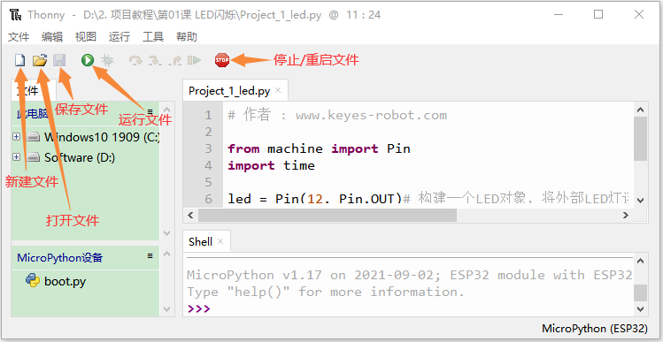

### 五、测试代码： 

**1\. 测试Shell命令**

在“Shell”窗口中输入“print('hello world')”并按Enter键。

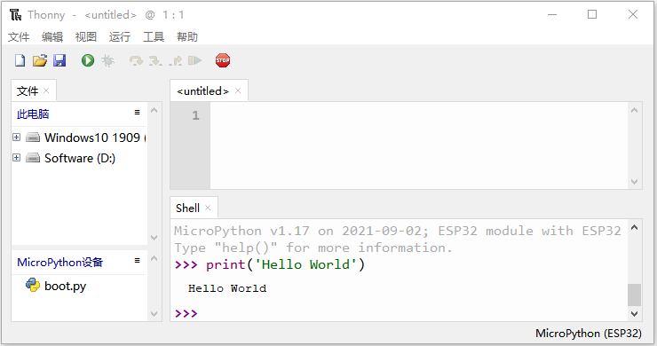

### 六、Thonny常见的操作： 

**上传代码到ESP32**

为了方便起见，我们以“第09课LCD1602显示”文件夹中的文件“i2c_lcd.py”为例。在“第09课LCD1602显示”文件夹中选择“i2c_lcd.py”，右键单击鼠标，选择“上载到/”将代码上传到ESP32的根目录。

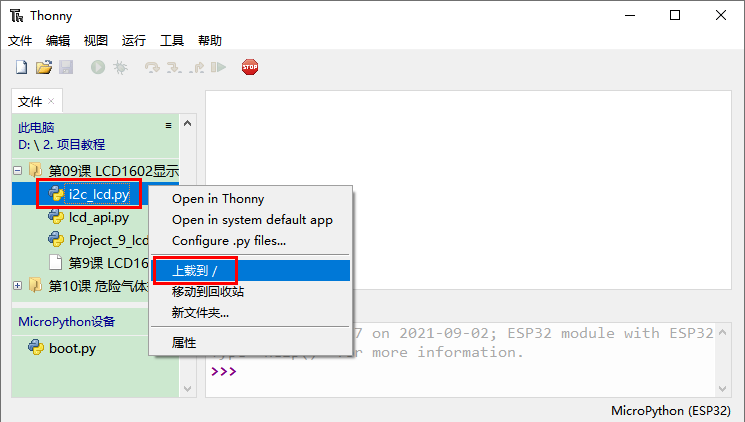

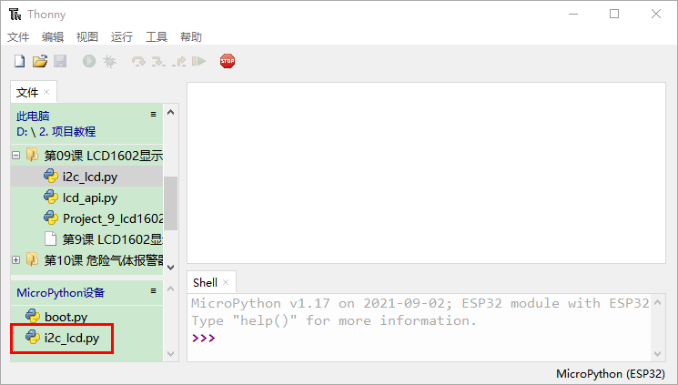

**下载代码到电脑**

在“MicroPython设备”中选择“i2c_lcd.py”，右键选择“下载到…”把代码下载到你的电脑里。

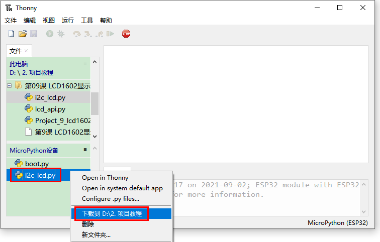

删除ESP32根目录下的文件

在“MicroPython设备”中选择“i2c_lcd.py”，右键单击它且选择“删除”，将“i2c_lcd.py”从ESP32的根目录中删除。

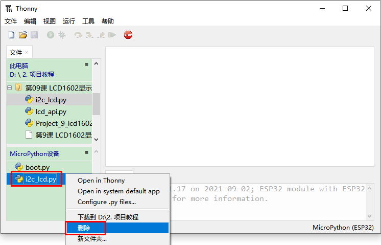

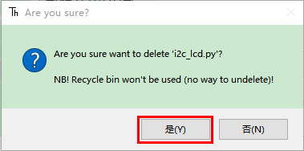

在“第09课LCD1602显示”文件夹中选择“i2c_lcd.py”，右键单击它并选择“移动到回收站”可以将其从“第09课LCD1602显示”文件夹中删除。

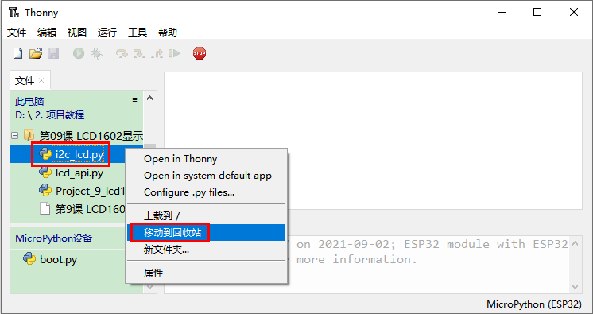

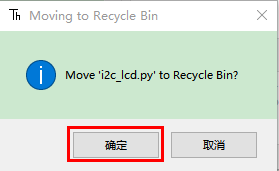

**创建并保存代码**

单击“文件”→“新文件”创建并编写代码。

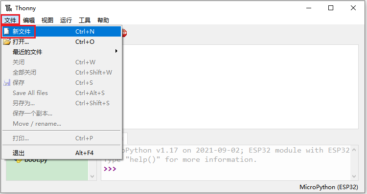

在新打开的文件中输入代码。这里我们以“第01课 LED闪烁”文件夹中的“Project_1_led.py”的代码为例。

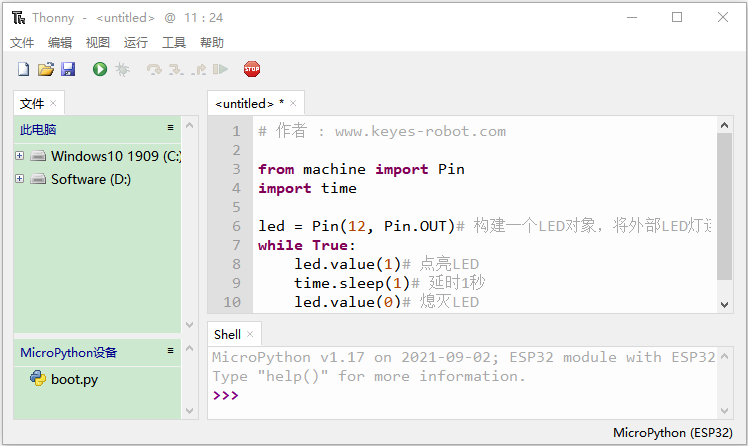

单击菜单栏上的“保存”，你可以将代码保存到你的电脑上或ESP32。

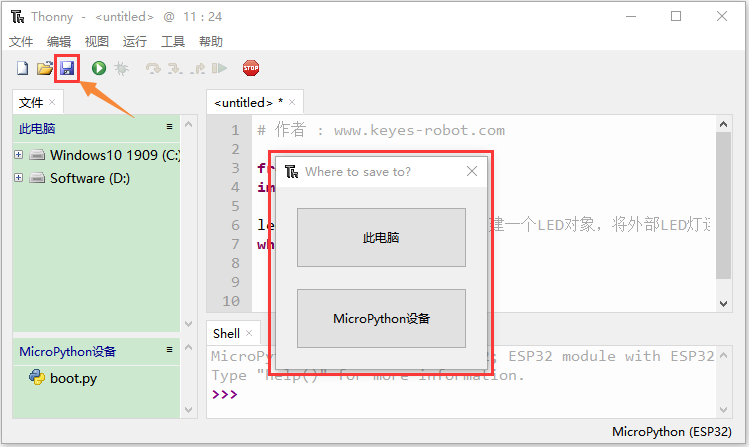

这里是选择“MicroPython设备”，在新弹出的窗口中输入“main\.py”并单击“确定”。

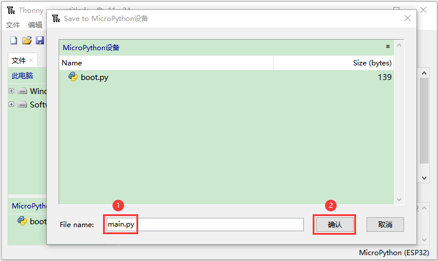

你可以看到代码已经上传到ESP32。

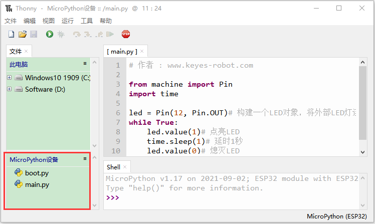

### 七、添加 MicroPython 库(<span style="color: rgb(255, 76, 65);">重要</span>)：

在某些项目中，您将需要额外的库。所以这里我们先把这些库上传到 ESP32 主控板上，然后我们可以直接运行代码。

1\. 使用 Micro USB 数据线将 ESP32 主控板连接到您的计算机。

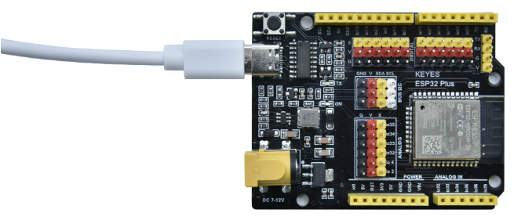

2\. 打开 Thonny IDE 并在顶部的菜单栏中，单击 “ **视图** -> **文件** ”。

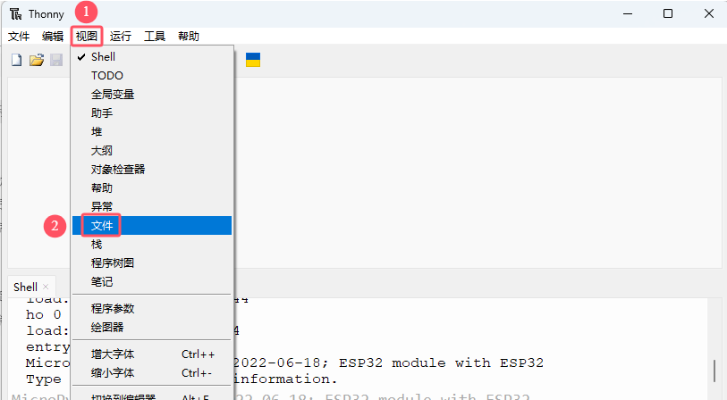

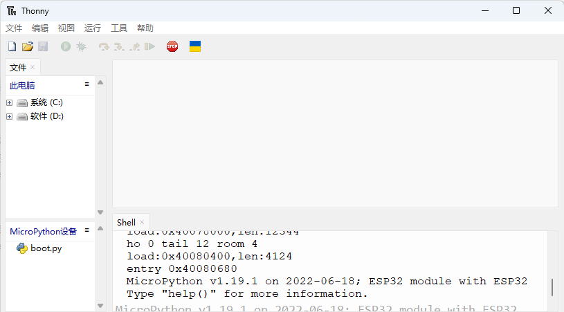


3\. 将路径切换到之前下载的 **项目代码+驱动文件+库文件** 文件夹，然后转到 **Python 库文件** 文件夹。
(<span style="color: rgb(255, 76, 65);">提醒：这里是以 **项目代码+驱动文件+库文件** 文件夹转移到D盘为例，你可以将下载的**项目代码+驱动文件+库文件** 文件夹复制粘贴到D盘。</span>)

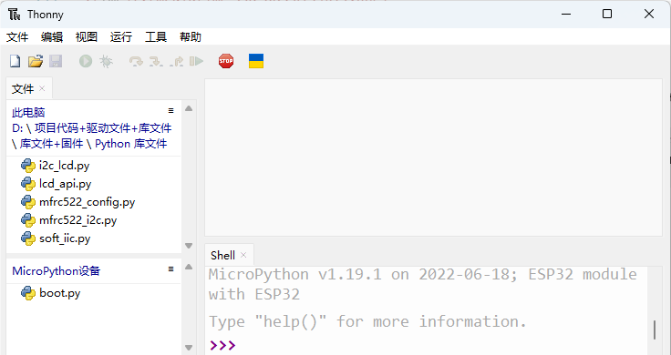

4\. 选中 <span style="color: rgb(255, 76, 65);">MicroPython_Libray</span> 文件夹中的 **i2c_lcd\.py** 文件，右键单击 **i2c_lcd\.py** 文件，然后选择 “**<span style="color: rgb(255, 76, 65);">上传到/</span>**” ，这样，**i2c_lcd\.py** 文件被上传到 “**MicroPython 设备**” 驱动器中。

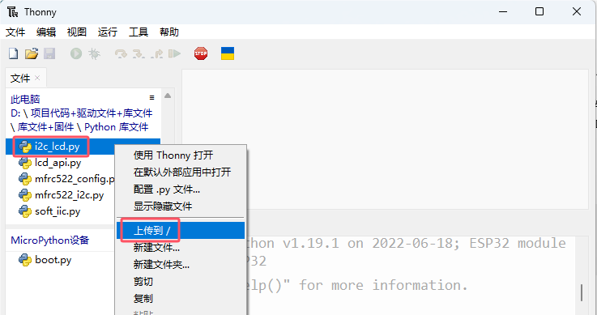

5\. 您将看到您刚刚上传到 “**MicroPython 设备**” 驱动器中的文件。

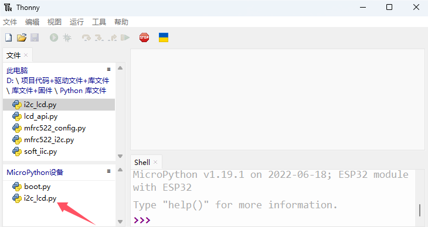

6\. 用相同的方法，将剩余的库文件都上传到 “**MicroPython 设备**” 驱动器中。

7\. 这样，您将看到您刚刚上传到“**MicroPython 设备**”驱动器中的所有文件。

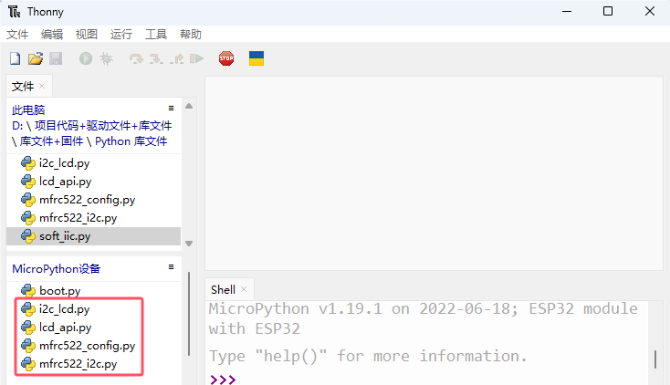

## 项目教程

### 第1课 LED闪烁

**1.1. 项目介绍：**

前面我们已经组装好了智能家居。接下来的项目我们就要由简单到复杂，将向你展示点亮LED。我们使用ESP32的数字引脚打开LED，使LED闪烁，也就是Blink项目。Blink对于学习ESP32的爱好者而言，是最基础的项目，也是新手必须经历的一个练习。

LED，即发光二极管的简称。由含镓（Ga）、砷（As）、磷（P）、氮（N）等的[化合物](https://baike.baidu.com/item/%E5%8C%96%E5%90%88%E7%89%A9/1142931)制成。当电子与[空穴](https://baike.baidu.com/item/%E7%A9%BA%E7%A9%B4/3517781)复合时能辐射出可见光，因而可以用来制成发光二极管。在电路及仪器中作为指示灯，或者组成文字或数字显示。砷化镓二极管发红光，磷化镓二极管发绿光，碳化硅二极管发黄光，氮化镓二极管发蓝光。因化学性质又分有机发光二极管OLED和无机发光二极管LED。

为了实验的方便，我们将LED发光二极管做成了一个LED模块，在这个项目中，我们用一个最基本的测试代码来控制LED，亮一秒钟，灭一秒钟，来实现闪烁的效果。你可以改变代码中LED灯亮灭的时间，实现不同的闪烁效果。LED模块信号端S为高电平时LED亮起，S为低电平时LED熄灭。

**1.2. 模块相关资料：**


|工作电压:|DC 3.3-5V|
|-|-|
|工作电流：|< 20mA|
|最大功率：|0.1W|
|控制接口:|数字口（数字输入）|
|工作温度：|-10°C ~ +50°C|
|LED显示颜色：|黄色|

**1.3. 实验组件：**

|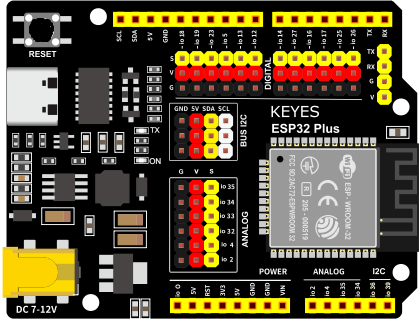||||
|-|-|-|-|
|ESP32 Plus主板 * 1|黄色LED模块*1|3P 转杜邦线母*1|USB线*1|

**1.4. 模块接线图：**

黄色LED的控制引脚：

* 黄色LED灯（S引脚）io12

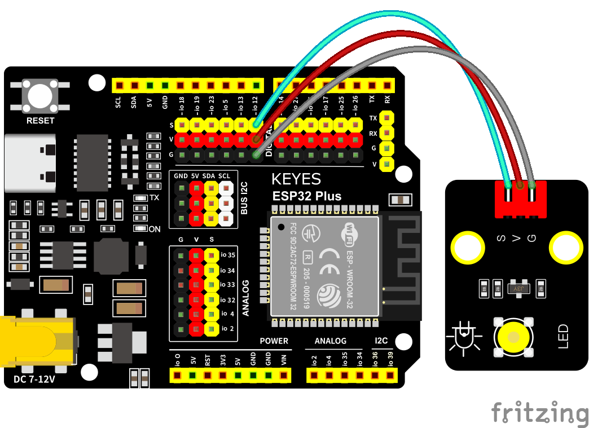

<span style="color: rgb(255, 76, 65);">注意：</span> 这里体现的是实验使用到的模块接线图，若前面已经组装好智能家居并不用拆掉

**1.5. 实验代码：** 


打开“Thonny”软件，点击“此电脑” → “D:” → “项目代码+驱动文件+库文件” → “项目代码” → “Python 代码”。并鼠标左键双击“Project_01_led.py”。

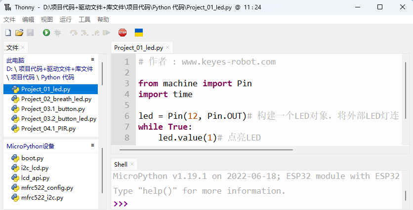

```python
## 作者 : www.keyes-robot.com

from machine import Pin
import time

led = Pin(12, Pin.OUT)# 构建一个LED对象，将外部LED灯连接到引脚12，并将引脚12设置为输出模式
while True:
    led.value(1)# 点亮LED
    time.sleep(1)# 延时1秒
    led.value(0)# 熄灭LED
    time.sleep(1)# 延时1秒
```

**1.6. 实验结果：**

将 ESP32 主控板通过Micro USB数据线与计算机相连供电，单击“当前运行脚本”，代码开始执行，外接电源供电，你会看到的现象是：黄色LED灯不断地闪烁。


单击“停止/启动后端进程”退出程序。

### 第2课 呼吸灯

**1.1. 项目介绍：**

在之前的研究中，我们知道LED有亮/灭状态，那么如何进入中间状态呢?如何输出一个中间状态让LED“半亮”?这就是我们将要学习的。呼吸灯，即LED由灭到亮，再由亮到灭，就像“呼吸”一样。那么，如何控制LED的亮度呢?我们将使用ESP32的PWM来实现这个目标。

**1.2. 模块相关资料：**


|工作电压:|DC 3.3-5V|
|-|-|
|工作电流：|< 20mA|
|最大功率：|0.1W|
|控制接口:|数字口（数字输入）|
|工作温度：|-10°C ~ +50°C|
|LED显示颜色：|黄色|

**1.3. 元件知识：** 


**Analog & Digital**

模拟信号在时间和数值上都是连续的信号。相反，数字信号或离散时间信号是由一系列数字组成的时间序列。生活中的大多数信号都是模拟信号。一个熟悉的模拟信号的例子是，全天的温度是如何不断变化的，而不是突然从0到10的瞬间变化。然而，数字信号的值可以瞬间改变。这个变化用数字表示为1和0(二进制代码的基础)。如下图所示，我们可以更容易地看出它们的差异。

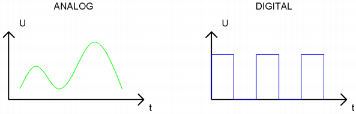

在实际应用中，我们经常使用二进制作为数字信号，即一系列的0和1。由于二进制信号只有两个值(0或1)，因此具有很大的稳定性和可靠性。最后，可以将模拟信号和数字信号相互转换。

**PWM：**

脉宽调制(PWM)是一种利用数字信号控制模拟电路的有效方法。普通处理器不能直接输出模拟信号。PWM技术使这种转换(将数字信号转换为模拟信号)非常方便。PWM技术利用数字引脚发送一定频率的方波，即高电平和低电平的输出，交替持续一段时间。每一组高电平和低电平的总时间一般是固定的，称为周期(注:周期的倒数是频率)。高电平输出的时间通常称为脉宽，占空比是脉宽(PW)与波形总周期(T)之比的百分比。高电平输出持续时间越长，占空比越长，模拟信号中相应的电压也就越高。下图显示了对应于脉冲宽度0%-100%的模拟信号电压在0V-3.3V(高电平为3.3V)之间的变化情况.


PWM占空比越长，输出功率越高。既然我们了解了这种关系，我们就可以用PWM来控制LED的亮度或直流电机的速度等等。从上面可以看出，PWM并不是真实的模拟信号，电压的有效值等于相应的模拟信号。因此，我们可以控制LED和其他输出模块的输出功率，以达到不同的效果。

**ESP32 与 PWM**

几乎所有ESP32输入/输出引脚都可用于PWM（脉冲宽度调制）。使用这些引脚可以控制电机、LED灯和颜色等。

**1.4. 实验组件**：

|||||
|-|-|-|-|
|ESP32 Plus主板 * 1|黄色LED模块*1|3P 转杜邦线母*1|USB线*1|

**1.5. 模块接线图：**

黄色LED的控制引脚：

* 黄色LED灯（S引脚）io12


<span style="color: rgb(255, 76, 65);">注意：</span> 这里体现的是实验使用到的模块接线图，若前面已经组装好智能家居并不用拆掉

**1.6. 实验代码：** 

打开“Thonny”软件，点击“此电脑” → “D:” → “项目代码+驱动文件+库文件” → “项目代码” → “Python 代码”。并鼠标左键双击“Project_02_breath_led.py”。

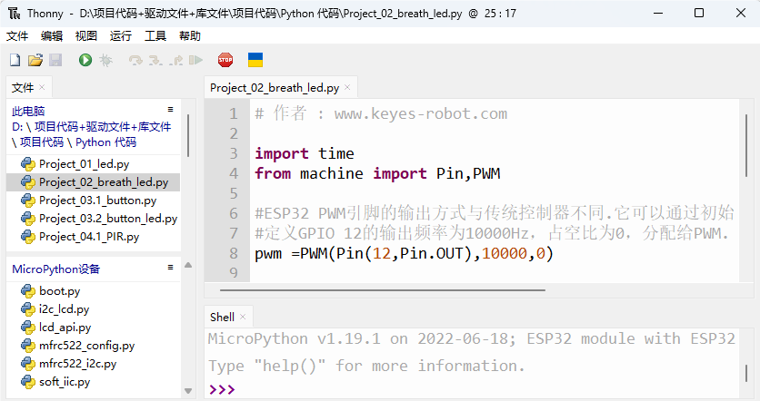


```python
## 作者 : www.keyes-robot.com

import time
from machine import Pin,PWM

##ESP32 PWM引脚的输出方式与传统控制器不同.它可以通过初始化阶段的PWM参数来改变频率和占空比.
##定义GPIO 12的输出频率为10000Hz，占空比为0，分配给PWM.
pwm =PWM(Pin(12,Pin.OUT),10000,0)

try:
    while True: 
##占空比范围为0-1023，因此我们使用第一个for环路来控制PWM来改变占空比值，
##使PWM输出0% -100%;使用第二个for循环使PWM输出100%-0%。
 
        for i in range(0,1023):
            pwm.duty(i)
            time.sleep_ms(1)
            
        for i in range(0,1023):
            pwm.duty(1023-i)
            time.sleep_ms(1)  
except:
##每次使用PWM时，将打开硬件定时器配合它。因此，每次使用PWM后,
##需要调用deinit()来关闭计时器。否则，下次PWM可能无法工作.
    pwm.deinit()
```

**1.7. 实验结果：**

将 ESP32 主控板通过Micro USB数据线与计算机相连供电，单击“当前运行脚本”，代码开始执行，外接电源供电，你会看到的现象是：黄色LED灯渐亮渐暗，似乎在呼吸。


单击“停止/启动后端进程”退出程序。

### 第3课 台灯

**1.1. 项目介绍：**

常见的台灯，用到了LED灯和按键。通过按按键来控制灯的开与关。

按键按下，我们的单片机读取到低电平，松开读取到高电平。在这一实验课程中，我们利用按键和黄色LED做一个扩展，当按键按下时即读取到低电平时点亮黄色LED灯，松开按键时即读取到高电平时熄灭黄色LED灯，这样就可以通过一个模块控制另一个模块了。

**1.2. 模块相关资料：**


附原理图，按键有四个引脚，其中1和3是相连的，2和4是相连的，在我们未按下按键时，1,3与2,4是断开的，信号端S读取的是被4.7K的上拉电阻R1所拉高的高电平，而当我们按下按键时，1,3和2,4连通。信号端S连接到了GND，此时读取到的电平为低电平，即按下按键，传感器信号端为低电平；松开按键时，信号端为高电平。

**1.3. 实验组件：**

||||||
|-|-|-|-|-|
|ESP32 Plus主板 * 1|黄色LED模块*1|按键*1|3P 转杜邦线母*2|USB线*1|

**1.4. 模块接线图：**

木板房子⑦处按键1和黄色LED灯的控制引脚：

|木板房子⑦处按键1（S引脚）|IO16|
|-|-|
|黄色LED灯（S引脚）|IO12|


**1.5. 读取按钮值的实验代码：** 

读取按钮的状态值，在Shell窗口中打印出来，这样就可以直观的看到按钮的状态值。

打开“Thonny”软件，点击“此电脑” → “D:” → “项目代码+驱动文件+库文件” → “项目代码” → “Python 代码”。并鼠标左键双击“Project_03.1_button.py”。

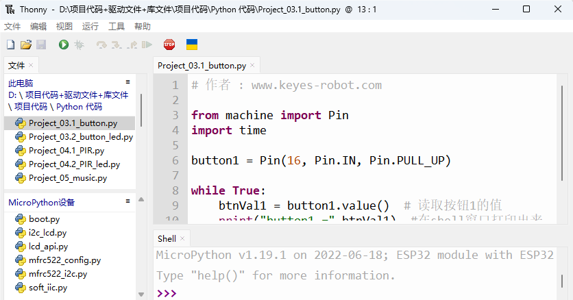


```python
## 作者 : www.keyes-robot.com

from machine import Pin
import time

button1 = Pin(16, Pin.IN, Pin.PULL_UP)

while True:
    btnVal1 = button1.value()  # 读取按钮1的值
    print("button1 =",btnVal1)  #在shell窗口打印出来
    time.sleep(0.1) #延时 0.1秒
```

**1.6. 实验结果1：**

将 ESP32 主控板通过Micro USB数据线与计算机相连供电，单击“当前运行脚本”，代码开始执行，外接电源供电，你会看到的现象是：未按按键时，Shell窗口打印按键值；再按下按键就可以看到按键状态值的改变，如下图。

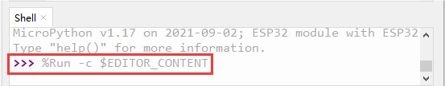


单击“停止/启动后端进程”退出程序。

**1.7. 台灯的实验代码2：** 

计算按键被点击的次数，然后再对计算的次数进行对2求余数，即可得到0或1两种状态值。

打开“Thonny”软件，点击“此电脑” → “D:” → “项目代码+驱动文件+库文件” → “项目代码” → “Python 代码”。并鼠标左键双击“Project_03.2_button_led.py”。

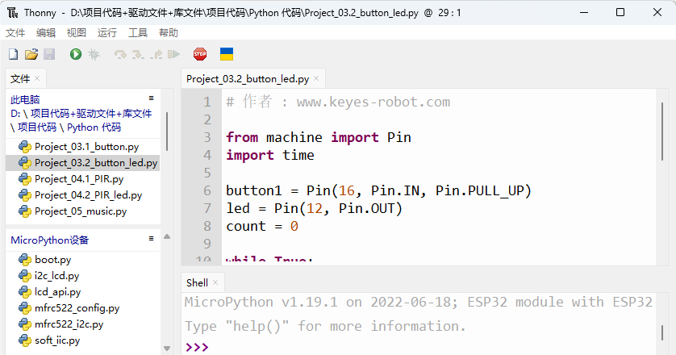


```python
## 作者 : www.keyes-robot.com

from machine import Pin
import time

button1 = Pin(16, Pin.IN, Pin.PULL_UP)
led = Pin(12, Pin.OUT)
count = 0

while True:
    btnVal1 = button1.value()  # 读取按钮1的值
    #print("button1 =",btnVal1)  #在shell窗口打印出来
    if(btnVal1 == 0):
        time.sleep(0.01)
        while(btnVal1 == 0):
            btnVal1 = button1.value()
            if(btnVal1 == 1):
                count = count + 1
                print(count)
    val = count % 2
    if(val == 1):
        led.value(1)
    else:
        led.value(0)
    time.sleep(0.1) #延时 0.1秒
```

**1.8. 实验结果2：**

将 ESP32 主控板通过Micro USB数据线与计算机相连供电，单击“当前运行脚本”，代码开始执行，外接电源供电，你会看到的现象是：在shell窗口中打印出按键被点击的次数，并且点击一次按键，LED灯就亮，再点击一次，LED关闭。如下图。


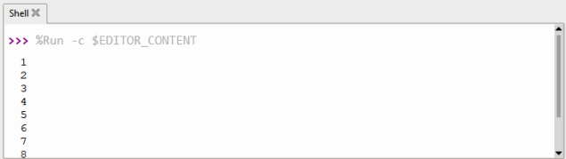

单击“停止/启动后端进程”退出程序。

### 第4课 人体感应灯

**1.1. 项目介绍：**

人体红外热释电传感器和按钮一样也是数字传感器，也就是有两个状态值0或1。还有需要人在动时才能感应的到。

人体红外热释电传感器在日常生活中是有很多应用场景的，例如，楼梯的自动感应灯，洗手台的自动感应水龙头等。

**1.2. 模块相关资料：**


|工作电压：|DC 4.5-6.5V|
|-|-|
|最大工作电流：|50MA|
|静态电流:|<50uA|
|控制接口：|数字输出(高电平为3.3V ，低电平0V)|
|控制信号：|数字信号1/0|
|工作温度：|-10 ~ 50 ℃|
|最大探测距离：|4米|
|感应角度：|＜100°锥角|


**1.3. 元件知识：** 

**人体红外热释电传感器：** 它是一款基于热释电效应的人体热释电红外运动传感器，能检测运动的人体或动物身上发出的红外信号，配合菲涅尔透镜能使传感器探测范围更远更广。它主要采用RE200B-P传感器元件，当附近有人或动物运动时，人体红外热释电传感器能根据检测到的红外线，将红外线信号转化为数字信号并输出一个高电平。它可以应用于多种场合来检测人体的运动。传统的热释电红外传感器体积大，电路复杂，可靠性低。

现在我们推出这款一款新的热释电红外运动传感器，该传感器集成了数字热释电红外传感器和连接管脚。具有灵敏度高、可靠性强、超低功耗，体积小、重量轻，超低电压工作模式和外围电路简单等特点。

**1.4. 实验组件：**

||||||
|-|-|-|-|-|
|ESP32 Plus主板 * 1|人体红外热释传感器*1|黄色LED模块*1|3P 转杜邦线母*2|USB线*1|

**1.5. 模块接线图：**

人体红外热释传感器和黄色LED灯的控制引脚：

|人体红外热释传感器（S引脚）|io14|
|-|-|
|黄色LED灯（S引脚）|io12|


**1.6. 读取人体红外热释电传感器值的实验代码1：** 

通过Shell窗口打印出人体红外热释电传感器的状态值。

打开“Thonny”软件，点击“此电脑” → “D:” → “项目代码+驱动文件+库文件” → “项目代码” → “Python 代码”。并鼠标左键双击“Project_04.1_PIR”。

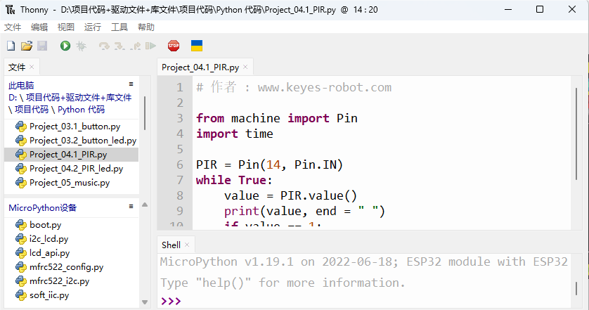


```python
## 作者 : www.keyes-robot.com

from machine import Pin
import time

PIR = Pin(14, Pin.IN)
while True:
    value = PIR.value()
    print(value, end = " ")
    if value == 1:
        print("Some body is in this area!")
    else:
        print("No one!")
    time.sleep(0.1)
```

**1.7. 实验结果1：**

将 ESP32 主控板通过Micro USB数据线与计算机相连供电，单击“当前运行脚本”，代码开始执行，外接电源供电，你会看到的现象是：Shell窗口中打印的数据，当你在传感器前静止不动，读取到的值是0，稍微动一下，读取到的值就变为1。

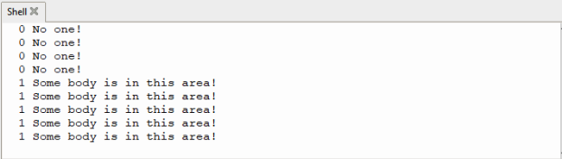

单击“停止/启动后端进程”退出程序。

**1.8. 人体感应灯的实验代码2：** 

只要有人在人体红外热释电传感器前面移动一下，LED灯就会亮起。

打开“Thonny”软件，点击“此电脑” → “D:” → “项目代码+驱动文件+库文件” → “项目代码” → “Python 代码”。并鼠标左键双击“Project_04.2_PIR_led”。

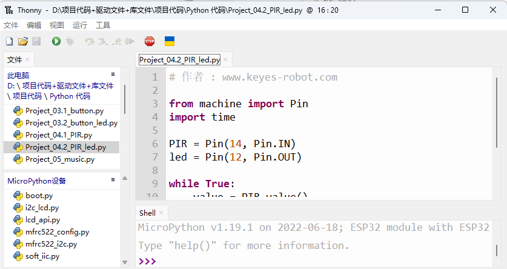


```python
## 作者 : www.keyes-robot.com

from machine import Pin
import time

PIR = Pin(14, Pin.IN)
led = Pin(12, Pin.OUT)

while True:
    value = PIR.value()
    print(value)
    if value == 1:
        led.value(1)# turn on led
    else:
        led.value(0)
    time.sleep(0.1)
```

**1.9. 实验结果2：**

将 ESP32 主控板通过Micro USB数据线与计算机相连供电，单击“当前运行脚本”，代码开始执行，外接电源供电，你会看到的现象是：用手在传感器前面动一下，LED灯亮起，人静止不动几秒后，LED灯关闭。


单击“停止/启动后端进程”退出程序。

### 第5课 演奏音乐

**1.1. 项目介绍：**

本实验用无源蜂鸣器播放音乐，无源蜂鸣器是通过PWM脉冲宽度调制脉冲进而调节音调，

PWM比较多用于调节LED灯的亮度或者调节无源蜂鸣器的频率，或者是电机的转动速度，电机带动的车轮速度也就能很容易控制了，在玩一些智能机器人时，更能体现PWM的好处。

音乐除了要“唱的准”，还要“节奏对”，每一个音符的持续时间，就是节拍啦。我们可以用延时多少来设置节拍的，例如：1拍，1秒即1000毫秒；1/2拍，0.5秒即500毫秒；1/4拍，0.25秒即250毫秒；1/8拍，0.125秒即125毫秒….，我们可以试一试组合不同的音调和节拍，看看会有什么不同的效果。

**1.2. 模块相关资料：**


工作电压：3.3-5V（DC）

电流：50MA

工作温度：-10摄氏度 到 +50摄氏度

尺寸：31.6mmx23.7mm

接口：3PIN接口

输入信号：数字信号（方波）

**1.3. 元件知识：** 

无源蜂鸣器：其内部不带震荡电路，控制时需要在元件正极输入不同频率的方波，负极接地，从而控制喇叭功放元件响起不同频率的声音。

**1.4. 实验组件：**

|||||
|-|-|-|-|
|ESP32 Plus主板 * 1|无源蜂鸣器模块*1|3P 转杜邦线母*1|USB线*1|

**1.5. 模块接线图：**

无源蜂鸣器的控制引脚：

* 无源蜂鸣器（S引脚）io25

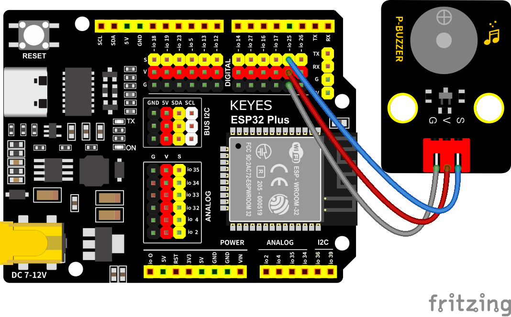

**1.6. 播放生日快乐的实验代码：** 

打开“Thonny”软件，点击“此电脑” → “D:” → “项目代码+驱动文件+库文件” → “项目代码” → “Python 代码”。并鼠标左键双击“Project_05_music.py”。

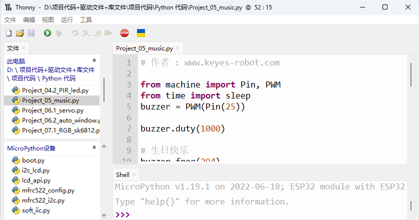


```python
## 作者 : www.keyes-robot.com

from machine import Pin, PWM
from time import sleep
buzzer = PWM(Pin(25))

buzzer.duty(1000) 

## 生日快乐
buzzer.freq(294)
sleep(0.25)
buzzer.freq(440)
sleep(0.25)
buzzer.freq(392)
sleep(0.25)
buzzer.freq(532)
sleep(0.25)
buzzer.freq(494)
sleep(0.25)
buzzer.freq(392)
sleep(0.25)
buzzer.freq(440)
sleep(0.25)
buzzer.freq(392)
sleep(0.25)
buzzer.freq(587)
sleep(0.25)
buzzer.freq(532)
sleep(0.25)
buzzer.freq(392)
sleep(0.25)
buzzer.freq(784)
sleep(0.25)
buzzer.freq(659)
sleep(0.25)
buzzer.freq(532)
sleep(0.25)
buzzer.freq(494)
sleep(0.25)
buzzer.freq(440)
sleep(0.25)
buzzer.freq(698)
sleep(0.25)
buzzer.freq(659)
sleep(0.25)
buzzer.freq(532)
sleep(0.25)
buzzer.freq(587)
sleep(0.25)
buzzer.freq(532)
sleep(0.5)
buzzer.duty(0)
```

**1.7. 实验结果：**

将 ESP32 主控板通过Micro USB数据线与计算机相连供电，单击“当前运行脚本”，代码开始执行，外接电源供电，你会看到的现象是：无源蜂鸣器播放一次生日快乐歌曲。


单击“停止/启动后端进程”退出程序。

### 第6课 自动门窗

**1.1. 项目介绍：**

当我们在制作智能家居时，经常会将舵机和门、窗等固定在一起。这样，我们就可以利用舵机转动，带动门、窗等开或关，从而起到家居生活的智能化功能。既然是自动门窗，那就需要动力装置，我们使用的是180度的舵机。再加上一些传感器，就会变得更加自动化，例如添加个雨滴传感器，就可以做下雨自动关窗；增加个RFID，就可以实现刷卡开门等。

**1.2. 舵机相关资料：**

**舵机：** 舵机是一种位置伺服的驱动器，主要是由外壳、电路板、无核心马达、齿轮与位置检测器所构成。其工作原理是由接收机或者单片机发出信号给舵机，其内部有一个基准电路，产生周期为20ms，宽度为1.5ms的基准信号，将获得的直流偏置电压与电位器的电压比较，获得电压差输出。经由电路板上的IC判断转动方向，再驱动无核心马达开始转动，透过减速齿轮将动力传至摆臂，同时由位置检测器送回信号，判断是否已经到达定位。适用于那些需要角度不断变化并可以保持的控制系统。当电机转速一定时，通过级联减速齿轮带动电位器旋转，使得电压差为0，电机停止转动。

伺服电机有多种规格，但它们都有三根连接线，分别是棕色、红色、橙色(不同品牌可能有不同的颜色)。棕色为GND，红色为电源正极，橙色为信号线。


舵机的伺服系统由可变宽度的脉冲来进行控制，橙色的控制线是用来传送脉冲的。一般而言，PWM控制舵机的基准信号周期为20ms（50Hz），理论上脉宽应在1ms到2ms之间，对应控制舵机角度是0°～180°。但是，实际上更多控制舵机的脉宽范围是0.5ms到2.5ms，具体需要自己实际调试下。

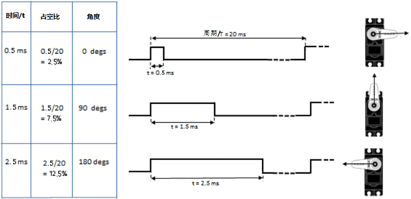

经过实测，舵机的脉冲范围为0.65ms~2.5ms。180度舵机，对应的控制关系是这样的：

|高电平时间|舵机角度|基准信号周期时间（20ms）|
|-|-|-|
|0.65ms|0度|0.65ms高电平+19.35ms低电平|
|1.5ms|90度|1.5ms高电平+18.5ms低电平|
|2.5ms|180度|2.5ms高电平+17.5ms低电平|

舵机的规格参数：

|工作电压：|DC 4.8V〜6V|可操作角度范围：|大约180°(在500→2500μsec)|
|-|-|-|-|
|脉波宽度范围：|500→2500 μsec|外观尺寸：|22.9*12.2*30mm|

|空载转速：|0.12±0.01 sec/60度（DC 4.8V） 0.1±0.01 sec/60度（DC 6V）|
|-|-|
|空载电流：|200±20mA（DC 4.8V） 220±20mA（DC 6V）|
|停止扭力：|1.3±0.01kg·cm（DC 4.8V） 1.5±0.1kg·cm（DC 6V）|
|停止电流：|≦850mA（DC 4.8V） ≦1000mA（DC 6V）|
|待机电流：|3±1mA（DC 4.8V） 4±1mA（DC 6V）|
|重量:|9±1g (without servo horn)|
|使用温度：|-30℃~60℃|

**1.3. 实验组件：**

||||||
|-|-|-|-|-|
|ESP32 Plus主板 * 1|水滴传感器模块*1|180度舵机*2|3P 转杜邦线母*1|USB线*1|

**1.4. 模块接线图：**

水滴传感器，窗户舵机和门舵机的控制引脚：

|窗户舵机（橙黄色线引脚）|io5|
|-|-|
|门舵机（橙黄色线引脚）|io13|
|水滴传感器（S引脚）|io34|


**1.5. 控制门来回转动的实验代码1：** 

打开“Thonny”软件，点击“此电脑” → “D:” → “项目代码+驱动文件+库文件” → “项目代码” → “Python 代码”。并鼠标左键双击“Project_06.1_servo.py”。

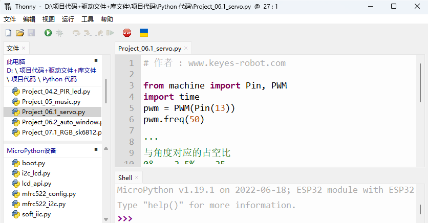


```python
## 作者 : www.keyes-robot.com

from machine import Pin, PWM
import time
pwm = PWM(Pin(13))  
pwm.freq(50)

'''
与角度对应的占空比
0°----2.5%----25
45°----5%----51.2
90°----7.5%----77
135°----10%----102.4
180°----12.5%----128
'''
angle_0 = 25
angle_90 = 77
angle_180 = 128

while True:
    pwm.duty(angle_0)
    time.sleep(1)
    pwm.duty(angle_90)
    time.sleep(1)
    pwm.duty(angle_180)
    time.sleep(1)
```

**1.6. 实验结果1：**

将 ESP32 主控板通过Micro USB数据线与计算机相连供电，单击“当前运行脚本”，代码开始执行，外接电源供电，你会看到的现象是：门的舵机带着门转动，来回旋转。


单击“停止/启动后端进程”退出程序。

**1.7. 下雨自动关窗的实验代码2：** 

使用舵机和雨滴传感器搭配做个下雨自动关窗装置。

**雨滴传感器：** 这是个模拟输入传感器，水分覆盖到检测面上的面积越大，返回的值越大（范围0~4096）

打开“Thonny”软件，点击“此电脑” → “D:” → “项目代码+驱动文件+库文件” → “项目代码” → “Python 代码”。并鼠标左键双击“Project_06.2_auto_window.py”。

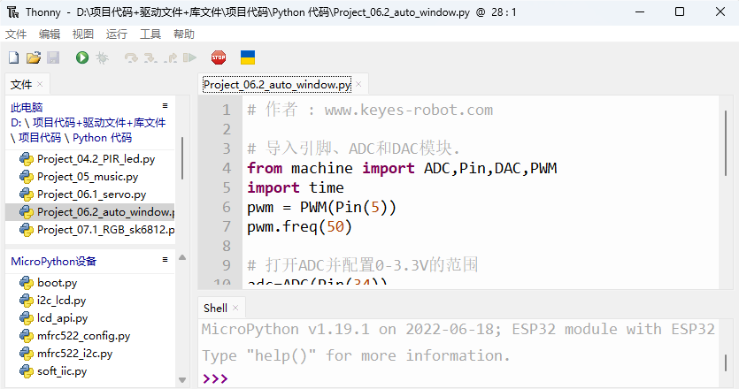


```python
## 作者 : www.keyes-robot.com

## 导入引脚、ADC和DAC模块.
from machine import ADC,Pin,DAC,PWM
import time
pwm = PWM(Pin(5))  
pwm.freq(50)

## 打开ADC并配置0-3.3V的范围 
adc=ADC(Pin(34))
adc.atten(ADC.ATTN_11DB)
adc.width(ADC.WIDTH_12BIT)
pwm.duty(80)

## 每0.1秒读取一次ADC值，将ADC值转换为DAC值并输出，将这些数据打印到“Shell”窗口中。 
try:
    while True:
        adcVal=adc.read()
        dacVal=adcVal//16
        voltage = adcVal / 4095.0 * 3.3
        print("ADC Val:",adcVal,"DACVal:",dacVal,"Voltage:",voltage,"V")
        if(voltage > 0.6):
            pwm.duty(25)
        else:
            pwm.duty(80)
        time.sleep(0.1)
except:
    pass
```

**1.8. 实验结果2：**

将 ESP32 主控板通过Micro USB数据线与计算机相连供电，单击“当前运行脚本”，代码开始执行，外接电源供电，你会看到的现象是：开始窗户自动打开，然后用手（手皮肤有水）触碰一下雨滴传感器，窗户就会关闭。

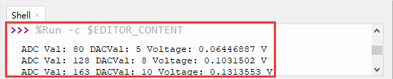


单击“停止/启动后端进程”退出程序。


### 第7课 氛围灯

**1.1. 项目介绍：**

智能家居的氛围灯是4个SK6812RGB LED，RGB LED属于简单的发光模块，可以通过调节色彩调出不同颜色的灯效，可广泛应用于建筑物、桥梁、道路、花园、庭院、地板等领域的装饰照明与会场布置、圣诞节、万圣节、情人节、复活节、国庆节等节日期间烘托气氛等场景。在本实验中，实现各种灯光效果。

**1.2. 模块相关资料：**

**SK6812RGB：** 从原理图中可以看出，这4个RGBLED都是串联起来的，在电压电流充足的情况下可以接几百个RGB LED，都可以用一根信号线控制任意一个RGB LED，并且让它显示任意一种颜色。每一颗RGBLED都是一个独立的像素点，每个像素点都是由R、G、B三基色颜色组成，可实现256级亮度显示，完成16777216种颜色的全真色彩显示，同时像素点内部包含了智能数字接口数据锁存信号整形放大驱动电路，还内置信号整形电路，有效保证了像素点光的颜色高度一致。

数据协议采用单线归零码的通讯方式，像素点在上电复位以后，S端接受从控制器传输过来的数据，首先送过来的24bit数据被第一个像素点提取后，送到像素点内部的数据锁存器。这个6812RGB通讯协议与驱动已经在底层封装好了，我们直接调用函数的接口就可以使用，简单方便，LED具有低电压驱动，环保节能，亮度高，散射角度大，一致性好，超低功率，超长寿命等优点。


**1.3. 实验组件：**

|||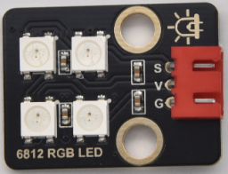|||
|-|-|-|-|-|
|ESP32 Plus主板 * 1|按键*2|SK6812RGB灯*1|3P 转杜邦线母*3|USB线*1|

**1.4. 模块接线图：**

按键1，按键2和SK6812RGB灯的控制引脚：

|SK6812RGB灯（S引脚）|io26|
|-|-|
|按键1（S引脚）|io16|
|按键2（S引脚）|io27|


**1.5. 控制SK6812的实验代码1：** 

控制SK6812显示各种灯效

打开“Thonny”软件，点击“此电脑” → “D:” → “项目代码+驱动文件+库文件” → “项目代码” → “Python 代码”。并鼠标左键双击“Project_07.1_RGB_sk6812.py”。

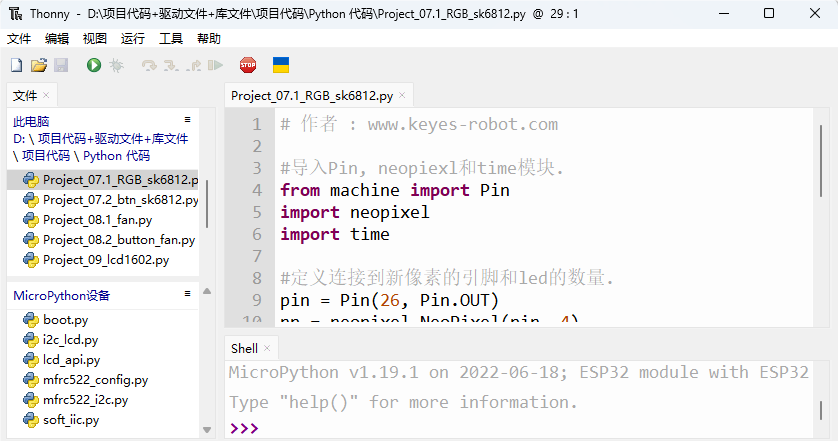


```python
## 作者 : www.keyes-robot.com

##导入Pin, neopiexl和time模块.
from machine import Pin
import neopixel
import time

##定义连接到新像素的引脚和led的数量.
pin = Pin(26, Pin.OUT)
np = neopixel.NeoPixel(pin, 4) 

##亮度:0 - 255
brightness=100                                
colors=[[brightness,0,0],                     #红
        [0,brightness,0],                    #绿
        [0,0,brightness],                    #蓝
        [brightness,brightness,brightness],     #白
        [0,0,0]]                           #关闭

##嵌套两个for循环，使模块重复显示红、绿、蓝、白和OFF五种状态。    
while True:
    for i in range(0,5):
        for j in range(0,4):
            np[j]=colors[i]
            np.write()
            time.sleep_ms(50)
        time.sleep_ms(500)
    time.sleep_ms(500)
```

**1.6. 实验结果1：**

将 ESP32 主控板通过Micro USB数据线与计算机相连供电，单击“当前运行脚本”，代码开始执行，外接电源供电，你会看到的现象是：智能家居的氛围灯显示红、绿、蓝、白。


单击“停止/启动后端进程”退出程序。

**1.7. 按钮切换灯颜色的实验代码2：** 

两个按键，左右切换氛围灯的颜色。

打开“Thonny”软件，点击“此电脑” → “D:” → “项目代码+驱动文件+库文件” → “项目代码” → “Python 代码”。并鼠标左键双击“Project_07.2_btn_sk6812.py”。

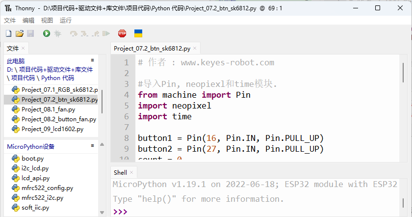


```python
## 作者 : www.keyes-robot.com

##导入Pin, neopiexl和time模块.
from machine import Pin
import neopixel
import time

button1 = Pin(16, Pin.IN, Pin.PULL_UP)
button2 = Pin(27, Pin.IN, Pin.PULL_UP)
count = 0

##定义连接到新像素的引脚和led的数量.
pin = Pin(26, Pin.OUT)
np = neopixel.NeoPixel(pin, 4) 

##亮度:0 - 255
brightness=100                                
colors=[[0,0,0],
        [brightness,0,0],                    #红
        [0,brightness,0],                    #绿
        [0,0,brightness],                    #蓝
        [brightness,brightness,brightness]  #白
        ]                             #关闭

def func_color(val):
    for j in range(0,4):
        np[j]=colors[val]
        np.write()
        time.sleep_ms(50)
        
##嵌套两个for循环，使模块重复显示红、绿、蓝、白和OFF五种状态.    
while True:
    btnVal1 = button1.value()  # 读取按钮1的值
    #print("button1 =",btnVal1)  #用shell窗口中打印出来
    if(btnVal1 == 0):
        time.sleep(0.01)
        while(btnVal1 == 0):
            btnVal1 = button1.value()
            if(btnVal1 == 1):
                count = count - 1
                print(count)
                if(count <= 0):
                    count = 0
                
    btnVal2 = button2.value()        
    if(btnVal2 == 0):
        time.sleep(0.01)
        while(btnVal2 == 0):
            btnVal2 = button2.value()
            if(btnVal2 == 1):
                count = count + 1
                print(count)
                if(count >= 4):
                    count = 4
    
    if(count == 0):
        func_color(0)
    elif(count == 1):
        func_color(1)
    elif(count == 2):
        func_color(2)
    elif(count == 3):
        func_color(3)
    elif(count == 4):
        func_color(4)
```

**1.8. 实验结果2：**

将 ESP32 主控板通过Micro USB数据线与计算机相连供电，单击“当前运行脚本”，代码开始执行，外接电源供电，你可以通过点击按键1和按键2来切换氛围灯的颜色。


单击“停止/启动后端进程”退出程序。

### 第8课 风扇

**1.1. 项目介绍：**

130电机控制模块采用HR1124S电机控制芯片。HR1124S是应用于直流电机方案的单通道H桥驱动器芯片。HR1124S的H桥驱动部分采用低导通电阻的PMOS和NMOS功率管。低导通电阻保证芯片低的功率损耗，使得芯片安全工作更长时间。此外HR1124S拥有低待机电流，低静态工作电流，这些性能使HR1124S易用于玩具方案。

该模块兼容各种单片机控制板，如arduino系列单片机。模块上自带的防反插红色端子间距为2.54mm，实验中，我们可通过输出到两个信号端IN+和IN-的电压方向来控制电机的转动方向，使用PWM输出控制风扇的转速，让电机转动起来。

**1.2. 模块相关资料：**

**（1）元件知识：**

130电机控制模块采用HR1124S电机控制芯片。HR1124S是应用于直流电机方案的单通道H桥驱动器芯片。HR1124S的H桥驱动部分采用低导通电阻的PMOS和NMOS功率管。低导通电阻保证芯片低的功率损耗，使得芯片安全工作更长时间。此外HR1124S拥有低待机电流，低静态工作电流，这些性能使HR1124S易用于玩具方案。

该模块兼容各种单片机控制板，如arduino系列单片机。模块上自带的防反插红色端子间距为2.54mm，实验中，我们可通过输出到两个信号端IN+和IN-的电压方向来控制电机的转动方向，使用PWM输出控制风扇的转速，让电机转动起来。


|工作电压：|3.3-5V(DC)|最大电流：|200mA (DC5V)|
|-|-|-|-|
|最大功率：|1W|控制接口：|双数字口（数字输入）|
|工作温度：|-10°C ~+50°C|环保属性：|ROHS|

**（2）控制方法**

需要两个引脚控制风扇的电机，一引脚为INA，二引脚为INB。PWM值范围是0~255，当两个引脚的PWM输出一定差值时，风扇就能转动。

|INA - INB <= -45|顺时针转动|
|-|-|
|INA - INB >= 45|逆时针转动|
|INA == 0 , INB == 0|停止|

**1.3. 实验组件：**

|||||
|-|-|-|-|
|ESP32 Plus主板 * 1|按键*1|130电机模块*1|风扇叶*1|
|||||
|4P 转杜邦线母*1|3P 转杜邦线母*1|USB线*1||

**1.4. 模块接线图**：

按键1和130电机模块的控制引脚：

|按键1（S引脚）|io16|
|-|-|
|电机模块的IN+引脚|io19|
|电机模块的IN-引脚|io18|

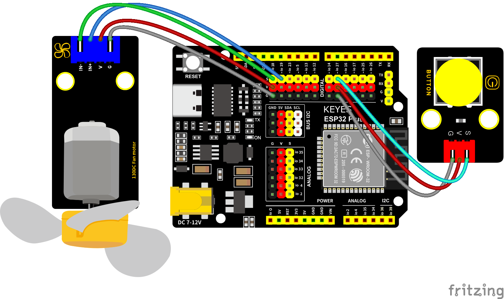

**1.5. 控制风扇转动的实验代码1：** 

控制风扇的正反转和速度。

打开“Thonny”软件，点击“此电脑” → “D:” → “项目代码+驱动文件+库文件” → “项目代码” → “Python 代码”。并鼠标左键双击“Project_08.1_fan.py”。

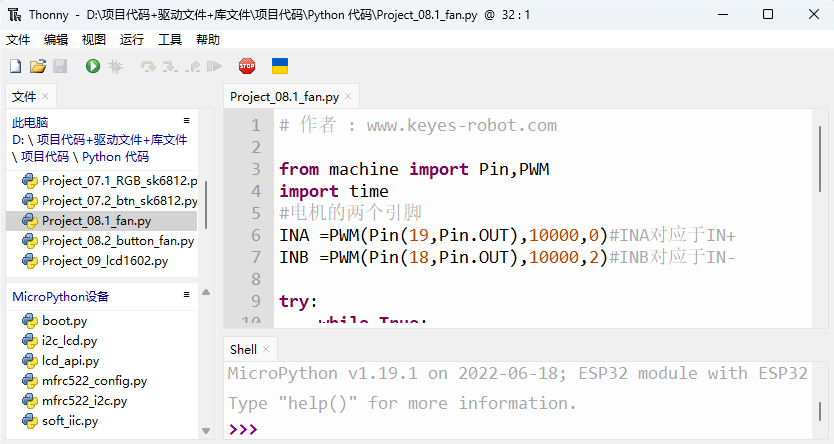


```python
## 作者 : www.keyes-robot.com

from machine import Pin,PWM
import time
##电机的两个引脚
INA =PWM(Pin(19,Pin.OUT),10000,0)#INA对应于IN+
INB =PWM(Pin(18,Pin.OUT),10000,2)#INB对应于IN- 

try:
    while True:
        #逆时针方向2秒
        INA.duty(0) #占空比范围为0-1023
        INB.duty(700)
        time.sleep(2)
        #停止1秒
        INA.duty(0)
        INB.duty(0)
        time.sleep(1)
        #顺时针旋转2秒
        INA.duty(600)
        INB.duty(0)
        time.sleep(2)
        #停止1秒
        INA.duty(0)
        INB.duty(0)
        time.sleep(1)
except:
    INA.duty(0)
    INB.duty(0)
    INA.deinit()
    INB.deinit()
    INB.deinit()
```

**1.6. 实验结果1：**

将 ESP32 主控板通过Micro USB数据线与计算机相连供电，单击“当前运行脚本”，代码开始执行，外接电源供电，你会看到的现象是：顺时针和逆时针不同转速转动。


单击“停止/启动后端进程”退出程序。

**1.7. 按钮开关风扇的实验代码2：** 

一台简易的风扇，通过按键1开关风扇。

打开“Thonny”软件，点击“此电脑” → “D:” → “项目代码+驱动文件+库文件” → “项目代码” → “Python 代码”。并鼠标左键双击“Project_08.2_button_fan.py”。

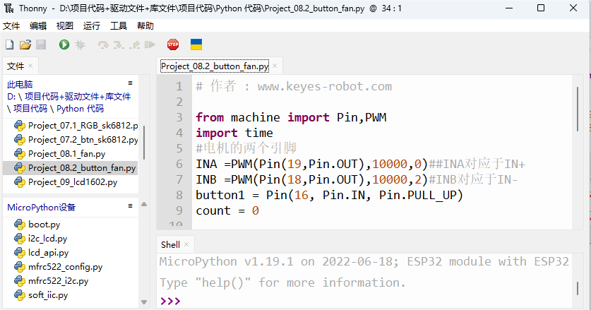


```python
## 作者 : www.keyes-robot.com

from machine import Pin,PWM
import time
##电机的两个引脚
INA =PWM(Pin(19,Pin.OUT),10000,0)##INA对应于IN+
INB =PWM(Pin(18,Pin.OUT),10000,2)#INB对应于IN-
button1 = Pin(16, Pin.IN, Pin.PULL_UP)
count = 0

try:
    while True:
        btnVal1 = button1.value()  # 读取按钮1的值
        if(btnVal1 == 0):
            time.sleep(0.01)
            while(btnVal1 == 0):
                btnVal1 = button1.value()
                if(btnVal1 == 1):
                    count = count + 1
                    print(count)
        val = count % 2
        if(val == 1):
            INA.duty(0) #占空比范围为0-1023
            INB.duty(700)
        else:
            INA.duty(0)
            INB.duty(0)
except:
    INA.duty(0)
    INB.duty(0)
    INA.deinit()
    INB.deinit()
```

**1.8. 实验结果2：**

将 ESP32 主控板通过Micro USB数据线与计算机相连供电，单击“当前运行脚本”，代码开始执行，外接电源供电，你点击一下按键1，风扇开始转动，再按一下按键1，风扇停止。


单击“停止/启动后端进程”退出程序。

### 第9课 LCD1602显示

**1.1. 项目介绍：**

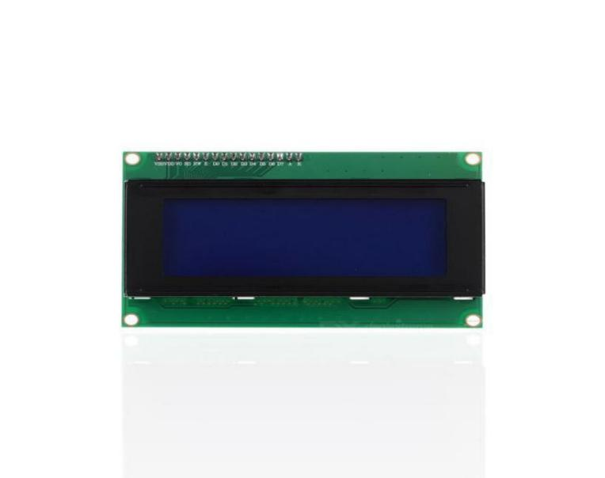

现代社会人类每天面对最多的就是屏幕了吧，电脑、手机和各类电子产品。屏幕是人与电子设备最好的交互方式之一，直观明了。

Keyes I2C 1602 LCD模块是可以显示2行，每行16个字符的液晶显示器模块。液晶显示器显示蓝底白字，自带I2C通信模块，使用时只需连接单片机I2C通信接口，大大节约了单片机资源。最初的1602 LCD需要7个IO端口来启动和运行，而Keyes I2C 1602 LCD模块内置Arduino IIC/I2C接口，节省了5个IO端口。和Arduino液晶库文件兼容，用起来很简单。

LCD非常适合打印数据和显示数字。可以显示32个字符(16x2)。在Keyes I2C 1602 LCD模块的背面有一个蓝色的电位器，可以转动电位器来调整对比度。连接时请注意，LCD的GND和VCC不能接反，否则会损坏LCD。

**1.2. 模块相关资料：**

|工作电压：|DC5V|I2C地址：|0x27|控制接口：|I2C|
|-|-|-|-|-|-|
|工作电流：|< 130mA|工作环境温度：|0°C ~ 45°C（推荐）|驱动芯片：|PCF8574T|

|GND：一个接地的引脚|VCC：一个连接到+5V电源的引脚|SDA：一个连接到SDA（或A4）的引脚，用于IIC通信|
|-|-|-|
|SCL：一个连接到SCL（或A5）的引脚，用于IIC通信|背光（蓝底白字）|可调对比度|

**1.3. 实验组件：**

||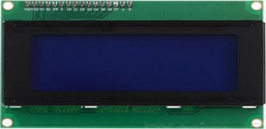|||
|-|-|-|-|
|ESP32 Plus主板 * 1|I2C LCD1602模块* 1|4P 转杜邦线母*1|USB线*1|

**1.4. 模块接线图：**

I2C 1602 LCD模块的控制引脚：

|I2C 1602 LCD模块的SCL引脚|SCL|
|-|-|
|I2C 1602 LCD模块的SDA引脚|SDA|

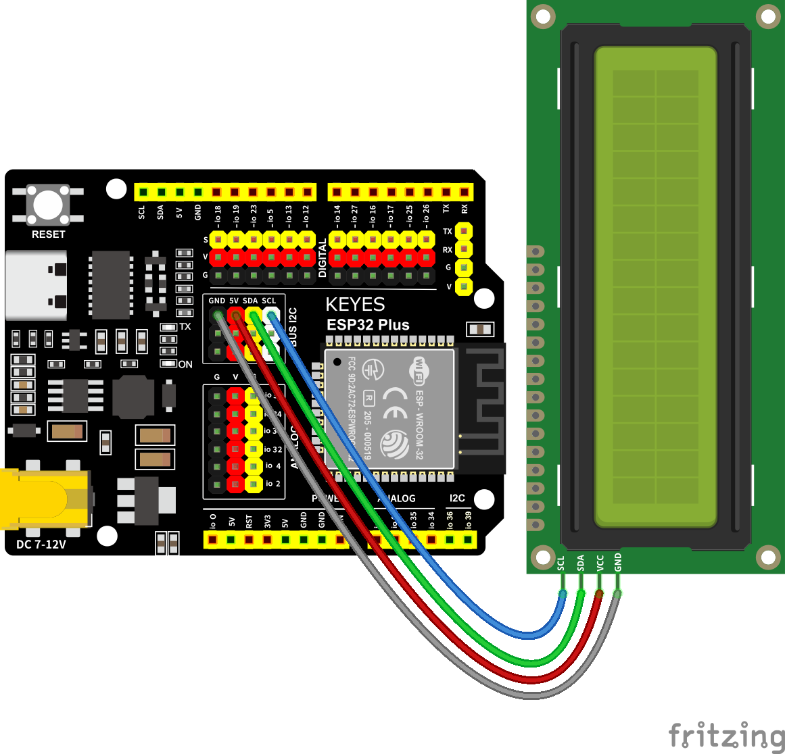

**1.5. 屏幕显示字符串的实验代码：** 


打开“Thonny”软件，点击“此电脑” → “D:” → “项目代码+驱动文件+库文件” → “项目代码” → “Python 代码”。然后鼠标左键双击“Project_09_lcd1602.py”。

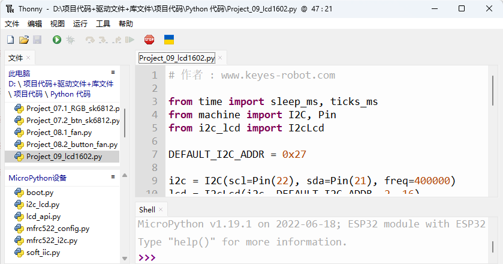


```python
## 作者 : www.keyes-robot.com

from time import sleep_ms, ticks_ms 
from machine import I2C, Pin 
from i2c_lcd import I2cLcd 

DEFAULT_I2C_ADDR = 0x27

i2c = I2C(scl=Pin(22), sda=Pin(21), freq=400000) 
lcd = I2cLcd(i2c, DEFAULT_I2C_ADDR, 2, 16)

lcd.move_to(1, 0)
lcd.putstr('Hello')
lcd.move_to(1, 1)
lcd.putstr('keyes')

## The following line of code should be tested
## using the REPL:

## 1. To print a string to the LCD:
##    lcd.putstr('Hello world')
## 2. To clear the display:
##lcd.clear()
## 3. To control the cursor position:
## lcd.move_to(2, 1)
## 4. To show the cursor:
## lcd.show_cursor()
## 5. To hide the cursor:
##lcd.hide_cursor()
## 6. To set the cursor to blink:
##lcd.blink_cursor_on()
## 7. To stop the cursor on blinking:
##lcd.blink_cursor_off()
## 8. To hide the currently displayed character:
##lcd.display_off()
## 9. To show the currently hidden character:
##lcd.display_on()
## 10. To turn off the backlight:
##lcd.backlight_off()
## 11. To turn ON the backlight:
##lcd.backlight_on()
## 12. To print a single character:
##lcd.putchar('x')
## 13. To print a custom character:
##happy_face = bytearray([0x00, 0x0A, 0x00, 0x04, 0x00, 0x11, 0x0E, 0x00])
##lcd.custom_char(0, happy_face)
##lcd.putchar(chr(0))
```

**1.6. 实验结果：**

将 ESP32 主控板通过Micro USB数据线与计算机相连供电，单击“当前运行脚本”，代码开始执行，外接电源供电，你会看到的现象是：LCD1602第一行显示hello，第二行显示keyes。

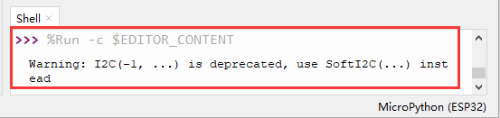

单击“停止/启动后端进程”退出程序。

### 第10课 MQ2模拟气体传感器实验

**1.1. 项目介绍：**

气体传感器检测到危险气体比较浓时，蜂鸣器发出警报声，显示屏显示dangerous。

我们的传感器引出了数字引脚D和模拟输出引脚A，本课程中是接到了D引脚，作为数字传感器的。

**1.2. 模块相关资料：**


**（1）元件知识**

气体传感器（MQ-2）可用于家庭用气体泄漏报警器、工业用可燃气体报警器以及便携式气体检测仪器，适宜于液化气、苯、烷、酒精、氢气、烟雾等的探测，被广泛运用到各种消防报警系统中。故因此，气体传感器（MQ-2）可以准确来说是一个多种气体探测器，同时还具有灵敏度高、响应快、稳定性好、寿命长、驱动电路简单等优点。

气体传感器（MQ-2）检测可燃气体与烟雾的浓度范围是300~10000ppm，对天然气、液化石油气等烟雾有很高的灵敏度，尤其对烷类烟雾更为敏感。在使用之前必须加热一段时间，这样输出的电阻和电压较准确。但是加热电压不宜过高，否则会导致内部的信号线熔断。

模拟气体（MQ-2）传感器属于二氧化锡半导体气敏材料，属于表面离子式N型半导体。处于200~300摄氏度时，二氧化锡吸附空气中的氧，形成氧的负离子吸附，使半导体中的电子密度减少，从而使其电阻值增加。当与空气中可燃气体和烟雾烟雾接触时，如果晶粒间界处的势垒收到烟雾的调至而变化，就会引起表面导电率的变化。利用这一点就可以获得烟雾或可燃气体存在的信息，空气中烟雾或可燃气体的浓度越大，导电率越大，输出电阻越低，则输出的模拟信号就越大。

此外，通过旋转电位器可以调整气体传感器（MQ-2）灵敏度。上电后，传感器上的一个指示灯亮绿灯，并且还可以调节蓝色的正方体电位器，使模块上另一个指示灯介于不亮与亮之间的临界点时，灵敏度最高。

**（2）参数**


|工作电压：|3.3-5V|
|-|-|
|工作电流：|160mA (DC5V)|
|工作温度：|0°C ~ 40°C|
|控制接口：|数字、模拟输出|
|检测浓度：|300-10000ppm(可燃气体)|
|浓度斜率：|≤0.6(R3000ppm/R1000ppm C3H8)|
|灵敏度：|Rs(in air)/Rs(1000ppm异丁烷)≥5|
|敏感体表面电阻（Rs）|2KΩ-20KΩ(in 2000ppm C3H8 )|

**1.3. 实验组件：**

||||
|-|-|-|
|ESP32 Plus主板 * 1|MQ2传感器*1|USB线*1|
||||
|I2C LCD1602模块* 1|4P 转杜邦线母*2||

**1.4. 模块接线图：**

MQ-2气体传感器和I2C 1602 LCD模块的控制引脚：

|MQ-2气体传感器（D引脚）|io23|
|-|-|
|I2C 1602 LCD模块的SCL引脚|SCL|
|I2C 1602 LCD模块的SDA引脚|SDA|

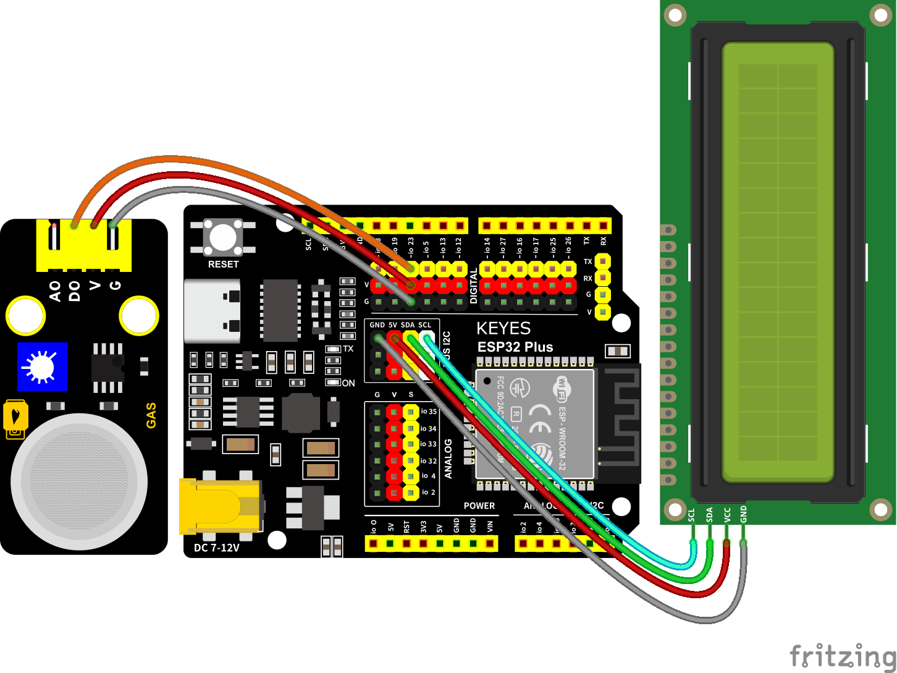

**1.5. 实验代码：** 


打开“Thonny”软件，点击“此电脑” → “D:” → “项目代码+驱动文件+库文件” → “项目代码” → “Python 代码”。然后鼠标左键双击“Project_10_gas_lcd.py”。

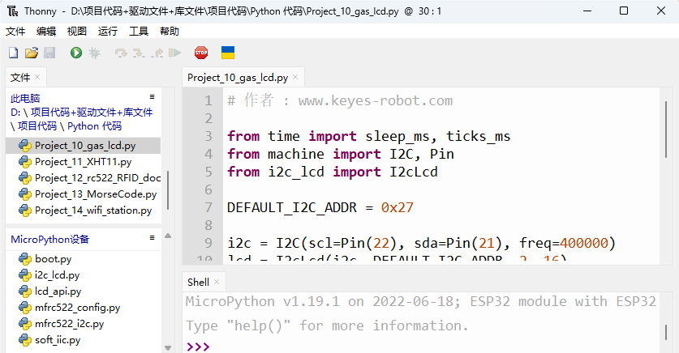


```python
## 作者 : www.keyes-robot.com

from time import sleep_ms, ticks_ms 
from machine import I2C, Pin 
from i2c_lcd import I2cLcd 

DEFAULT_I2C_ADDR = 0x27

i2c = I2C(scl=Pin(22), sda=Pin(21), freq=400000) 
lcd = I2cLcd(i2c, DEFAULT_I2C_ADDR, 2, 16)

from machine import Pin
import time
gas = Pin(23, Pin.IN, Pin.PULL_UP)

while True:
    gasVal = gas.value()  # 读取MQ-2的值
    print("gas =",gasVal)  #在shell窗口中打印出来
    lcd.move_to(1, 1)
    lcd.putstr('val: {}'.format(gasVal))
    if(gasVal == 1):
        #lcd.clear()
        lcd.move_to(1, 0)
        lcd.putstr('Safety       ')
    else:
        lcd.move_to(1, 0)
        lcd.putstr('dangerous')
    time.sleep(0.1) #延时 0.1秒
```

**1.6. 实验结果：**

将 ESP32 主控板通过Micro USB数据线与计算机相连供电，单击“当前运行脚本”，代码开始执行，外接电源供电，你会看到的现象是：屏幕正常状态下显示safety，当气体传感器检测到一些危险气体，例如一氧化碳(可以使用打火机气体检测)，检测到一定浓度时，显示屏显示dangerous。

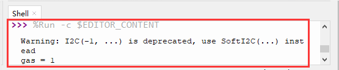


单击“停止/启动后端进程”退出程序。

### 第11课 温湿度

**1.1. 项目介绍：**

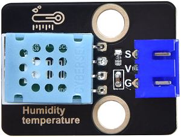

XHT11温湿度传感器（XHT11完全兼容DHT11）是一款含有已校准数字信号输出的温湿度复合传感器，其精度：湿度±5%RH，温度±2℃；量程：湿度5-95%RH，温度-20~60℃。XHT11温湿度传感器应用专用的数字模块采集技术和温湿度传感技术，确保产品具有极高的可靠性和卓越的长期稳定性。XHT11温湿度传感器包括一个电阻式感湿元件和一个NTC测温元件，非常适用于对精度和实时性要求不高的温湿度测量场合。

XHT11有三个引脚，分别为V，G，和S。S为数据输出的引脚，使用的是串行通讯。

**1.2. 模块相关资料：**


|工作电压：|3.3V-5V（DC）|
|-|-|
|最大工作电流：|50mA|
|最大功率：|0.25W|
|控制接口：|数字双向单总线|
|温度范围：|0-50℃（±2℃）|
|湿度范围：|20-90%RH（±5%RH）|
|工作温度：|-25℃~+60℃|

**XHT11温湿度传感器的单总线格式定义：**

|名称|单总线格式定义|
|-|-|
|起始信号|微处理器把数据总线（SDA）拉低一段时间至少 18ms（最大不得超过30ms），通知传感器准备数据。|
|响应信号|传感器把数据总线（SDA）拉低 83µs，再接高 87µs以响应主机的起始信号。|
|湿度|湿度高位为湿度整数部分数据，湿度低位为湿度小数部分数据|
|温度|温度高位为温度整数部分数据，温度低位为温度小数部分数据，且温度低位Bit8 为 1 则表示负温度，否则为正温度。|
|校验位|校验位＝湿度高位+湿度低位+温度高位+温度低位|

**XHT11温湿度传感器数据时序图：**

用户主机（MCU）发送一次开始信号后，XHT11
从低功耗模式转换到高速模式，待主机开始信号结束后，XHT11
发送响应信号，送出 40bit 的数据，并触发一次信采集。信号发送如图所示。


**1.3. 实验组件：**

|||||
|-|-|-|-|
|ESP32 Plus主板 * 1|XHT11传感器*1|USB线*1|4P 转杜邦线母*1|
|||||
|I2C LCD1602模块* 1|3P 转杜邦线母*1|||

**1.4. 模块接线图：**

XHT11温湿度传感器和I2C 1602 LCD模块的控制引脚：

|XHT11温湿度传感器（S引脚）|io17|
|-|-|
|I2C 1602 LCD模块的SCL引脚|SCL|
|I2C 1602 LCD模块的SDA引脚|SDA|


**1.5. 实验代码：** 

打开“Thonny”软件，点击“此电脑” → “D:” → “项目代码+驱动文件+库文件” → “项目代码” → “Python 代码”。然后鼠标左键双击“Project_11_XHT11.py”。

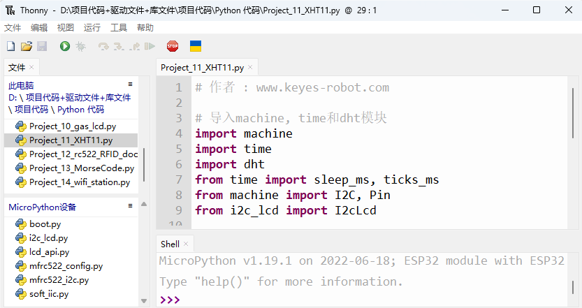


```python
## 作者 : www.keyes-robot.com

## 导入machine, time和dht模块
import machine
import time
import dht
from time import sleep_ms, ticks_ms 
from machine import I2C, Pin 
from i2c_lcd import I2cLcd 

##关联DHT11与引脚(17).
DHT = dht.DHT11(machine.Pin(17))

DEFAULT_I2C_ADDR = 0x27

i2c = I2C(scl=Pin(22), sda=Pin(21), freq=400000) 
lcd = I2cLcd(i2c, DEFAULT_I2C_ADDR, 2, 16)

while True:
    DHT.measure() # 启动DHT11测量一次数据。
   # 调用DHT的内置函数获取温度和湿度数据，并打印在 “Shell”.
    print('temperature:',DHT.temperature(),'℃','humidity:',DHT.humidity(),'%')
    lcd.move_to(1, 0)
    lcd.putstr('T= {}'.format(DHT.temperature()))
    lcd.move_to(1, 1)
    lcd.putstr('H= {}'.format(DHT.humidity()))
    time.sleep_ms(1000)
```

**1.6. 实验结果：**

将 ESP32 主控板通过Micro USB数据线与计算机相连供电，单击“当前运行脚本”，代码开始执行，外接电源供电，你会看到的现象是：LCD1602显示屏显示温度值 T= \*\*，湿度值H = \*\*，用口对着温湿度传感器呼一下气体，可以看到湿度值上升。


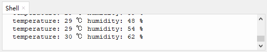

单击“停止/启动后端进程”退出程序。

### 第12课 刷卡开门

**1.1. 项目介绍：**

现在很多小区的门使用了刷卡开门这个功能，非常的方便。这节课我们将学习使用及RFID-MFRC522模块和磁卡（钥匙扣/白卡）控制门转动。

**1.2. 模块相关资料**：

**（1）元件知识**

**RFID：** RFID (Radio Frequency Identification)是一种无线通信技术。一个完整的RFID系统一般由应答器和读取器组成。通常我们使用标签作为应答器，每个标签都有一个唯一的代码，它附着在物体上，用来识别目标物体。阅读器是用来读取(或写入)标签信息的设备。

从RFID技术衍生的产品可以分为三类：无源RFID产品、有源RFID产品和半有源RFID产品。而无源RFID产品是市场上最早、最成熟、使用最广泛的产品。它在我们的日常生活中随处可见，如公交卡、餐卡、银行卡、酒店门禁卡等，这些都属于近距离接触识别。无源RFID产品的主要工作频率有:125KHZ(低频)、13.56MHZ(高频)、433MHZ(超高频)、915MHZ(超高频)。有源和半有源RFID产品工作在更高的频率。

我们使用的RFID模块是无源RFID产品，工作频率为13.56MHz。

**RFID-RC522模块：** MFRC522是一个高度集成的读取/写入器IC，用于13.56MHz的非接触式通信。MFRC522的内部发射器能够驱动一个读取/写入天线，设计用于与ISO/IEC 14443A/MIFARE卡和应答器通信，而无需额外的有源电路。接收模块为来自ISO/IEC 14443 A/MIFARE兼容卡和应答器的信号解调和解码提供了一个健壮和高效的实现。数字模块管理完整的ISO/IEC 14443A组帧和错误检测(奇偶校验和CRC)功能。

该RFID模块采用MFRC522作为控制芯片，采用I2C (Inter－Integrated Circuit)接口。

**（2）规格参数：**

工作电压：DC 3.3V-5V

工作电流：13—100mA/DC 5V

空闲电流：10-13mA/DC 5V

休眠电流：\<80uA

峰值电流：\<100mA

工作频率：13.56MHz

最大功率：0.5W

支持的卡类型：mifare1 S50、mifare1 S70、mifare UltraLight、mifare Pro、mifare Desfire

环境工作温度：摄氏-20—80℃  
环境储存温度：摄氏-40—85℃  
环境相对湿度：相对湿度5%—95%

数据传输速率：最大10Mbit/s

**1.3. 实验组件：**

|||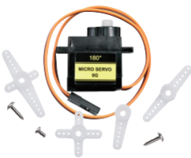|||
|-|-|-|-|-|
|ESP32 Plus主板 * 1|RFID-MFRC522模块*1|180度舵机*1|3P 转杜邦线母*1|钥匙扣*1|
||||| |
|按键*1|4pin 黑红蓝绿母对母连拼*1|白卡*1|USB线*1| |

**1.4. 模块接线图：**

RFID-RC522模块，木板房子⑦处按键1和门舵机的控制引脚：

|木板房子⑦处按键1（S引脚）|io16|
|-|-|
|门舵机（橙黄色线引脚）|io13|
|RFID-RC522模块的SCL引脚|SCL|
|RFID-RC522模块的SDA引脚|SDA|

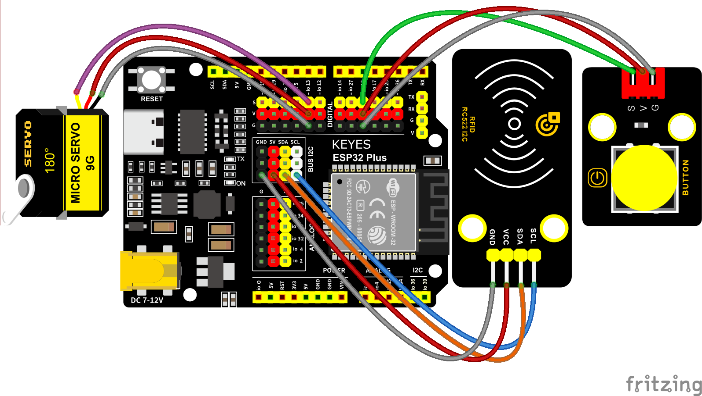

**1.5. 实验代码：**

打开“Thonny”软件，点击“此电脑” → “D:” → “项目代码+驱动文件+库文件” → “项目代码” → “Python 代码”。然后鼠标左键双击“Project_12_rc522_RFID_door.py”。

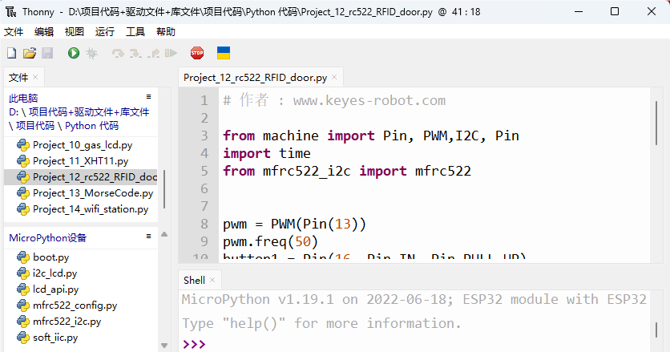


<span style="color: rgb(255, 76, 65);">特别注意：</span>对于不同的RFID-RC522的白磁卡和蓝色钥匙扣，其白磁卡值和蓝色钥匙扣的值可能都不一样。所以，当使用你自己的白磁卡靠近RFID模块的感应区域时，你需要将你在Shell窗口中读取的值更换程序中的值。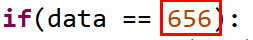


```python
## 作者 : www.keyes-robot.com

from machine import Pin, PWM,I2C, Pin
import time
from mfrc522_i2c import mfrc522

pwm = PWM(Pin(13))  
pwm.freq(50)
button1 = Pin(16, Pin.IN, Pin.PULL_UP)
##i2c config
addr = 0x28
scl = 22
sda = 21
    
rc522 = mfrc522(scl, sda, addr)
rc522.PCD_Init()
rc522.ShowReaderDetails()  # 显示PCD - MFRC522读卡器详细信息

data = 0

while True:
    if rc522.PICC_IsNewCardPresent():
        #print("Is new card present!")
        if rc522.PICC_ReadCardSerial() == True:
            print("Card UID:")
            #print(rc522.uid.uidByte[0 : rc522.uid.size])
            for i in rc522.uid.uidByte[0 : rc522.uid.size]:
                data = data + i
        print(data)
        if(data == 656):
            pwm.duty(128)
            print("open")
        else:
            print("error")
        data = 0
    btnVal1 = button1.value()
    if(btnVal1 == 0):
        pwm.duty(25)
        print("close")
    time.sleep(1)
```

**1.6. 实验结果：**

将 ESP32 主控板通过Micro USB数据线与计算机相连供电，单击“当前运行脚本”，代码开始执行，外接电源供电，将我们提供的白磁卡片靠近RFID感应区域，门就会转动打开，Shell窗口中显示“open”。点击一下按键1，门转动关闭，Shell窗口中显示“close”。在RFID感应区域刷另一个蓝色钥匙扣，Shell窗口中显示“Error”。

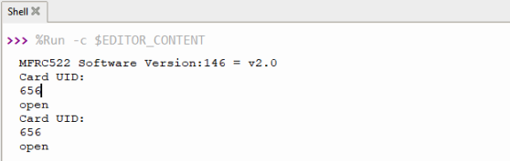

单击“停止/启动后端进程”退出程序。

<span style="color: rgb(255, 76, 65);">特别注意：</span> 对于不同的RFID-RC522的白磁卡和蓝色钥匙扣，其白磁卡值和蓝色钥匙扣的值可能都不一样。所以，你需要将你在Shell窗口中读取的值更换程序中的值。


### 第13课 摩斯密码

**1.1. 项目介绍：**

摩尔斯电码也被称作摩斯密码，是一种时通时断的信号代码，通过不同的排列顺序来表达不同的英文字母、数字和标点符号。

现在我们使用它来作为我们的密码门。

**1.2. 摩斯密码的相关资料：**

摩斯密码对应的字符如下：


**1.3. 实验组件**：

|||||
|-|-|-|-|
|ESP32 Plus主板 * 1|按键*2|180度舵机*1|3P 转杜邦线母*2|
|||| |
|I2C LCD1602模块* 1|4P 转杜邦线母*1|USB线*1| |

**1.4. 模块接线图：**

按键1，按键2，门舵机和I2C 1602 LCD模块的控制引脚：

|按键1（S引脚）|io16|
|-|-|
|按键2（S引脚）|io27|
|门舵机（橙黄色线引脚）|io13|
|I2C 1602 LCD模块的SCL引脚|SCL|
|I2C 1602 LCD模块的SDA引脚|SDA|

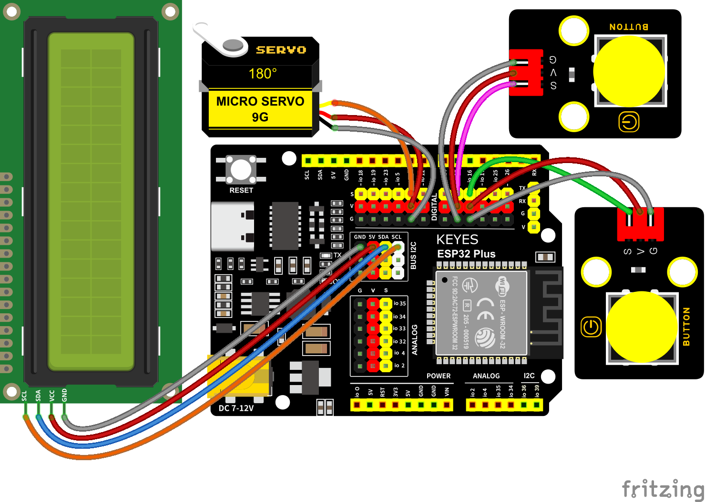

**1.5. 实验代码：** 

简单的使用作为正确密码。

非常简单的实现按键的点击、双击、长按等功能。对应摩斯密码，点击为“.”，长按再松开为“-”。

打开“Thonny”软件，点击“此电脑” → “D:” → “项目代码+驱动文件+库文件” → “项目代码” → “Python 代码”。然后鼠标左键双击“Project_13_MorseCode.py”。

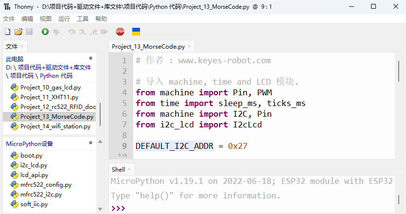


```python
## 作者 : www.keyes-robot.com

## 导入 machine, time and LCD 模块. 
from machine import Pin, PWM
from time import sleep_ms, ticks_ms 
from machine import I2C, Pin 
from i2c_lcd import I2cLcd 

DEFAULT_I2C_ADDR = 0x27

i2c = I2C(scl=Pin(22), sda=Pin(21), freq=400000) 
lcd = I2cLcd(i2c, DEFAULT_I2C_ADDR, 2, 16)

button1 = Pin(16, Pin.IN, Pin.PULL_UP)
button2 = Pin(27, Pin.IN, Pin.PULL_UP)
count = 0
time_count = 0
password = ""   #输入密码
correct_password = "-.-"  #正确密码
lcd.putstr("Enter password")
pwm = PWM(Pin(13))  
pwm.freq(50)
pwm.duty(25)  #关门
sleep_ms(2000)

while True:
    btnVal1 = button1.value()  # 读取按钮的值 1
    if(btnVal1 == 0):
        sleep_ms(10)
        while(btnVal1 == 0):
            time_count = time_count + 1  #开始计算按键被按下的时间
            sleep_ms(200)                #时间为200ms累加
            btnVal1 = button1.value()
            if(btnVal1 == 1):
                count = count + 1
                print(count)
                print(time_count)
                if(time_count > 3):      #如果按键被按下的时间大于200*3ms，密码加"-"
                    lcd.clear()
                    #lcd.move_to(1, 1)
                    password = password + "-"
                else:
                    lcd.clear()
                    password = password + "."  #否则加"."
                lcd.putstr('{}'.format(password)) 
                time_count = 0
                
    btnVal2 = button2.value()
    if(btnVal2 == 0):
        if(password == correct_password):  #如果输入密码正确
            lcd.clear()
            lcd.putstr("open")
            pwm.duty(128)  #开门
            password = ""  #清除密码
            sleep_ms(1000)
        else:              #如果密码错误
            lcd.clear()
            lcd.putstr("error")
            pwm.duty(25)  #关门
            sleep_ms(2000)
            lcd.clear()
            lcd.putstr("enter again")
            password = ""  #清除密码
```

**1.6. 实验结果：**

将 ESP32 主控板通过Micro USB数据线与计算机相连供电，单击“当前运行脚本”，代码开始执行，外接电源供电，开始LCD1602显示“Enter password”，点击或长按按键1来输入密码，如果输入正确密码“-.-”，再点击按键2，门就转动打开，LCD1602显示“open”。如果是输入了其它错误的密码，LCD1602显示error，门关闭，两秒后显示enter again。

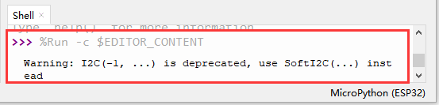

单击“停止/启动后端进程”退出程序。

### 第14课 WiFi控制

**1.1. 项目介绍：**

物联网，就是将硬件设备接入网络。接入网络最便捷的方法就是使用WiFi连接了。ESP32 Plus主控板自带有WiFi模块，所以将我们的智能家居接入网络还是比较简单的。

我们将智能家居连接到局域网，也就是你家里的WiFi或者你手机开启的热点。连接成功后就会分配一个地址，这个地址就可以用来通讯了，我们将分配到的地址在Shell窗口中打印出来。

**1.2. 相关资料：**

**Station模式：** 当ESP32选择Station模式时，它作为一个WiFi客户端。它可以连接路由器网络，通过WiFi连接与路由器上的其他设备通信。如下图所示，PC和路由器已经连接，ESP32如果要与PC通信，需要将PC和路由器连接起来。

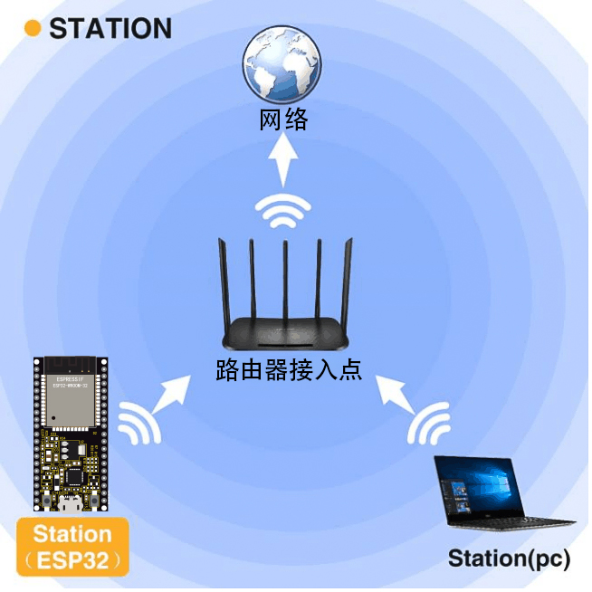

**1.3. 实验组件：**

|||
|-|-|
|ESP32 Plus主板 * 1|USB线*1|

**1.4. 模块接线图：**


**1.5. 智能家居连接WiFi的实验代码：** 

打开“Thonny”软件，点击“此电脑” → “D:” → “项目代码+驱动文件+库文件” → “项目代码” → “Python 代码”。并鼠标左键双击“Project_14_wifi_station.py”。

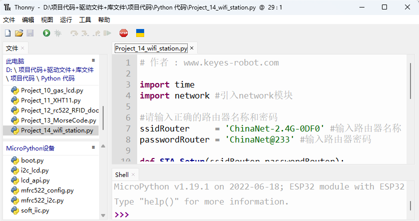


<span style="color: rgb(255, 76, 65);">注意：</span>代码中的ssid 和 password要填上你自己的WiFi名称和密码。

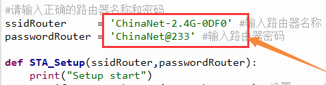

```python
## 作者 : www.keyes-robot.com

import time
import network #引入network模块

##请输入正确的路由器名称和密码
ssidRouter     = 'ChinaNet-2.4G-0DF0' #输入路由器名称
passwordRouter = 'ChinaNet@233' #输入路由器密码

def STA_Setup(ssidRouter,passwordRouter):
    print("Setup start")
    sta_if = network.WLAN(network.STA_IF) #设置ESP32为Station模式
    if not sta_if.isconnected():
        print('connecting to',ssidRouter)
##激活ESP32的工作站模式，向路由器发起连接请求并输入连接密码.
        sta_if.active(True)
        sta_if.connect(ssidRouter,passwordRouter)
##等待ESP32连接路由器，直到两台路由器连接成功.
        while not sta_if.isconnected():
            pass
##在“Shell”窗口中打印ESP32的IP地址.
    print('Connected, IP address:', sta_if.ifconfig())
    print("Setup End")

try:
    STA_Setup(ssidRouter,passwordRouter)
except:
    sta_if.disconnect()
```

**1.6. 实验结果：**

将 ESP32 主控板通过Micro USB数据线与计算机相连供电，单击“当前运行脚本”，代码开始执行，外接电源供电，你会看到的现象是：Shell窗口中会打印出连接到WiFi的名称，如果成功连接上WiFi，会打印出分配到的IP地址。

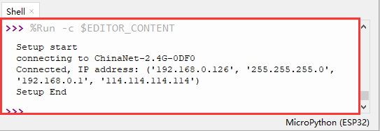


<span style="color: rgb(255, 76, 65);">注意：</span>只支持连接2.4GHz频段的WiFi，不支持连接5GHz频段的WiFi。

单击“停止/启动后端进程”退出程序。