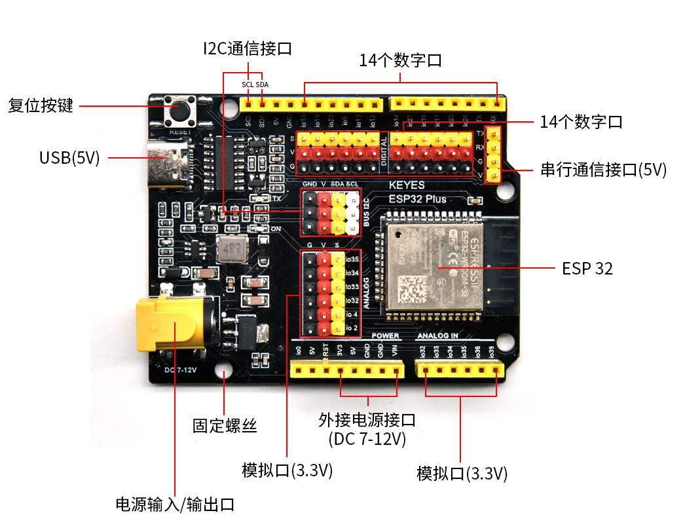
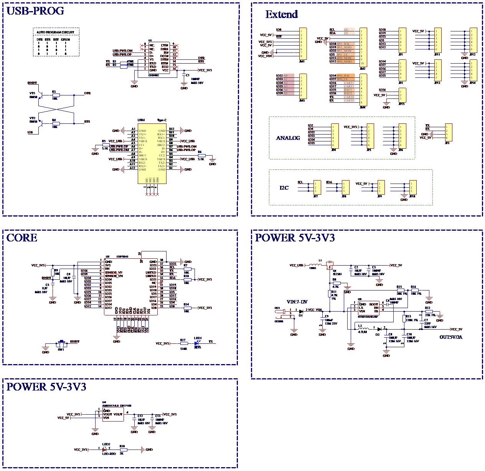

# KEYES ESP32 PLUS开发板介绍

**1\. 简介：**

这是一款基于ESP32开发板，集成了ESP32-WOROOM-32模组，是一款通用型的WIFI加蓝牙开发板，引脚兼容Arduino。有丰富的外设，包括霍尔传感器，高速SDIO/SPI、UART、I2S和I2C等，并且可以搭载freeRTOS操作系统，非常适用于物联网、智能家居方案。

**2\. 参数：**

|输出电压|3.3V-5V|
|-|-|
|输出电流|MAX：1.2A|
|最大功率|最大输出10W|
|工作温度范围|-10~50摄氏度|
|尺寸|69*54*14.5mm|
|重量|25.5g|
|环保属性|ROHS|

**3\. 接口图：**

**4\. 原理图：**

