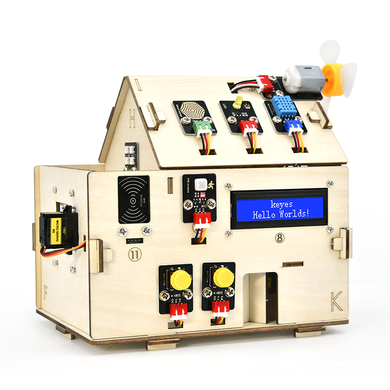

首先感谢选择keyes产品,

我们将继续为你提供好的产品和服务!

**关于keyes**

Keyes是KEYES Corporation旗下最畅销的品牌，我们的产品包括Arduino开发板、扩展板、传感器模块；树莓派、micro：bit扩展板和智能小车；以及为各阶段客户设计的完整入门套件。这些入门套件旨在为任何水平的客户学习Arduino、树莓派、micro：bit相关知识。

我们所有产品，均符合国际质量标准，在世界各地不同市场中，得到了极大的赞赏。

欢迎从我们的官方网站查看更多内容：

[http://www.keyes-robot.com](http://www.keyestudio.com)

**售后服务**

1\. 如果发现某些东西丢失或损坏，或者学习套件时遇到一些困难。keyes会提供免费和快速的支持，如果您有任何疑问，请联系我们我们客服或工作人员。

2\. 欢迎提出建议和反馈，我们会根据您的反馈不断更新套件和教程，以使其更好。谢谢！

**产品安全**

1\. 本产品内含细小的零件（螺丝，铜柱等），请放在儿童接触不到的地方，防止划伤或误食。7岁及以下儿童使用，请在大人监督下使用。

2\. 本产品包含导电部件(控制板和电子模块），请按照本教程的要求进行操作，不当的操作可能导致过热并且损害零件，请勿触摸并立即断开电路电源。

**版权**

keyes商标和徽标是KEYES DIY ROBOT co.,LTD的版权,任何人和公司在没有授权的情况下，不得复制，售卖，转卖，keyes品牌的产品。如果您有兴趣在当地售卖我们的产品，请联系我们专业的批发销售人员。

# 产品介绍

**Keyes IOT ESP32智能家居套件**

## 简介：

当下是物联网快速发展时代，各类智能设备逐渐融入到人们日常生活当中。例如：使用RFID实现刷卡开门；厨房装有气体检测报警器，检测到危险气体和大的烟雾就会发出警报声，提醒人们注意危险；检测到下雨了，能够自动收衣服和关上窗。各类电器设备都可以通过手机控制，控制灯、风扇、空调等。

因此，我们推出这款ESP32主控的智能家居产品，具有多样的传感器和模块，并且具备联网功能，能很好的助你学习物联网的相关知识。

## 产品特点：

- 1\. 结构外观好看
- 2\. 丰富的传感器模块
- 3\. 手机APP网络控制
- 4\. 摩斯密码门
- 5\. 自动关窗
- 6\. RFID刷卡
- 7\. 支持C语言编程，MicroPython语言编程，Mixly图形化编程和Scratch图形化编程

## 产品参数:

外接电源：DC（7-12V）

工作电压：DC（3.3V-5V）

工作电流：最大输出1.2A

工作最大功率：最大输出6W

工作温度范围：-10~50℃

