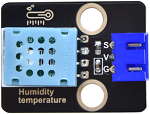

# 套装清单：

当收到这个Keyes IOT ESP32智能家居套件的时候，首先看到是一个包装精美的外盒，每个配件被安全且有序的装在外盒里面的小袋子里，先来清点一下：

|序号|图片|规格|倍用量|
|-|-|-|-|
|1||ESP32智能家居用椴木板 七片 厚度3mm|1|
|2||ESP32智能家居用亚克力板 两片 无色透明|1|
|3||ESP32 PLUS开发板|1|
|4||SK6812 RGB模块|1|
|5||MQ-2模拟气体传感器|1|
|6||单路按键模块|2|
|7||RFID刷卡模块|1|
|8||无源蜂鸣器模块|1|
|9||130电机模块|1|
|10||水滴传感器|1|
|11||XHT11温湿度传感器（兼容DHT11）|1|
|12||人体红外热释传感器|1|
|13||黄色LED模块|1|
|14||舵机|2|
|15||I2C1602液晶屏模块|1|

