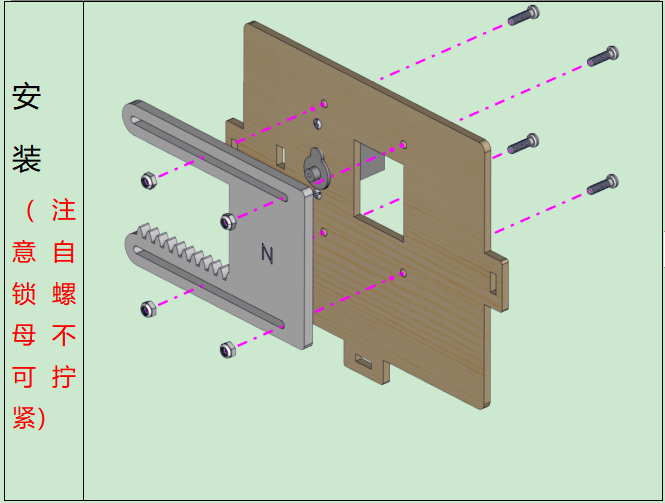
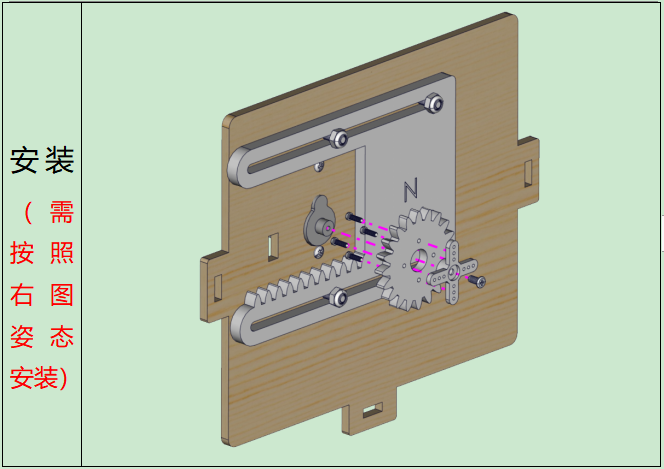

# 常见故障排除

## 1 智能家居无反应 

答：1. 请检查电池电量是否充足。

2. 请检查接线是否正确。

3. 开关是否已经打开

注意：控制板出厂前并没有烧录智能家居的相关程序，实现功能需要自己烧录相应的程序。

## 2 电脑识别不了USB端口 

答：1. 请确保已参考”开发环境配置”安装了开发板驱动程序。

2. 请检查USB线是否良好。

## 3 程序编译出错 

答：是否已经添加库文件？添加方式请参考：3. Arduino
教程中的开发环境配置资料的第三小节

## 4 程序上传不了 

答：检查Arduino IDE 的开发板板型和端口是否选择正确？

## 5 无法连接到APP 

答：手机APP界面上输入的IP地址是否与Arduino IDE的串口监视器窗口读取的WiFi IP地址保持一致？

## 6 舵机发烫 

答：1. 安装时需要先把舵机复位到0度再进行安装，避免舵机执行示例程序时发生堵转而发烫烧毁舵机

2. 安装窗户时的自锁螺母不能拧太紧，保证窗户能滑动，避免舵机执行程序时发生堵转而发烫烧毁舵机

‘

